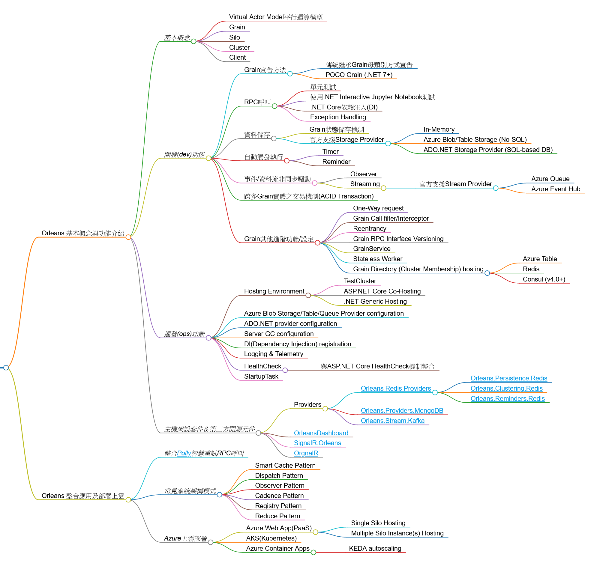

# Microsoft Orleans介紹

Microsoft Orleans (以下簡稱Orleans)原是微軟研究院為了實現分散式運算理論的 Virtual Actor Model 架構，所研發出的獨家 .NET Framework 分散式運算框架實現，在需要能夠即時容量擴展以及開發能夠依使用者量需要彈性延伸的應用功能場景，如網路遊戲微軟 Xbox 上的第一人稱射擊遊戲 Halo 上廣泛使用。在 2015 年Orleans以開源 MIT 授權模式釋出之後，一般開發者也可使用；在 2018 年支援跨平台 .NET Core 的 version 2.0 版發布後，所有可跑 .NET Core/ .NET 5+ 的運算平台上都可以運行。

Orleans在2021年2月由一般性的開源專案轉變為微軟 .NET 官方支援的開源專案，並且將會於 .NET 7正式發行時和 [ASP.NET Core 7一併推出Orleans v7正式版](https://devblogs.microsoft.com/dotnet/asp-net-core-updates-in-net-7-preview-1/)，成為如同SignalR、gRPC一樣， ASP.NET Core框架所包含的官方功能之一，而包含於ASP.NET Core這個大框架的目的，由官方近期2022Build大會的大會簡報上來看：

  
*影片網址：[Next Steps for Distributed Programming with .NET and Orleans \| OD112](https://youtu.be/-4BelRbFOVo)*

使用ASP.NET Core開發的應用程式，導入Orleans框架，可以自然地在原本三層式架構上多帶入一層在資料庫資料層之上的跨叢集跨主機分散式運算單元層，提供從快取/狀態資料同步的基本功能層面，到實現將應用程式商業邏輯層的負載”後送”到分散式運算單元層上來跑的需求；在需要做『[水平擴展(scale-out)](https://docs.microsoft.com/en-us/azure/architecture/guide/design-principles/scale-out)』的場景時，只要藉由Orleans提供的分散式運算架構，就能將運算負載分散到多台主機上執行，達到擴展的目的。

Orleans框架的設計原則是讓開發者專注於開發分散式應用程式的商業邏輯實作，不被分散式系統天生的軟硬體環境複雜性考量而減低生產力。其本身框架所提供的功能，我們在理解/記憶上，也可從開發端(dev)和運營端(ops)這兩個面向來分類，再加上如何導入架構設計模式來實作功能以及運營部署雲端的各種事項，整個思維架構彙整如下圖：  

整個看起來好像很包山包海，但採用Orleans其實只要先瞭解由Actor Model所衍生的Virtual Actor Model運算模型思維，就會發現在主要商業邏輯的實作上其實很簡單，而在運營部署上需要調校設定的雜事多；而這些事情，都是在開發者在開發時期撰寫商業邏輯時不需要考慮的，所以Orleans框架的設計目的就是要讓開發者專注於商業邏輯的開發，而不是在分散式系統的運營/維護上花太多時間。

總結三個要點：

1.  Orleans框架的設計目的是讓開發者專注於開發分散式應用程式的商業邏輯實作，不被分散式系統天生的軟硬體環境複雜性考量分心而減低生產力。
2.  Orleans框架提供的功能可從開發端(dev)和運營端(ops)這兩個面向來分類理解記憶。
3.  ASP.NET Core + Orleans框架，可自然地在原本三層式架構上多帶入一層在資料庫資料層之上的跨叢集跨主機分散式運算單元層，以便讓日後有需要做[scale-out](https://docs.microsoft.com/en-us/azure/architecture/guide/design-principles/scale-out)的場景時，可以輕鬆達成。

------------------------------------------------------------------------

Actor Model, Virtual Actor Model概念，以及Orleans提供API的基本單元，將於明天介紹，敬請期待。
