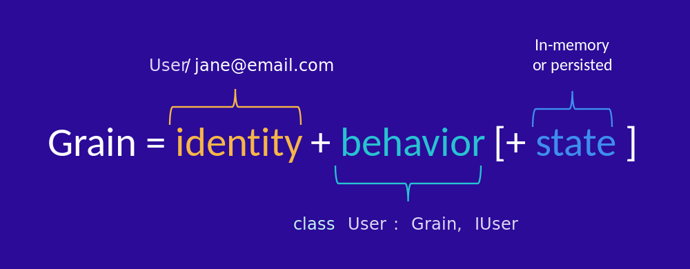

# Microsoft Orleans的Grain組成結構與宣告方式

## Grain的組成結構

Orleans的Grain物件由 **識別子(identity) + 行為(behavior) + 狀態(state) ** 所組成：


*圖片來源：[Microsoft Orleans官方說明網頁](https://learn.microsoft.com/en-us/dotnet/orleans/overview#what-are-grains)*

Grain在Orleans裡的寫法是定義成自訂類別(Class)，在目前v3.x的版本需繼承自Orleans框架提供的[`Grain`抽象類別](https://learn.microsoft.com/zh-tw/dotnet/api/orleans.grain)，在Orleans v7之後可以直接宣告為更有彈性的[POCO(Plain Old CLR Object)物件](https://en.wikipedia.org/wiki/Plain_old_CLR_object)。  
Grain對應到Actor Model中的Actor，Actor實體即為自訂Grain類別(Class)的實體(Object Instance)，因此，為了要讓Actor實體識別上/定址上是唯一的，Grains的識別子(identity)就是對應用來識別Grain物件，由開發者自行設計，而程式執行時根據程式邏輯之類動態指定/使用的值，實務上可以用來表達如User ID、Product ID、Order ID等的對應。但識別子僅能使用下列方式定義：

  * `Guid`型別的值
  * `Int64`型別的值
  * `string`型別的值
  * 複合式：
    * `Guid & string`
    * `Int64 & string`

雖然需要指定唯一值，不過不同種自訂Grain類別的識別子(identity)值可以重複，因為Orleans的API在使用時所需的參數除了識別子之外，還有自訂Grain類別的型別才會確定是哪個Grain實體（以昨天的大掃除舉例來說，三兄弟和爸爸這兩種不同的家人角色理應不會搞混，有些特殊情況的家庭可能也會有一個以上的爸爸需要有不同的識別值來區分XD），所以總結來說，**不同種自訂Grain類別的識別子(identity)值可以重複，但同一種自訂Grain類別的識別子(identity)值不可重複**。

Grain的行為(behavior)則是對應到Actor Model中Actor實體可以接收訊息並執行對應動作的能力，開發者需自行定義行為，在Grains裡定義行為的方式是宣告public的非同步方法，並且回傳參數的型別是[Task](https://learn.microsoft.com/en-us/dotnet/api/system.threading.tasks.task), [Task &lt;T&gt;](https://learn.microsoft.com/en-us/dotnet/api/system.threading.tasks.task-1)或[ValueTask](https://learn.microsoft.com/en-us/dotnet/api/system.threading.tasks.valuetask), [ValueTask &lt;T&gt;](https://learn.microsoft.com/en-us/dotnet/api/system.threading.tasks.valuetask-1)；有泛型參數`<T>`的表示會有回傳值，原本對該Grain物件發送訊息（也就是呼叫非同步方法）的呼叫者會收得到回傳值。

實際使用Orleans API來定義時，行為(behavior)的宣告會寫在一個為繼承自[`IGrainWithGuidKey`](https://learn.microsoft.com/en-us/dotnet/api/orleans.igrainwithguidkey), [`IGrainWithIntegerKey`](https://learn.microsoft.com/en-us/dotnet/api/orleans.igrainwithintegerkey), [`IGrainWithStringKey`](https://learn.microsoft.com/en-us/dotnet/api/orleans.igrainwithstringkey), [`IGrainWithGuidCompoundKey`](https://learn.microsoft.com/en-us/dotnet/api/orleans.igrainwithguidcompoundkey), [`IGrainWithIntegerCompoundKey`](https://learn.microsoft.com/en-us/dotnet/api/orleans.igrainwithintegercompoundkey)
這五種Interface之一的自定義 *RPC介面(Interface)* 中的非同步方法宣告（而這五種介面就恰是Grain識別子(identity)的定義種類選擇方式），而自訂Grain類別(Class)要做的就是實作該RPC介面宣告方法的內容，這樣架構的好處是之後客戶端(Client)在『發送訊息』時只需要使用該RPC介面進行呼叫，不需要直接參考到自訂Grain類別的物件實體，也是同等於OOP設計裡的 *"Programming to Interface"* 設計哲學：客戶端(Client)只需要知道介面的定義，而不需要知道實作的細節。

最後一個狀態(state)在圖上是畫成非必須的，因為有些Grain可能不需要狀態，例如：[Stateless worker](https://learn.microsoft.com/en-us/dotnet/orleans/grains/stateless-worker-grains)；狀態(state)是開發者可自行定義的任意一個以上能被[.NET序列化(Serialization)](https://learn.microsoft.com/zh-tw/dotnet/standard/serialization/) 的自定義類別成員。早期Orleans版本，狀態的自定義宣告需要在自訂Grain類別寫成 `class MyCustomGrainClass : Grain<TState> { /* ... */}`的`TState`泛型參數，這只能有一個狀態變數的設計頗侷限；所以後來的Orleans版本改以定義成使用 .NET Core的依賴注入(Dependency Injection)風格形式：
```csharp 
    public class MyCustomGrainClass : Grain, IMyCustomGrainInterface
    {
        private readonly IPersistentState<MyState> _state01;
        private readonly IPersistentState<AnotherState> _state02;

        public MyCustomGrainClass(
          [PersistentState("stateName01", "storageName")] IPersistentState<MyState> state01,
          [PersistentState("stateName02", "storageName")] IPersistentState<AnotherState> state02,
          ...)
        {
            _state01 = state01;
            _state02 = state02;
        }
        /* ... */
    }

    public class MyState
    {
        public int MyStateValue { get; set; }
    }
    public class AnotherState
    {
        public string AnotherStateValue { get; set; }
    }
```
上面的範例中，`MyState`和`AnotherState`這兩個Class即為注入的Grain狀態成員的自訂類別宣告。這樣的設計好處是比較容易測試，且實際上不同的狀態也可藉由Orleans框架底層機制的[Grain Storage Provider](https://learn.microsoft.com/en-us/dotnet/orleans/resources/nuget-packages#grain-storage-providers)存在不同種類的資料庫中，例如：SQL Server、MongoDB、Redis等。

## Grain的宣告方式

開發一個Orleans的Grain元件，通常先由定義其RPC介面開始：

```csharp
using Orleans;

namespace RpcDemo.Interfaces.Hello;

public interface IHelloGrain : IGrainWithIntegerKey
{
    Task<string> SayHello(string greeting);
}
```
這裡定義了一個介面`IHelloGrain`，並繼承自[`IGrainWithIntegerKey`](https://learn.microsoft.com/en-us/dotnet/api/orleans.igrainwithintegerkey)，代表這個Grain的識別子(identity)是使用Int64整數值，而`SayHello()`則是一個非同步方法，其參數是要給一個字串，而回傳值也是字串型別。

然後就是實作這個介面的Grain類別（（記得在Orleans v3.x框架，類別要繼承Orleans提供的[`Grain`抽象類別](https://learn.microsoft.com/zh-tw/dotnet/api/orleans.grain)）：

```csharp
using Orleans;
using RpcDemo.Interfaces.Hello;

namespace RpcDemo.Grains.Greeting;

public class HelloGrain : Grain, IHelloGrain
{
    public Task<string> SayHello(string greeting)
    {
        return Task.FromResult($"Hello {greeting}!");
    }
}
```

如此我們就完成了一個最簡單的Hello World的Grain元件，它會在其`SayHello()`RPC方法被呼叫之後回傳{`Hello 原本輸入的字串!`}，至於接下來這Grain要如何使用，請待明日講解。
