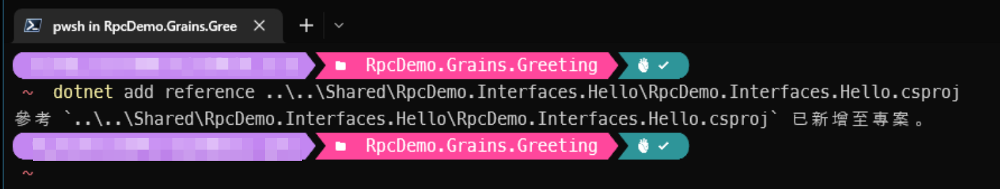

# Orleans專案建議結構與建立流程

## 建立Orleans專案

需要安裝的軟體有：

* [.NET 6 SDK](https://aka.ms/DotNET_SDKs)
* [Visual Studio Code](https://code.visualstudio.com/Download)
* Visual Studio Code的[C#擴充套件](https://marketplace.visualstudio.com/items?itemName=ms-dotnettools.csharp)

這都是跨Windows/MacOS/Linux的，所以不用擔心平台問題。

Orleans專案沒有公定規範要有什麼格式，但建議專案檔案的結構組成如下圖：


此圖有標題的容器框是Visual Studio的["方案資料夾(Solution Folder)"](https://learn.microsoft.com/en-us/visualstudio/ide/solutions-and-projects-in-visual-studio#solution-folder)，當專案整個程式碼複雜起來時，在Visual Studio的[方案總管(Solution Explorer)](https://learn.microsoft.com/en-us/visualstudio/ide/solutions-and-projects-in-visual-studio#solution-explorer)中可以看到一個個虛擬資料夾，以便於組織分類不同用途的C#專案。

基本上除了方案資料夾之外，在實際作業系統的程式碼目錄內，建議也建立實際檔案系統目錄的對應，這樣在Visual Studio Code左侧的[Explorer](https://code.visualstudio.com/docs/getstarted/userinterface#_explorer)中也可以看到分類的目錄。

接下来解说每个方案资料夹的目的，從最上方依序下來是：

* ***Shared***：放置一些前後端都會共用的程式碼，包含Grain的RPC介面的[類別庫Class Library](https://learn.microsoft.com/en-us/dotnet/standard/class-library-overview)類型專案，以及會在RPC方法的輸入輸出參數使用到的共用資料類別/錯誤處理時丢出的例外类别。此資料夾中的類別庫專案如果不需相容 .NET Framework的話，可以使用 .NET 6.0的[目標框架(Target Framework)](https://learn.microsoft.com/en-us/dotnet/standard/frameworks)即可，反之則使用 [.NET Standard](https://learn.microsoft.com/en-us/dotnet/standard/net-standard) 2.0/2.1 的，以達到最大的共用可能性（Orleans的執行環境支援 .NET Standard v2.0+ 的Windows/Linux/macOS執行環境）。目前放在此方案資料夾中的`RpcDemo.Interfaces.Hello`專案即為Grain的RPC介面專案。

* ***Grains***：放置Microsoft Orleans的Grain實作之類別庫專案，也就是RPC介面內宣告方法的實作，由於這個資料夾內的專案只會被後端服務參考到，所以可以僅使用 .NET 6目標框架來建立其中之類別庫專案，圖中`RpcDemo.Grains.Greeting`類別庫專案即為Microsoft Orleans的Grain實作專案。

* ***Hosting***：裡面的子方案資料夾 ***Server*** 內放實際上跑Microsoft Orleans的Silo之後端專案，目前有一個使用 .NET 6目標框架的命令列(Console)專案`RpcDemo.HOsting.Console`，另一個子方案資料夾 ***Client*** 內放叫用Grain RPC方法的客戶端命令列專案`RpcDemo.Client.Console`。

圖中的藍色箭頭表示該C#專案有[專案對專案參考(reference)](https://learn.microsoft.com/en-us/visualstudio/ide/managing-references-in-a-project#project-to-project-references)到其他專案，箭頭所指的專案即為被參考的專案。所以圖中的Grain專案`RpcDemo.Grains.Greeting`參考了RPC介面專案`RpcDemo.Interfaces.Hello`，可以實作RPC介面中宣告之RPC方法的實作；Client專案`RpcDemo.Client.Console`也有參考到該專案，因此可以呼叫Grain的RPC方法。Silo專案`RpcDemo.Hosting.Console`有參考到Grain專案`RpcDemo.Grains.Greeting`，因此而有辦法跑該Grain元件。

以下示範使用 .NET SDK的CLI指令來建立如上圖的專案結構。

## 使用命令列建立專案的步驟

在此使用PowerShell 7的指令列介面來示範建立過程。

首先建立資料夾結構：
```powershell
New-Item -ItemType Directory "./OrleansRpcDemo/src/Shared"
New-Item -ItemType Directory "./OrleansRpcDemo/src/Grains"
New-Item -ItemType Directory "./OrleansRpcDemo/src/Hosting"
New-Item -ItemType Directory "./OrleansRpcDemo/src/Hosting/Client"
New-Item -ItemType Directory "./OrleansRpcDemo/src/Hosting/Server"
```
建好的目錄結構如下圖所示：


然後PowerShell將工作目錄切入在`OrleansRpcDemo`資料夾，建議建立一個`global.json`檔案，鎖定使用的SDK版本範圍，以確保專案使用的SDK版本相容性，避免開發環境的SDK版本不同造成的問題：
```powershell
dotnet new globaljson --sdk-version 6.0.400 --roll-forward latestMinor
```
建立的檔案內容如下圖，順便可用`dotnet --info`來確認使用的SDK版本：


使用dotnet CLI建立一個`OrleansRpcDemo.sln`的解決方案檔案。
```powershell
dotnet new sln
```
會建立一個解決方案檔案`OrleansRpcDemo.sln`如下圖：


工作目錄切換到`OrleansDemo/src/Shared`，建立一個`RpcDemo.Interfaces.Hello`的類別庫專案：
```powershell
dotnet new classlib -f netstandard2.0 --langVersion 10 --no-restore --name "RpcDemo.Interfaces.Hello"
```


工作目錄切換到`OrleansDemo/src/Grains`，建立一個`RpcDemo.Grains.Greeting`的類別庫專案：
```powershell
dotnet new classlib --no-restore --name "RpcDemo.Grains.Greeting"
```
將工作目錄切進`RpcDemo.Grains.Greeting`，將`RpcDemo.Interfaces.Hello`類別庫專案的參考加入：
```powershell
dotnet add reference ..\..\Shared\RpcDemo.Interfaces.Hello\RpcDemo.Interfaces.Hello.csproj
```


工作目錄切換到`OrleansDemo/src/Hosting/Server`，建立`RpcDemo.Hosting.Console`的主控台應用程式專案：
```powershell
dotnet new console --no-restore --name "RpcDemo.Hosting.Console"
```
並且將工作目錄切換進`RpcDemo.Hosting.Console`，將`RpcDemo.Grains.Greeting`類別庫專案的參考加入：
```powershell
dotnet add reference ..\..\..\Grains\RpcDemo.Grains.Greeting\RpcDemo.Grains.Greeting.csproj
```
過程如下圖：


工作目錄切換到`OrleansDemo/src/Hosting/Client`，建立`RpcDemo.Client.Console`的主控台應用程式專案：
```powershell
dotnet new console --no-restore --name "RpcDemo.Client.Console"
```
並且將工作目錄切換進`RpcDemo.Client.Console`，將`RpcDemo.Interfaces.Hello`類別庫專案的參考加入：
```powershell
dotnet add reference ..\..\..\Shared\RpcDemo.Interfaces.Hello\RpcDemo.Interfaces.Hello.csproj
```
過程如下圖：


工作目錄切換回最上層`OrleansDemo`，將類別庫專案一一加入解決方案：  
（記得要使用`--solution-folder`參數，指定產生方案資料夾(Solution Folder)）
```powershell
dotnet sln add .\src\Shared\RpcDemo.Interfaces.Hello\RpcDemo.Interfaces.Hello.csproj --solution-folder "Shared"
```
```powershell
dotnet sln add .\src\Grains\RpcDemo.Grains.Greeting\RpcDemo.Grains.Greeting.csproj --solution-folder "Grains"
```
```powershell
dotnet sln add .\src\Hosting\Server\RpcDemo.Hosting.Console\RpcDemo.Hosting.Console.csproj --solution-folder "Hosting\Server"
```
```powershell
dotnet sln add .\src\Hosting\Client\RpcDemo.Client.Console\RpcDemo.Client.Console.csproj --solution-folder "Hosting\Client"
```
執行過程如下圖：


將`RpcDemo.Interfaces.Hello`以及`RpcDemo.Grains.Greeting`類別庫專案中預設產出的Class1.cs檔案刪除。


如此建立好的Orleans專案架構已經備妥，如果系統有安裝Visual Studio或是JetBrains Rider的話，可以打開`OrleansRpcDemo.sln`來確認專案檔案結構和專案參考無錯誤：


---

接下來就是為每個C#專案安裝對應Orleans各元件的Nuget套件以及撰寫程式碼，這還有些Orleans所謂的『[RPC Stub Code Generation](https://learn.microsoft.com/en-us/dotnet/orleans/grains/code-generation)』的細節要注意，所以，明天繼續。
