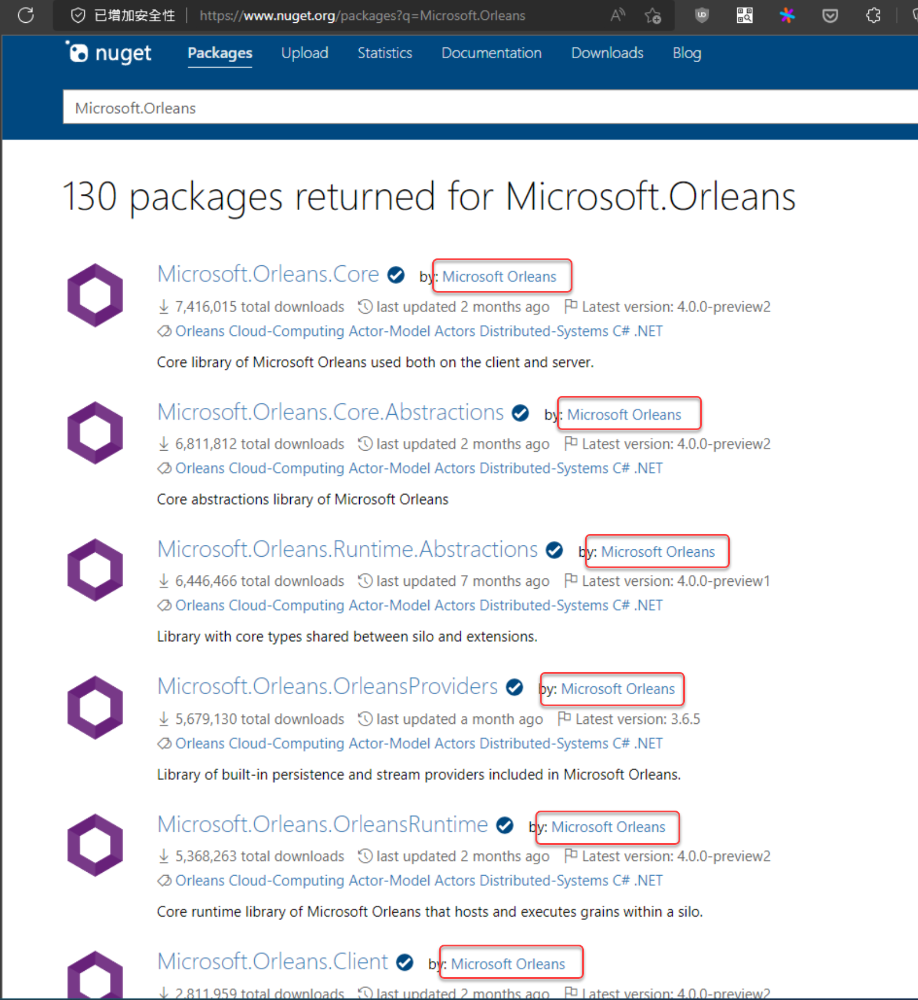

# Orleans需使用的NuGet套件及RPC Code Gen解說

## Orleans的各種C#專案所需Nuget套件

由於Microsoft Orleans的Nuget套件有一些純粹是Orleans框架中運營(Ops)面向的 [“*Provider*” 套件](https://learn.microsoft.com/dotnet/orleans/resources/nuget-packages#clustering-providers)，還有一些是第三方開源的輔助套件，因此如果在[Nuget.org](https://www.nuget.org)或是Visual Studio/JetBrains Rider的安裝介面上尋找時，需要知道哪些是官方套件，確認名稱是 **Microsoft.Orleans….** 開頭，然後套件Owner是[Microsoft](https://www.nuget.org/profiles/Microsoft)和[Orleans](https://www.nuget.org/profiles/Orleans)的Nuget套件即為官方套件。  


Orleans的各種專案所需的Nuget套件如下：

- **RPC介面專案**：
  - [Microsoft.Orleans.Core.Abstractions](https://www.nuget.org/packages/Microsoft.Orleans.Core.Abstractions)
  - [**Microsoft.Orleans.CodeGenerator.MSBuild**](https://www.nuget.org/packages/Microsoft.Orleans.CodeGenerator.MSBuild)
- **Grain實作專案**：
  - [Microsoft.Orleans.Core](https://www.nuget.org/packages/Microsoft.Orleans.Core)
  - [**Microsoft.Orleans.CodeGenerator.MSBuild**](https://www.nuget.org/packages/Microsoft.Orleans.CodeGenerator.MSBuild)
  - Grain的實作程式碼使用Dependency Injection的套件，例如寫log所需的[`ILogger`](https://learn.microsoft.com/en-us/dotnet/api/microsoft.extensions.logging.ilogger?view=dotnet-plat-ext-6.0)介面宣告 [Microsoft.Extensions.Logging.Abstractions](https://wwww.nuget.org/packages/Microsoft.Extensions.Logging.Abstractions) 套件，或是其他第三方支援.NET Core/.NET 5+內建DI用的宣告/標頭套件。
- **Silo專案**：
  - [Microsoft.Orleans.Server](https://www.nuget.org/packages/Microsoft.Orleans.Server)：讓Microsoft Orleans的Silo服務跑起來的主要套件。
  - Orleans在運營(Ops)面向的各種因應Grain State storage, Reminder, Streaming等框架服務所需的Provider套件，例如 [Microsoft.Orleans.Persistence.AdoNet](https://www.nuget.org/packages/Microsoft.Orleans.Persistence.AdoNet) 即為讓Grain狀態資料實際存入 ADO.NET 支援之資料庫的套件。
  - Grains實作專案中程式碼用Dependency Injection注入的服務，需要註冊於HostBuilder構建時期程式碼的套件。
- **Client專案**：
  - [Microsoft.Orleans.Client](https://www.nuget.org/packages/Microsoft.Orleans.Client)：提供客戶端可建立Grain的RPC方法呼叫的Proxy等Orleans的API。

其中在RPC介面專案以及在Grain實作專案，會發現都有安裝那個 [**Microsoft.Orleans.CodeGenerator.MSBuild**](https://www.nuget.org/packages/Microsoft.Orleans.CodeGenerator.MSBuild) 套件，而且安裝時記錄在 `.csrpoj` 檔裡的XML紀錄格式和其他普通Nuget套件不一樣：

``` xml
<PackageReference Include="Microsoft.Orleans.CodeGenerator.MSBuild" Version="3.6.5">
  <PrivateAssets>all</PrivateAssets>
  <IncludeAssets>runtime; build; native; contentfiles; analyzers</IncludeAssets>
</PackageReference>
```

這個就是讓Orleans專案可以在 *建置時期(Build Time)* 進行RPC Code Gen的套件，接下來會解釋這個套件的作用。

## RPC Code Gen解說

安裝了Code Gen套件的專案可以用下列PowerShell 7的命令列指令來檢查，會發現多了一些MSBuild的Target:

``` powershell
dotnet msbuild -targets | Select-String "Orleans"
```


在RPC介面專案和Grain實作專案都會有，而在Silo專案和Client專案則沒有，這個就是實際上RPC Code Gran在建置時期產生客戶端呼叫Proxy物件(RPC Method Stub)以及RPC方法參數物件的序列化/反序列化程式碼的機制。

Microsoft Orleans的RPC方法呼叫，跟其他類似技術的 [gRPC](https://grpc.io/), [Proto.Actor](https://proto.actor/docs/what-is-protoactor/) 一樣，不免需要透過序列化/反序列化的方式來傳遞參數物件，而這個序列化/反序列化的程式碼產生，在Orleans有兩種產生方式：

- *建置時期(Build Time)* 產生：安裝 [**Microsoft.Orleans.CodeGenerator.MSBuild**](https://www.nuget.org/packages/Microsoft.Orleans.CodeGenerator.MSBuild) 套件，由MSBuild負責在專案建置時期產生，詳細的產生動作可以看它的[MSBuild Task程式碼](https://github.com/dotnet/orleans/blob/3.x/src/Orleans.CodeGenerator.MSBuild/build/Microsoft.Orleans.CodeGenerator.MSBuild.targets)。
- *執行時期(Run Time)* 產生：由Silo程式開始跑時，去掃描Builder程式碼之中所描述的註冊RPC介面＆Grain類別，在服務正式可連結之前動態產生程式碼，這個機制需要在Silo專案內撰寫註冊於Builder建構定義時的 [`AddApplicationPart( /*...*/ )`](https://learn.microsoft.com/dotnet/api/orleans.applicationpartmanagerextensions.addapplicationpart) 程式碼，額外多呼叫 [`WithCodeGeneration()`](https://learn.microsoft.com/dotnet/api/orleans.hosting.applicationpartmanagercodegenextensions.withcodegeneration) 擴充方法；使用這種方式配置時，呼叫RPC方法的客戶端呼叫Proxy在Proxy Builder初始設置時也得進行類似的動作，除非該客戶端參考的RPC介面專案是用建置時期產生的RPC Code Gen方式。

建議使用 *建置時期(Build Time)* 產生的方式，以避免在程式執行時，延長服務啟動/重啟動所需時間，甚至有可能會因為Code Gen有錯誤而導致Silo啟動失敗。況且，目前的Orleans Silo預設的Builder建構行為有『自動註冊機制』：啟動時會掃描目前Silo專案有跟哪些Grain實作專案建置出的有[專案對專案參考(Project reference)](https://learn.microsoft.com/visualstudio/ide/managing-references-in-a-project#project-to-project-references)並且已有內含建置時期跑過RPC Code Gen的Assembly，自動加入該Grain至Silo以便承載執行。

總的來說，使用 *建置時期(Build Time)* 產生的配置，可以簡化Silo專案需要的樣版(boilerplate)程式碼並且減少Silo服務啟動時間。

### RPC Code Gen的除錯與調校

#### RPC Code Gen的除錯

*建置時期(Build Time)* 的RPC Code Gen有個供除錯用的設定可以在專案的 `.csproj` 檔案中設定：

``` xml
<PropertyGroup>
  <OrleansCodeGenLogLevel>Trace</OrleansCodeGenLogLevel>
</PropertyGroup>
```

這樣在編譯建置的輸出視窗中或是指令列建置時就能看到RPC Code Gen過程的Log。

另外，假如在 *執行時期(Run Time)* 的RPC Code Gen遇到錯誤，可以設定RPC Code Gen的 [`WithCodeGeneration()`](https://learn.microsoft.com/dotnet/api/orleans.hosting.applicationpartmanagercodegenextensions.withcodegeneration) 擴充方法的一個選用參數 `loggerFactory`，以便在Silo跑起來時看到RPC Code Gen的訊息log以方便除錯，如以下使用 [Serilog](https://serilog.net/) 產生輸出log到主控台(Console)的 `codeGenLoggerFactory` 變數然後在 `WithCodeGeneration()` 中叫用的範例：

``` csharp
// Optional, the logger factory for seeing the Orleans RPC method stud code gen log.
Log.Logger = new LoggerConfiguration().WriteTo.Console().CreateLogger();
var codeGenLoggerFactory = LoggerFactory.Create(logBuilder =>logBuilder.AddSerilog());

var hostBuilder = new HostBuilder().UseOrleans(siloBuilder =>{

    // ... other silo builder configuration ...
   
    // Grain and its interface needs to be registered via adding the "ApplicationPart", and also assign the RPC method code generation strategy during host startup.
    siloBuilder.ConfigureApplicationParts(parts =>{
        parts.AddApplicationPart(typeof(HelloGrain).Assembly).WithCodeGeneration(loggerFactory: codeGenLoggerFactory);
        parts.AddApplicationPart(typeof(IHelloGrain).Assembly).WithCodeGeneration(loggerFactory: codeGenLoggerFactory);
    });
});
```

#### RPC Code Gen的特殊調校

- 假如在RPC介面的方法宣告中的參數，或是Grain實作專案在實作傳回值時有用到的一些第三方函式庫NuGet套件內的類別，這些類別也需要被RPC Code Gen才有辦法順利讓Orleans的RPC方法使用，步驟如下：
  1.  建立一個C#類別庫(Class Library)專案（在此取名`RpcDemo.My3rdPartyLibGen`為範例），專案要安裝 [Microsoft.Orleans.Core.Abstractions](https://www.nuget.org/packages/Microsoft.Orleans.Core.Abstractions) 、 [Microsoft.Orleans.CodeGenerator.MSBuild](https://www.nuget.org/packages/Microsoft.Orleans.CodeGenerator.MSBuild) 這兩個Microsoft Orleans官方Nuget套件，以及需要RPC Code Gen的第三方函式庫Nuget套件。  
      (建議將該專案加入到 *Shared* 方案資料夾)

  2.  在此專案中新增一個空白的 `*.cs` 檔案，檔案的內容為：

      ``` csharp
      [assembly: Orleans.CodeGeneration.KnownAssembly(typeof(My3rdPartyClassInNuget))]
      ```

      其中 `My3rdPartyClassInNuget` 是包含在第三方函式庫Nuget套件中的類別(Class)或結構(Struct)的舉例名稱，此型別不一定需要是在RPC介面專案、Grain實作專案程式碼中有實際用到的。

  3.  將此專案加入到實際上有用到第三方函式庫Nuget套件的C#程式碼專案的[專案對專案參考(reference)](https://learn.microsoft.com/visualstudio/ide/managing-references-in-a-project#project-to-project-references)之中，以便配合Orleans專案的RPC Code Gen流程。

  4.  在Silo專案的Build建構定義程式碼加入此專案會產生的Assembly：

      ``` csharp
      siloBuilder.ConfigureApplicationParts(parts =>{
        /* Other AddApplicationPart() definition ... */
        parts.AddApplicationPart(
          Assembly.LoadFrom("RpcDemo.My3rdPartyLibGen.dll"));
      });
      ```

      假如是在RPC介面宣告中有用到第三方函式庫Nuget的話，則Client專案的Builder建構程式碼也需要加入該Application Part的宣告。
- 要強制RPC Code Gen產生某型別的RPC呼叫用程式碼，在該類別宣告前加入`[assembly: Orleans.CodeGeneration.KnownType(typeof(MyClass))]`，其中 `MyClass` 是要強制RPC Code Gen產生的類別(Class)或結構(Struct)的舉例名稱。此 [KnowTypeAttribute](https://learn.microsoft.com/en-us/dotnet/api/orleans.codegeneration.knowntypeattribute) 是定義在 [Microsoft.Orleans.Core.Abstractions](https://www.nuget.org/packages/Microsoft.Orleans.Core.Abstractions) 這個Orleans官方Nuget套件中的。

------------------------------------------------------------------------

RPC Code Gen的介紹終於完了，感謝大家的耐心，明天會繼續介紹如何將昨天建立的Orleans專案安裝對應的Nuget套件和實際跑起來的步驟，以及如何呼叫Orleans的RPC方法，敬請期待。
