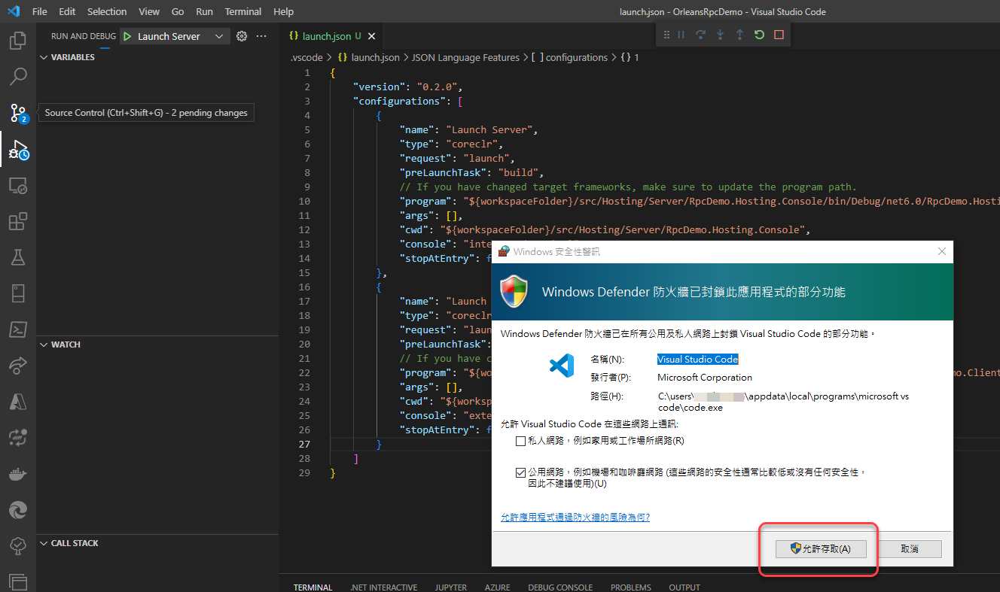

<script  src="20220921_files/libs/quarto-diagram/mermaid-postprocess-shim.js"></script>

# 第一個Helloworld專案的建置與執行

## HelloWorld Grain的執行架構

HelloWorld專案程式碼完成後的執行架構將如下圖所示：

<div>

<p>
<svg viewbox="0 0 1105.3203125 1116" height="480" aria-labelledby="chart-title-mermaid-1675229720121 chart-desc-mermaid-1675229720121" role="img" xlink="http://www.w3.org/1999/xlink" xmlns="http://www.w3.org/2000/svg" width="672" id="mermaid-figure-1">
<title id="chart-title-mermaid-1675229720121">
</title>
<desc id="chart-desc-mermaid-1675229720121"></desc>
<style>#mermaid-figure-1 {font-family:"trebuchet ms",verdana,arial,sans-serif;font-size:16px;fill:#333;}#mermaid-figure-1 .error-icon{fill:#552222;}#mermaid-figure-1 .error-text{fill:#552222;stroke:#552222;}#mermaid-figure-1 .edge-thickness-normal{stroke-width:2px;}#mermaid-figure-1 .edge-thickness-thick{stroke-width:3.5px;}#mermaid-figure-1 .edge-pattern-solid{stroke-dasharray:0;}#mermaid-figure-1 .edge-pattern-dashed{stroke-dasharray:3;}#mermaid-figure-1 .edge-pattern-dotted{stroke-dasharray:2;}#mermaid-figure-1 .marker{fill:#333333;stroke:#333333;}#mermaid-figure-1 .marker.cross{stroke:#333333;}#mermaid-figure-1 svg{font-family:"trebuchet ms",verdana,arial,sans-serif;font-size:16px;}#mermaid-figure-1 .label{font-family:"trebuchet ms",verdana,arial,sans-serif;color:#333;}#mermaid-figure-1 .cluster-label text{fill:#333;}#mermaid-figure-1 .cluster-label span{color:#333;}#mermaid-figure-1 .label text,#mermaid-figure-1 span{fill:#333;color:#333;}#mermaid-figure-1 .node rect,#mermaid-figure-1 .node circle,#mermaid-figure-1 .node ellipse,#mermaid-figure-1 .node polygon,#mermaid-figure-1 .node path{fill:#ECECFF;stroke:#9370DB;stroke-width:1px;}#mermaid-figure-1 .node .label{text-align:center;}#mermaid-figure-1 .node.clickable{cursor:pointer;}#mermaid-figure-1 .arrowheadPath{fill:#333333;}#mermaid-figure-1 .edgePath .path{stroke:#333333;stroke-width:2.0px;}#mermaid-figure-1 .flowchart-link{stroke:#333333;fill:none;}#mermaid-figure-1 .edgeLabel{background-color:#e8e8e8;text-align:center;}#mermaid-figure-1 .edgeLabel rect{opacity:0.5;background-color:#e8e8e8;fill:#e8e8e8;}#mermaid-figure-1 .cluster rect{fill:#ffffde;stroke:#aaaa33;stroke-width:1px;}#mermaid-figure-1 .cluster text{fill:#333;}#mermaid-figure-1 .cluster span{color:#333;}#mermaid-figure-1 div.mermaidTooltip{position:absolute;text-align:center;max-width:200px;padding:2px;font-family:"trebuchet ms",verdana,arial,sans-serif;font-size:12px;background:hsl(80, 100%, 96.2745098039%);border:1px solid #aaaa33;border-radius:2px;pointer-events:none;z-index:100;}#mermaid-figure-1 :root{--mermaid-font-family:"trebuchet ms",verdana,arial,sans-serif;}</style>
<g transform="translate(0, 0)"><marker orient="auto" markerheight="12" markerwidth="12" markerunits="userSpaceOnUse" refy="5" refx="9" viewbox="0 0 10 10" class="marker flowchart" id="flowchart-pointEnd"><path style="stroke-width: 1; stroke-dasharray: 1, 0;" class="arrowMarkerPath" d="M 0 0 L 10 5 L 0 10 z"></path></marker><marker orient="auto" markerheight="12" markerwidth="12" markerunits="userSpaceOnUse" refy="5" refx="0" viewbox="0 0 10 10" class="marker flowchart" id="flowchart-pointStart"><path style="stroke-width: 1; stroke-dasharray: 1, 0;" class="arrowMarkerPath" d="M 0 5 L 10 10 L 10 0 z"></path></marker><marker orient="auto" markerheight="11" markerwidth="11" markerunits="userSpaceOnUse" refy="5" refx="11" viewbox="0 0 10 10" class="marker flowchart" id="flowchart-circleEnd"><circle style="stroke-width: 1; stroke-dasharray: 1, 0;" class="arrowMarkerPath" r="5" cy="5" cx="5"></circle></marker><marker orient="auto" markerheight="11" markerwidth="11" markerunits="userSpaceOnUse" refy="5" refx="-1" viewbox="0 0 10 10" class="marker flowchart" id="flowchart-circleStart"><circle style="stroke-width: 1; stroke-dasharray: 1, 0;" class="arrowMarkerPath" r="5" cy="5" cx="5"></circle></marker><marker orient="auto" markerheight="11" markerwidth="11" markerunits="userSpaceOnUse" refy="5.2" refx="12" viewbox="0 0 11 11" class="marker cross flowchart" id="flowchart-crossEnd"><path style="stroke-width: 2; stroke-dasharray: 1, 0;" class="arrowMarkerPath" d="M 1,1 l 9,9 M 10,1 l -9,9"></path></marker><marker orient="auto" markerheight="11" markerwidth="11" markerunits="userSpaceOnUse" refy="5.2" refx="-1" viewbox="0 0 11 11" class="marker cross flowchart" id="flowchart-crossStart"><path style="stroke-width: 2; stroke-dasharray: 1, 0;" class="arrowMarkerPath" d="M 1,1 l 9,9 M 10,1 l -9,9"></path></marker><g class="root"><g class="clusters"><g id="client" class="cluster default"><rect height="1100" width="659.703125" y="8" x="8" ry="0" rx="0" style=""></rect><g transform="translate(286.40625, 13)" class="cluster-label"><foreignobject height="19" width="102.890625">

<div style="display: inline-block; white-space: nowrap;" xmlns="http://www.w3.org/1999/xhtml">

<span class="nodeLabel">Console Client</span>

</div>

</foreignobject></g></g><g id="server" class="cluster default"><rect height="633" width="295.0703125" y="475" x="802.25" ry="0" rx="0" style=""></rect><g transform="translate(918.65234375, 480)" class="cluster-label"><foreignobject height="19" width="62.265625">

<div style="display: inline-block; white-space: nowrap;" xmlns="http://www.w3.org/1999/xhtml">

<span class="nodeLabel">Silo Host</span>

</div>

</foreignobject></g></g></g><g class="edgePaths"><path marker-end="url(#flowchart-pointEnd)" style="fill:none;" class="edge-thickness-normal edge-pattern-solid flowchart-link LS-SiloHostBuilder LE-silo" id="L-SiloHostBuilder-silo-0" d="M985.03125,534L985.03125,542.9166666666666C985.03125,551.8333333333334,985.03125,569.6666666666666,976.0949885670731,587.8333333333334C967.1587271341464,606,949.2862042682927,624.5,940.3499428353658,633.75L931.413681402439,643"></path><path marker-end="url(#flowchart-pointEnd)" style="fill:none;" class="edge-thickness-normal edge-pattern-solid flowchart-link LS-silo LE-silo" id="L-silo-silo-0" d="M955.5390625,656.5791946480095L964.2491319444445,654.315995540008C972.9592013888888,652.0527964320064,990.3793402777777,647.5263982160031,1001.2669270833331,645.2631991080016C1012.1545138888888,643,1016.5095486111112,643,1020.8645833333334,647.4166666666666C1025.2196180555557,651.8333333333334,1029.5746527777778,660.6666666666666,1029.5746527777776,669.5C1029.5746527777778,678.3333333333334,1025.2196180555557,687.1666666666666,1020.8645833333335,691.5833333333334C1016.5095486111112,696,1012.1545138888888,696,1001.2669270833334,693.7368008919984C990.3793402777777,691.4736017839969,972.9592013888888,686.9472035679937,964.2491319444445,684.684004459992L955.5390625,682.4208053519905"></path><path marker-end="url(#flowchart-circleEnd)" style="stroke-width: 3.5px;fill:none;" class="edge-thickness-thick edge-pattern-solid flowchart-link LS-silo LE-helloworld_grain" id="L-silo-helloworld_grain-0" d="M905.8125,696L905.8125,705.25C905.8125,714.5,905.8125,733,905.8125,751.1666666666666C905.8125,769.3333333333334,905.8125,787.1666666666666,905.8125,796.0833333333334L905.8125,805"></path><path marker-end="url(#flowchart-pointEnd)" style="fill:none;" class="edge-thickness-normal edge-pattern-solid flowchart-link LS-silo LE-stopped" id="L-silo-stopped-0" d="M939.5737423780488,696L951.3583269817073,705.25C963.1429115853658,714.5,986.712080792683,733,998.4966653963414,754C1010.28125,775,1010.28125,798.5,1010.28125,820.4166666666666C1010.28125,842.3333333333334,1010.28125,862.6666666666666,1010.28125,884.5833333333334C1010.28125,906.5,1010.28125,930,1010.28125,951.9166666666666C1010.28125,973.8333333333334,1010.28125,994.1666666666666,1010.28125,1010.0833333333334C1010.28125,1026,1010.28125,1037.5,1010.28125,1043.25L1010.28125,1049"></path><path marker-end="url(#flowchart-pointEnd)" style="fill:none;" class="edge-thickness-normal edge-pattern-solid flowchart-link LS-ClientBuilder LE-orleans_client" id="L-ClientBuilder-orleans_client-0" d="M459.3359375,67L459.3359375,72.75C459.3359375,78.5,459.3359375,90,459.3359375,101.5C459.3359375,113,459.3359375,124.5,459.3359375,130.25L459.3359375,136"></path><path marker-end="url(#flowchart-pointEnd)" style="fill:none;" class="edge-thickness-normal edge-pattern-solid flowchart-link LS-orleans_client LE-connected_client" id="L-orleans_client-connected_client-0" d="M459.3359375,170L459.3359375,175.75C459.3359375,181.5,459.3359375,193,459.3359375,204.5C459.3359375,216,459.3359375,227.5,459.3359375,233.25L459.3359375,239"></path><path marker-end="url(#flowchart-pointEnd)" style="stroke-width: 3.5px;fill:none;" class="edge-thickness-thick edge-pattern-solid flowchart-link LS-connected_client LE-ihello_proxy" id="L-connected_client-ihello_proxy-0" d="M459.3359375,292L459.3359375,307.25C459.3359375,322.5,459.3359375,353,459.3359375,383.5C459.3359375,414,459.3359375,444.5,459.4192708333333,464C459.5026041666667,483.5,459.6692708333333,492,459.7526041666667,496.25L459.8359375,500.5"></path><path marker-end="url(#flowchart-pointEnd)" style="stroke-width: 3.5px;fill:none;" class="edge-thickness-thick edge-pattern-solid flowchart-link LS-ihello_proxy LE-silo" id="L-ihello_proxy-silo-0" d="M484.9582225177305,534.5L498.05177397310877,543.3333333333334C511.145325428487,552.1666666666666,537.3324283392435,569.8333333333334,599.1870475029551,590.3479102711873C661.0416666666666,610.8624872090413,758.5638020833334,634.2249744180828,807.3248697916666,645.9062180226034L856.0859375,657.5874616271241"></path><path marker-end="url(#flowchart-pointEnd)" style="stroke-width: 3.5px;fill:none;" class="edge-thickness-thick edge-pattern-solid flowchart-link LS-helloworld_grain LE-ihello_proxy" id="L-helloworld_grain-ihello_proxy-0" d="M837.25,811.1737738193144L774.2643229166666,801.2281448494286C711.2786458333334,791.282515879543,585.3072916666666,771.3912579397714,522.3216145833334,747.778962303219C459.3359375,724.1666666666666,459.3359375,696.8333333333334,459.3359375,669.5C459.3359375,642.1666666666666,459.3359375,614.8333333333334,459.4192708333333,592.3333333333334C459.5026041666667,569.8333333333334,459.6692708333333,552.1666666666666,459.7526041666667,543.3333333333334L459.8359375,534.5"></path><path marker-end="url(#flowchart-pointEnd)" style="fill:none;" class="edge-thickness-normal edge-pattern-solid flowchart-link LS-ihello_proxy LE-rpc_result" id="L-ihello_proxy-rpc_result-0" d="M382.2734375,532.9134331645012L335.9895833333333,542.0111943037509C289.7057291666667,551.1089554430008,197.13802083333334,569.3044777215003,150.85416666666666,589.2355721940835C104.5703125,609.1666666666666,104.5703125,630.8333333333334,104.5703125,641.6666666666666L104.5703125,652.5"></path><path marker-end="url(#flowchart-pointEnd)" style="fill:none;" class="edge-thickness-normal edge-pattern-solid flowchart-link LS-connected_client LE-disconnected_client" id="L-connected_client-disconnected_client-0" d="M406.94650423728814,292L376.7978681144068,307.25C346.64923199152537,322.5,286.3519597457627,353,256.2033236228813,383.5C226.0546875,414,226.0546875,444.5,226.0546875,466.75C226.0546875,489,226.0546875,503,226.0546875,521.75C226.0546875,540.5,226.0546875,564,226.0546875,589.4166666666666C226.0546875,614.8333333333334,226.0546875,642.1666666666666,226.0546875,669.5C226.0546875,696.8333333333334,226.0546875,724.1666666666666,226.0546875,749.5833333333334C226.0546875,775,226.0546875,798.5,226.0546875,820.4166666666666C226.0546875,842.3333333333334,226.0546875,862.6666666666666,226.0546875,880.1666666666666C226.0546875,897.6666666666666,226.0546875,912.3333333333334,226.0546875,919.6666666666666L226.0546875,927"></path><path marker-end="url(#flowchart-pointEnd)" style="fill:none;" class="edge-thickness-normal edge-pattern-solid flowchart-link LS-disconnected_client LE-dispoed" id="L-disconnected_client-dispoed-0" d="M226.0546875,980L226.0546875,985.75C226.0546875,991.5,226.0546875,1003,226.0546875,1014.5C226.0546875,1026,226.0546875,1037.5,226.0546875,1043.25L226.0546875,1049"></path><path style="fill:none;stroke-width:2px;stroke-dasharray:3;" class="edge-thickness-normal edge-pattern-dotted flowchart-link LS-client LE-tcpip01" id="L-client-tcpip01-0" d="M667.703125,491.84361292632707L702.703125,501.468534598514"></path><path marker-end="url(#flowchart-pointEnd)" style="fill:none;stroke-width:2px;stroke-dasharray:3;" class="edge-thickness-normal edge-pattern-dotted flowchart-link LS-tcpip01 LE-server" id="L-tcpip01-server-0" d="M767.25,531.095564213634L802.25,572.2135977542773"></path><path style="fill:none;stroke-width:2px;stroke-dasharray:3;" class="edge-thickness-normal edge-pattern-dotted flowchart-link LS-server LE-tcpip02" id="L-server-tcpip02-0" d="M802.25,787.2112529304507L756.6730385638298,805"></path><path marker-end="url(#flowchart-pointEnd)" style="fill:none;stroke-width:2px;stroke-dasharray:3;" class="edge-thickness-normal edge-pattern-dotted flowchart-link LS-tcpip02 LE-client" id="L-tcpip02-client-0" d="M702.703125,817.0964675971916L667.703125,756.8177983937501"></path></g><g class="edgeLabels"><g transform="translate(985.03125, 587.5)" class="edgeLabel"><g transform="translate(-43.6171875, -28.5)" class="label"><foreignobject height="57" width="87.234375">

<div style="display: inline-block; white-space: nowrap;" xmlns="http://www.w3.org/1999/xhtml">

<span class="edgeLabel">Build()<br>then<br>StartAsync()</span>

</div>

</foreignobject></g></g><g transform="translate(1033.9296875, 669.5)" class="edgeLabel"><g transform="translate(-43.390625, -28.5)" class="label"><foreignobject height="57" width="86.78125">

<div style="display: inline-block; white-space: nowrap;" xmlns="http://www.w3.org/1999/xhtml">

<span class="edgeLabel">Waiting<br>incoming<br>RPC request</span>

</div>

</foreignobject></g></g><g transform="translate(905.8125, 751.5)" class="edgeLabel"><g transform="translate(-58.15625, -28.5)" class="label"><foreignobject height="57" width="116.3125">

<div style="display: inline-block; white-space: nowrap;" xmlns="http://www.w3.org/1999/xhtml">

<span class="edgeLabel">4. activate<br>HelloworldGrain<br>instance</span>

</div>

</foreignobject></g></g><g transform="translate(1010.28125, 883)" class="edgeLabel"><g transform="translate(-41.8828125, -19)" class="label"><foreignobject height="38" width="83.765625">

<div style="display: inline-block; white-space: nowrap;" xmlns="http://www.w3.org/1999/xhtml">

<span class="edgeLabel">call<br>StopAsync()</span>

</div>

</foreignobject></g></g><g transform="translate(459.3359375, 101.5)" class="edgeLabel"><g transform="translate(-23.875, -9.5)" class="label"><foreignobject height="19" width="47.75">

<div style="display: inline-block; white-space: nowrap;" xmlns="http://www.w3.org/1999/xhtml">

<span class="edgeLabel">Build()</span>

</div>

</foreignobject></g></g><g transform="translate(459.3359375, 204.5)" class="edgeLabel"><g transform="translate(-44.734375, -9.5)" class="label"><foreignobject height="19" width="89.46875">

<div style="display: inline-block; white-space: nowrap;" xmlns="http://www.w3.org/1999/xhtml">

<span class="edgeLabel">1. Connect()</span>

</div>

</foreignobject></g></g><g transform="translate(459.3359375, 383.5)" class="edgeLabel"><g transform="translate(-168.3671875, -66.5)" class="label"><foreignobject height="133" width="336.734375">

<div style="display: inline-block; white-space: nowrap;" xmlns="http://www.w3.org/1999/xhtml">

<span class="edgeLabel">2. call<br>GetGrain\<IHelloGrain\>(0)<br><br><br>get<br>IHelloGrain<br>RPC Proxy instnace</span>

</div>

</foreignobject></g></g><g transform="translate(563.51953125, 587.5)" class="edgeLabel"><g transform="translate(-36.484375, -19)" class="label"><foreignobject height="38" width="72.96875">

<div style="display: inline-block; white-space: nowrap;" xmlns="http://www.w3.org/1999/xhtml">

<span class="edgeLabel">3. call<br> SayHello()</span>

</div>

</foreignobject></g></g><g transform="translate(459.3359375, 669.5)" class="edgeLabel"><g transform="translate(-36.484375, -28.5)" class="label"><foreignobject height="57" width="72.96875">

<div style="display: inline-block; white-space: nowrap;" xmlns="http://www.w3.org/1999/xhtml">

<span class="edgeLabel">5. return<br>SayHello()<br>result</span>

</div>

</foreignobject></g></g><g class="edgeLabel"><g transform="translate(0, 0)" class="label"><foreignobject height="0" width="0">

<div style="display: inline-block; white-space: nowrap;" xmlns="http://www.w3.org/1999/xhtml">

<span class="edgeLabel"></span>

</div>

</foreignobject></g></g><g transform="translate(226.0546875, 669.5)" class="edgeLabel"><g transform="translate(-24.9140625, -19)" class="label"><foreignobject height="38" width="49.828125">

<div style="display: inline-block; white-space: nowrap;" xmlns="http://www.w3.org/1999/xhtml">

<span class="edgeLabel">call<br>Close()</span>

</div>

</foreignobject></g></g><g transform="translate(226.0546875, 1014.5)" class="edgeLabel"><g transform="translate(-47.9453125, -9.5)" class="label"><foreignobject height="19" width="95.890625">

<div style="display: inline-block; white-space: nowrap;" xmlns="http://www.w3.org/1999/xhtml">

<span class="edgeLabel">call Dispose()</span>

</div>

</foreignobject></g></g><g class="edgeLabel"><g transform="translate(0, 0)" class="label"><foreignobject height="0" width="0">

<div style="display: inline-block; white-space: nowrap;" xmlns="http://www.w3.org/1999/xhtml">

<span class="edgeLabel"></span>

</div>

</foreignobject></g></g><g class="edgeLabel"><g transform="translate(0, 0)" class="label"><foreignobject height="0" width="0">

<div style="display: inline-block; white-space: nowrap;" xmlns="http://www.w3.org/1999/xhtml">

<span class="edgeLabel"></span>

</div>

</foreignobject></g></g><g class="edgeLabel"><g transform="translate(0, 0)" class="label"><foreignobject height="0" width="0">

<div style="display: inline-block; white-space: nowrap;" xmlns="http://www.w3.org/1999/xhtml">

<span class="edgeLabel"></span>

</div>

</foreignobject></g></g><g class="edgeLabel"><g transform="translate(0, 0)" class="label"><foreignobject height="0" width="0">

<div style="display: inline-block; white-space: nowrap;" xmlns="http://www.w3.org/1999/xhtml">

<span class="edgeLabel"></span>

</div>

</foreignobject></g></g></g><g class="nodes"><g transform="translate(459.3359375, 153)" id="flowchart-orleans_client-51" class="node default default"><rect height="34" width="116.5625" y="-17" x="-58.28125" ry="0" rx="0" style="" class="basic label-container"></rect><g transform="translate(-50.78125, -9.5)" style="" class="label"><foreignobject height="19" width="101.5625">

<div style="display: inline-block; white-space: nowrap;" xmlns="http://www.w3.org/1999/xhtml">

<span class="nodeLabel">Orleans Client</span>

</div>

</foreignobject></g></g><g transform="translate(459.3359375, 50)" id="flowchart-ClientBuilder-50" class="node default default"><rect height="34" width="108.609375" y="-17" x="-54.3046875" ry="0" rx="0" style="" class="basic label-container"></rect><g transform="translate(-46.8046875, -9.5)" style="" class="label"><foreignobject height="19" width="93.609375">

<div style="display: inline-block; white-space: nowrap;" xmlns="http://www.w3.org/1999/xhtml">

<span class="nodeLabel">ClientBuilder</span>

</div>

</foreignobject></g></g><g transform="translate(459.3359375, 265.5)" id="flowchart-connected_client-53" class="node default default"><rect height="53" width="116.5625" y="-26.5" x="-58.28125" ry="0" rx="0" style="" class="basic label-container"></rect><g transform="translate(-50.78125, -19)" style="" class="label"><foreignobject height="38" width="101.5625">

<div style="display: inline-block; white-space: nowrap;" xmlns="http://www.w3.org/1999/xhtml">

<span class="nodeLabel">Orleans Client<br>(connected)</span>

</div>

</foreignobject></g></g><g transform="translate(459.3359375, 517)" id="flowchart-ihello_proxy-55" class="node default default"><polygon style="" transform="translate(-69.5625,17)" class="label-container" points="0,0 139.125,0 139.125,-34 0,-34 0,0 -8,0 147.125,0 147.125,-34 -8,-34 -8,0"></polygon><g transform="translate(-62.0625, -9.5)" style="" class="label"><foreignobject height="19" width="124.125">

<div style="display: inline-block; white-space: nowrap;" xmlns="http://www.w3.org/1999/xhtml">

<span class="nodeLabel">IHelloGrain Proxy</span>

</div>

</foreignobject></g></g><g transform="translate(104.5703125, 669.5)" id="flowchart-rpc_result-60" class="node default default"><rect height="34" width="123.140625" y="-17" x="-61.5703125" ry="17" rx="17" style=""></rect><g transform="translate(-49.8203125, -9.5)" style="" class="label"><foreignobject height="19" width="99.640625">

<div style="display: inline-block; white-space: nowrap;" xmlns="http://www.w3.org/1999/xhtml">

<span class="nodeLabel">“Hello World!”</span>

</div>

</foreignobject></g></g><g transform="translate(226.0546875, 1066)" id="flowchart-dispoed-63" class="node default default"><rect height="34" width="123.3125" y="-17" x="-61.65625" ry="0" rx="0" style="" class="basic label-container"></rect><g transform="translate(-54.15625, -9.5)" style="" class="label"><foreignobject height="19" width="108.3125">

<div style="display: inline-block; white-space: nowrap;" xmlns="http://www.w3.org/1999/xhtml">

<span class="nodeLabel">Disposed client</span>

</div>

</foreignobject></g></g><g transform="translate(226.0546875, 953.5)" id="flowchart-disconnected_client-62" class="node default default"><rect height="53" width="121.328125" y="-26.5" x="-60.6640625" ry="0" rx="0" style="" class="basic label-container"></rect><g transform="translate(-53.1640625, -19)" style="" class="label"><foreignobject height="38" width="106.328125">

<div style="display: inline-block; white-space: nowrap;" xmlns="http://www.w3.org/1999/xhtml">

<span class="nodeLabel">Orleans Client<br>(disconnected)</span>

</div>

</foreignobject></g></g><g transform="translate(905.8125, 669.5)" id="flowchart-silo-43" class="node default default"><rect height="53" width="99.453125" y="-26.5" x="-49.7265625" ry="0" rx="0" style="" class="basic label-container"></rect><g transform="translate(-42.2265625, -19)" style="" class="label"><foreignobject height="38" width="84.453125">

<div style="display: inline-block; white-space: nowrap;" xmlns="http://www.w3.org/1999/xhtml">

<span class="nodeLabel">Orleans Silo<br>(started)</span>

</div>

</foreignobject></g></g><g transform="translate(985.03125, 517)" id="flowchart-SiloHostBuilder-42" class="node default default"><rect height="34" width="123.375" y="-17" x="-61.6875" ry="0" rx="0" style="" class="basic label-container"></rect><g transform="translate(-54.1875, -9.5)" style="" class="label"><foreignobject height="19" width="108.375">

<div style="display: inline-block; white-space: nowrap;" xmlns="http://www.w3.org/1999/xhtml">

<span class="nodeLabel">SiloHostBuilder</span>

</div>

</foreignobject></g></g><g transform="translate(905.8125, 822)" id="flowchart-helloworld_grain-47" class="node default default"><rect height="34" width="137.125" y="-17" x="-68.5625" ry="5" rx="5" style="" class="basic label-container"></rect><g transform="translate(-61.0625, -9.5)" style="" class="label"><foreignobject height="19" width="122.125">

<div style="display: inline-block; white-space: nowrap;" xmlns="http://www.w3.org/1999/xhtml">

<span class="nodeLabel">HelloWorld Grain</span>

</div>

</foreignobject></g></g><g transform="translate(1010.28125, 1066)" id="flowchart-stopped-49" class="node default default"><rect height="34" width="102.265625" y="-17" x="-51.1328125" ry="0" rx="0" style="" class="basic label-container"></rect><g transform="translate(-43.6328125, -9.5)" style="" class="label"><foreignobject height="19" width="87.265625">

<div style="display: inline-block; white-space: nowrap;" xmlns="http://www.w3.org/1999/xhtml">

<span class="nodeLabel">stopped Silo</span>

</div>

</foreignobject></g></g><g transform="translate(734.9765625, 517)" id="flowchart-tcpip01-33" class="node default default"><rect height="34" width="64.546875" y="-17" x="-32.2734375" ry="5" rx="5" style="stroke-dasharray: 5 5;" class="basic label-container"></rect><g transform="translate(-24.7734375, -9.5)" style="" class="label"><foreignobject height="19" width="49.546875">

<div style="display: inline-block; white-space: nowrap;" xmlns="http://www.w3.org/1999/xhtml">

<span class="nodeLabel">TCP/IP</span>

</div>

</foreignobject></g></g><g transform="translate(734.9765625, 822)" id="flowchart-tcpip02-37" class="node default default"><rect height="34" width="64.546875" y="-17" x="-32.2734375" ry="5" rx="5" style="stroke-dasharray: 5 5;" class="basic label-container"></rect><g transform="translate(-24.7734375, -9.5)" style="" class="label"><foreignobject height="19" width="49.546875">

<div style="display: inline-block; white-space: nowrap;" xmlns="http://www.w3.org/1999/xhtml">

<span class="nodeLabel">TCP/IP</span>

</div>

</foreignobject></g></g></g></g></g>
</svg>
</p>

</div>

此為Client端和Silo後端各自從程式起動到結束的執行流程，其中最重要的部分是Client端呼叫Silo後端Grain RPC方法的過程：

1.  Client端呼叫Orleans Client端物件的`Connect()`方法取得和Silo後端的TCP/IP連線。
2.  Client端呼叫Orleans Client端物件的`GetGrain<T>()`方法取得Grain在Client端的RPC Proxy實例。
3.  Client端呼叫Grain RPC Proxy實例的RPC方法`SayHello()`，此時Grain RPC Proxy實例會將原本C#的非同步呼叫轉換成RPC方法的底層呼叫機制，透過TCP/IP網路傳送呼叫參數給距離最近的Silo後端。
4.  Silo後端接收到RPC呼叫後，會根據呼叫參數建立HelloGrain實例，並呼叫Grain實例的RPC方法實作。
5.  Grain的RPC方法實作完成後，會將結果傳回Silo後端，然後Silo後端再藉由TCP/IP網路將結果傳回給還在非同步方法等待完成的Client端，此過程由於繁雜且實際上Orleans框架底層都幫你做完了，因此在圖上的流程就直接抽象化理解為Grain非同步方法完成後透過TCP/IP網路回傳結果給Client端RPC Proxy。

雖然圖中是畫成Client和Server端是靠TCP/IP網路連接，但但後面示範的程式實際上Client和Server都是跑在同台電腦用Localhost的方式連接：Client端的ClientBuilder程式碼會呼叫[UseLocalhostClustering()](https://learn.microsoft.com/en-us/dotnet/api/orleans.clientbuilderextensions.uselocalhostclustering)擴充方法以便稍後呼叫`Connect()`時連接本機Silo，而Server端的SiloHostBuilder程式碼也有一個[UseLocalhostClustering()](https://learn.microsoft.com/en-us/dotnet/api/orleans.hosting.corehostingextensions.uselocalhostclustering)擴充方法便配置使用Local的測試用Silo配置。

## 專案建置步驟

1.  將[前天完成檔案結構的HelloWorld Grain專案進度](https://github.com/windperson/OrleansRpcDemo/tree/day04)，安裝上對應的Nuget套件：

    - **RpcDemo.Interfaces.Hello**專案：RPC介面專案，安裝套件有：
      - [Microsoft.Orleans.Core.Abstractions](https://www.nuget.org/packages/Microsoft.Orleans.Core.Abstractions)
      - [Microsoft.Orleans.CodeGenerator.MSBuild](https://www.nuget.org/packages/Microsoft.Orleans.CodeGenerator.MSBuild)
    - **RpcDemo.Grains.Greeting**專案：Grain實作專案，安裝套件有：
      - [Microsoft.Orleans.Core](https://www.nuget.org/packages/Microsoft.Orleans.Core)
      - [Microsoft.Orleans.CodeGenerator.MSBuild](https://www.nuget.org/packages/Microsoft.Orleans.CodeGenerator.MSBuild)
    - **RpcDemo.Hosting.Console**專案：Silo後端服務專案，安裝套件有：
      - [Microsoft.Orleans.Server](https://www.nuget.org/packages/Microsoft.Orleans.Server)
      - [Microsoft.Extensions.Logging.Console](https://www.nuget.org/packages/Microsoft.Extensions.Logging.Console)
      - [Microsoft.Extensions.Logging.Debug](https://www.nuget.org/packages/Microsoft.Extensions.Logging.Debug)
    - **RpcDemo.Client.Console**專案：示範呼叫Orleans RPC方法的Client專案，安裝套件有：
      - [Microsoft.Orleans.Client](https://www.nuget.org/packages/Microsoft.Orleans.Client)

2.  用Visual Studio Code開啟專案根目錄，如果有提示增加設定檔案：  
      
    選Yes，因為等下我們會修改它以便在Visual Studio Code內啟動除錯階段來跑。

3.  在**RpcDemo.Interfaces.Hello**專案內新增一個 `IHelloGrain.cs` 檔案，將Day03設計的RPC介面程式碼貼上：

    ``` csharp
    using System.Threading.Tasks;
    using Orleans;

    namespace RpcDemo.Interfaces.Hello;

    public interface IHelloGrain : IGrainWithIntegerKey
    {
        Task<string> SayHello(string greeting);
    }
    ```

4.  在**RpcDemo.Grains.Greeting**專案內新增一個 `HelloGrain.cs` 檔案，將Day03設計的Grain實作程式碼貼上：

    ``` csharp
    using System.Threading.Tasks;
    using Orleans;
    using RpcDemo.Interfaces.Hello;

    namespace RpcDemo.Grains.Greeting;

    public class HelloGrain : Grain, IHelloGrain
    {
        public Task<string> SayHello(string greeting)
        {
            return Task.FromResult($"Hello {greeting}!");
        }
    }
    ```

5.  將**RpcDemo.Hosting.Console**專案中原本的 `Program.cs` 修改為：

    ``` csharp
    using System.Net;
    using Microsoft.Extensions.Logging;
    using Orleans;
    using Orleans.Configuration;
    using Orleans.Hosting;
    using RpcDemo.Grains.Greeting;

    var siloHost = new SiloHostBuilder()
        .UseLocalhostClustering()
        .Configure<ClusterOptions>(options =>
        {
            options.ClusterId = "console-host-01";
            options.ServiceId = "Demo Greeting Service";
        })
        .Configure<EndpointOptions>(options => options.AdvertisedIPAddress = IPAddress.Loopback)
        .ConfigureApplicationParts(parts =>
        {
            parts.AddApplicationPart(typeof(HelloGrain).Assembly).WithReferences();
        })
        .ConfigureLogging(logging =>
        {
            logging.AddConsole();
            logging.AddDebug();
        })
        .Build();

    //Tricks to manually wait for Ctrl+C key press
    var waitForProcessShutdown = new ManualResetEvent(false);
    Console.CancelKeyPress += (sender, eventArgs) =>
    {
        eventArgs.Cancel = true;
        waitForProcessShutdown.Set();
    };

    await siloHost.StartAsync();
    Console.WriteLine("===\r\nOrleans Silo started and able to connect,\r\nPress Ctrl+C to shutdown when client finish demonstration...\r\n===");
    waitForProcessShutdown.WaitOne();

    Console.WriteLine("Shutting down Silo...");
    await siloHost.StopAsync().ConfigureAwait(false);
    Console.WriteLine("===\r\nSilo shutdown complete, exiting...\r\n===");
    Environment.Exit(0);
    ```

6.  將**RpcDemo.Client.Console**專案中原本的 `Program.cs` 修改為：

    ``` csharp
    using Orleans;
    using Orleans.Configuration;
    using RpcDemo.Interfaces.Hello;

    using static System.Console;

    WriteLine("\r\n---Orleans RPCDemo Client---");
    WriteLine("\r\n---\r\nInitializing Orleans Client...\r\n---");
    var client = new ClientBuilder()
        .UseLocalhostClustering()
        .Configure<ClusterOptions>(options =>
        {
            options.ClusterId = "console-client-01";
            options.ServiceId = "Demo Greeting Service";
        })
        .ConfigureApplicationParts(parts =>
        {
            parts.AddApplicationPart(typeof(IHelloGrain).Assembly).WithReferences();
        })
        .Build();

    WriteLine(
            "Please wait until Orleans Server is started and ready for connections, then press any key to start connect...");
    ReadKey();
    await client.Connect();
    WriteLine("\r\n---\r\nOrleans Client connected\r\n---");

    var helloGrain = client.GetGrain<IHelloGrain>(0);
    var helloResult = await helloGrain.SayHello("Orleans");
    WriteLine($"\r\n---\r\nCall HelloGrain.SayHello(\"Orleans\") =\r\n{helloResult}\r\n---");
    WriteLine("Demonstration finished, press any key to exit...");
    ReadKey();

    await client.Close();
    client.Dispose();
    ```

7.  將Visual Studio Code的.vscode目錄內的`task.json`改為下列內容：

    ``` json
    {
      "version": "2.0.0",
      "tasks": [
          {
              "label": "build",
              "dependsOn": [
                  "build server",
                  "build client"
              ],
              "dependsOrder": "sequence",
              "group": "build"
          },
          {
              "label": "build client",
              "command": "dotnet",
              "type": "process",
              "args": [
                  "build",
                  "${workspaceFolder}/src/Hosting/Client/RpcDemo.Client.Console/RpcDemo.Client.Console.csproj",
                  "/property:GenerateFullPaths=true",
                  "/consoleloggerparameters:NoSummary"
              ],
              "problemMatcher": "$msCompile"
          },
          {
              "label": "build server",
              "command": "dotnet",
              "type": "process",
              "args": [
                  "build",
                  "${workspaceFolder}/src/Hosting/Server/RpcDemo.Hosting.Console/RpcDemo.Hosting.Console.csproj",
                  "/property:GenerateFullPaths=true",
                  "/consoleloggerparameters:NoSummary"
              ],
              "problemMatcher": "$msCompile"
          }
      ]
    }
    ```

8.  將Visual Stuido Code的.vscode目錄內的`launch.json`改為下列內容：

    ``` json
    {
      "version": "0.2.0",
      "configurations": [
          {
              "name": "Launch Server",
              "type": "coreclr",
              "request": "launch",
              "preLaunchTask": "build server",
              // If you have changed target frameworks, make sure to update the program path.
              "program": "${workspaceFolder}/src/Hosting/Server/RpcDemo.Hosting.Console/bin/Debug/net6.0/RpcDemo.Hosting.Console.dll",
              "args": [],
              "cwd": "${workspaceFolder}/src/Hosting/Server/RpcDemo.Hosting.Console",
              "console": "integratedTerminal",
              "stopAtEntry": false
          },
          {
              "name": "Launch Client",
              "type": "coreclr",
              "request": "launch",
              "preLaunchTask": "build client",
              // If you have changed target frameworks, make sure to update the program path.
              "program": "${workspaceFolder}/src/Hosting/Client/RpcDemo.Client.Console/bin/Debug/net6.0/RpcDemo.Client.Console.dll",
              "args": [],
              "cwd": "${workspaceFolder}/src/Hosting/Client/RpcDemo.Client.Console",
              "console": "externalTerminal",
              "stopAtEntry": false
          }
      ]
    }
    ```

## 執行測試

1.  切換到Visual Studio Code的**Debug**頁籤，選取**Launch Server**，按左邊的綠色啟動按鈕或下鍵盤**F5**鍵，啟動Orleans Silo。

    

    可能會出現是否要允許防火牆通過，請選擇**允許存取**。

    

    等到Visual Studio Code的Terminal視窗出現如下圖的螢幕提示時，表示Server端程式已經啟動完成。

    

2.  切換到Visual Studio Code的**Debug**頁籤，選取**Launch Client**，按左邊的綠色啟動按鈕或下鍵盤**F5**鍵，啟動Orleans Client。

    

    在跳出來的命令列視窗中，按下任意鍵，讓Client端程式開始連線到Server端程式。
    

    然後就會顯示呼叫Grain的SayHello() RPC方法的結果：

    

3.  要結束此執行範例，在Client的命令列視窗按任意鍵停止Client端程式，然後在Visual Studio的Terminal視窗按下**Ctrl+C**停止Server端程式。

    

整個完成的範例程式GitHub專案在：https://github.com/windperson/OrleansRpcDemo/tree/day06

------------------------------------------------------------------------

明天將會介紹另一種使用[.NET Interactive Notebooks](https://marketplace.visualstudio.com/items?itemName=ms-dotnettools.dotnet-interactive-vscode)來驗證Grain RPC方法呼叫的機制，比較不需要準備這麼多程式碼專案。
