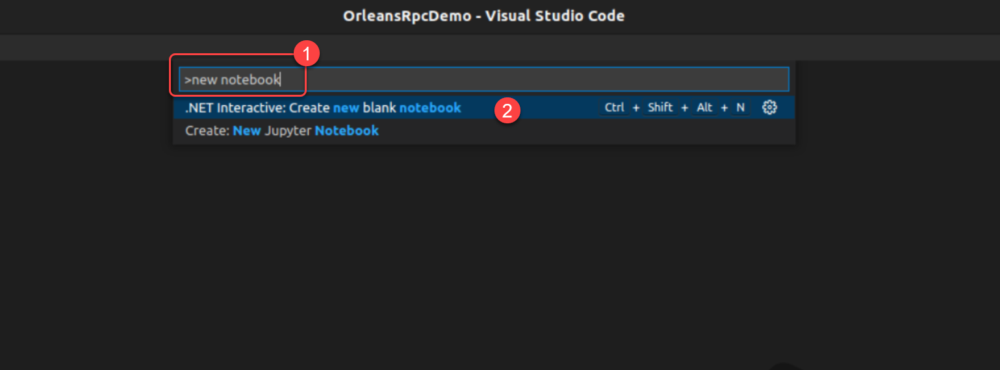
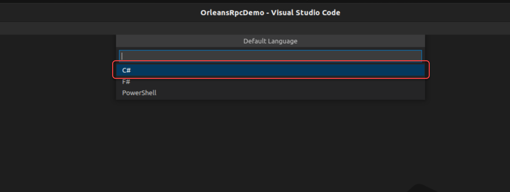
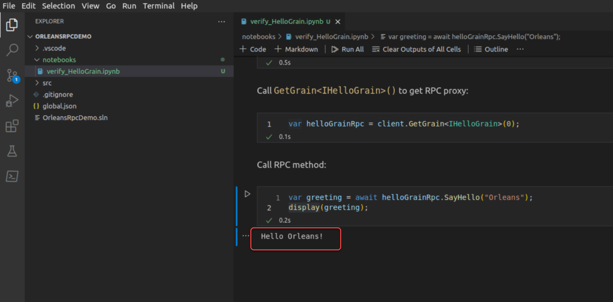

# 使用 .NET Interactive Notebooks 驗證Orleans的Grain實作程式

雖然在Microsoft Orleans的官方說明中有提及一個PowerShell模組可用來撰寫PowerShell的script呼叫Grain的RPC方法來驗證Grain行為，但由於該模組在Orleans v3+以後就沒在維護，而且實際使用上也並不太靈活，今天的文章提供另一個方法，使用.NET Interactive Notebooks來驗證Grain的功能。

## .NET Interactive Notebooks

[.NET Interactive](https://github.com/dotnet/interactive)是一個MIT授權的開源專案，它的目標是提供一個可以在瀏覽器中執行.NET程式碼的環境，並且可以與其他語言的程式碼互動。
目前提供配合 dotnet CLI的命令列工具延伸套件以便讓 .NET Interactive和資料探勘/人工智慧界常用的[Jupyter](https://jupyter.org/)整合，進而能在網頁介面的 *Jupyter Notebook*/*JupyterLab*上除了Python之外，還可以執行C#、F#、PowerShell、JavaScript、HTML、SQL等其他程式語言的程式碼。
如果不想要安裝Jupyter Notebook，.NET Interactive提供一個[Visual Studio Code](https://code.visualstudio.com/)的擴充套件，讓開發者可以在Visual Studio Code中使用.NET Interactive。

接下來示範如何在Visual Studio Code中用.NET Interactive擴充套件提供的功能來驗證Orleans的Grain專案功能。

## 使用 .NET Interactive Notebooks 測試Grain的RPC方法

需要安裝的軟體有：


* [.NET 6 SDK](https://aka.ms/DotNET_SDKs)
* [Visual Studio Code](https://code.visualstudio.com/Download)
* Visual Studio Code的[C#擴充套件](https://marketplace.visualstudio.com/items?itemName=ms-dotnettools.csharp)。
* Visual Studio Code的[.NET Interactive Notebooks](https://marketplace.visualstudio.com/items?itemName=ms-dotnettools.dotnet-interactive-vscode)擴充套件。
* [PowerShell Core (v7.+)](https://learn.microsoft.com/en-us/powershell/)，在目前[Windows, macOS, Linux各種主流版本發佈的作業系統安裝]()都有支援。

### 建立 .NET Interactive Notebooks 並進行測試

#### 在Visual Studio Code建立新的.NET Interactive Notebook檔案的方法：
1. 在Visual Studio Code中，按下 **Ctrl+Shift+P**以便叫出 [*Command Palette*](https://code.visualstudio.com/docs/getstarted/userinterface#_command-palette)命令列，然後輸入`new notebook`以便篩選可用選項：
    
    選擇`.NET Interactive: Create new blank notebook`，然後按下 **Enter**。
2. 選擇要使用的檔案格式，如果需要在非Visual Studio Code的 .NET Interactive這個擴充套件提供的UI中執行，或不需實際執行就能看到內容的場合(如GitHub網頁上)，選擇傳統Jupyter Notebook的 *.ipynb* 格式，然後按 **Enter**：
    
3. 選擇Notebook檔案主要使用的程式語言，此處選 **C#**，然後按 **Enter**。
    
4. 此時空白的Notebook檔案就已建立完成，可以開始撰寫程式碼了。
    

在Notebook檔案中，可以打程式碼按 **Ctrl + Enter** 執行程式的UI部分，以下簡稱『Code Cell』以方便進行說明。
    
#### 使用 .NET Interactive Notebooks 驗證Grain實作專案RPC的功能：

1. 首先在昨天程式碼專案的根目錄，建立一個 *notebooks* 目錄，然後在此目錄內建立一個 .NET Interactive Notebooks檔案。
2. 建立一個『Code Cell』輸入以下內容，以便安裝Nuget套件：
    ```csharp
    #region install Nuget
    //Essential libs for running .NET 6 Generic Host
    #r "nuget: Microsoft.Extensions.Hosting"
    #r "nuget: Microsoft.Extensions.DependencyInjection"

    //Orleans essential dependencies
    #r "nuget: Microsoft.Orleans.Core"
    #r "nuget: Microsoft.Orleans.OrleansRuntime"
    //Orleans silo server runtime essentials
    #r "nuget: Microsoft.Orleans.Server"
    #endregion
   ```
3. 接在後面再建立一個『Code Cell』輸入以下內容，以便引入命名空間(namespace)：
    ```csharp
    using Microsoft.Extensions.Hosting;
    using Orleans;
    using Orleans.Runtime;
    using Orleans.Hosting;
    ```
4. 由於 .NET Interactive的底層C#實作是使用[C# Script(.csx檔)](https://learn.microsoft.com/en-us/archive/msdn-magazine/2016/january/essential-net-csharp-scripting)，不支援自定義命名空間，因此我們定義RPC介面和Grain實作類別不以把程式碼寫在『Code Cell』裡的方式，而是在Code Cell內用PowerShell命令來呼叫dotnet CLI編譯先前已經定義好的Grain實作類別專案：  
    ```powershell
    #!pwsh
    dotnet build ../src/Grains/RpcDemo.Grains.Greeting/RpcDemo.Grains.Greeting.csproj --nologo --verbosity quiet
    ```
    [魔術命令(magic command)](https://github.com/dotnet/interactive/blob/main/docs/magic-commands.md)`#!pwsh`表示Code Cell中該標記之後的內容是使用PowerShell來解譯/執行的命令。
5. 接在後面再建立一個『Code Cell』輸入以下內容，以便載入編譯好的Grain實作類別：
    ```csharp
    #r "../src/Shared/RpcDemo.Interfaces.Hello/bin/Debug/netstandard2.0/RpcDemo.Interfaces.Hello.dll"
    #r "../src/Grains/RpcDemo.Grains.Greeting/bin/Debug/net6.0/RpcDemo.Grains.Greeting.dll"
    ```
6. 接在後面再建立一個『Code Cell』，輸入起始化Orleans Silo的Generic HostBuilder配置程式碼：
    ```csharp
    using RpcDemo.Interfaces.Hello;
    using RpcDemo.Grains.Greeting;
    var hostBuilder = Host.CreateDefaultBuilder()
        .UseOrleans(builder =>
        {
            builder.UseLocalhostClustering();
            builder.ConfigureApplicationParts(parts => {
              parts.AddApplicationPart(typeof(IHelloGrain).Assembly).WithReferences();
              parts.AddApplicationPart(typeof(HelloGrain).Assembly).WithReferences();
            });
        });
    ```
    Microsoft Orleans框架提供一個[`UseOrleans()`](https://learn.microsoft.com/en-us/dotnet/api/microsoft.extensions.hosting.generichostextensions.useorleans)擴充方法來整合至ASP.NET Core的web服務框架/[.NET Generic Host](https://learn.microsoft.com/en-us/aspnet/core/fundamentals/host/generic-host)中執行Silo的服務實體，而餵給該方法的Lambda敘述式參數中，第一行[`UseLocalhostClustering()`](https://learn.microsoft.com/en-us/dotnet/api/orleans.hosting.corehostingextensions.uselocalhostclustering)設定Silo使用本機端測試叢集，第二行呼叫`SiloBuilder`的[`ConfigureApplicationParts()`](https://learn.microsoft.com/en-us/dotnet/api/orleans.hosting.silobuilderextensions.configureapplicationparts)擴充方法來載入`HelloGrain`實作類別的Assembly，並且使用另一個[`WithReferences()`](https://learn.microsoft.com/en-us/dotnet/api/orleans.applicationpartmanagerextensions.withreferences)擴充方法來載入該Grain實作類別的程式中有用到的其他相依類別。
    這裡要注意的是，由於[.NET Interactive底層的Nested Kernel機制](https://github.com/dotnet/interactive/blob/main/docs/kernels-overview.md)，所以在.NET Interactive Notebook中宣告的SiloBuilder除了要宣告載入Grain實作類別之外，RPC介面的Interface型別也得要明確寫出載入宣告。
7. 然後上述的配置無誤的話，呼叫hostBuilder的`Build()`建置方法來產生一個Generic Host實體，並且呼叫StartAsync()方法來啟動承載本機Silo測試叢集的.NET Generic Host服務實體：
    ```csharp
    var host = hostBuilder.Build();
    await host.StartAsync();
    ```
8. 再來我們開始配置Orleans呼叫RPC客戶端的[`ClientBuilder`](https://docs.microsoft.com/en-us/dotnet/api/orleans.clientbuilder)程式碼：
    ```csharp
    var clientBuilder = new ClientBuilder().UseLocalhostClustering();
    clientBuilder.ConfigureApplicationParts(parts=>parts.AddApplicationPart(typeof(IHelloGrain).Assembly));
    ```
    與Server端類似，在Client端也有個[`UseLocalhostClustering()`](https://learn.microsoft.com/en-us/dotnet/api/orleans.clientbuilderextensions.uselocalhostclustering)擴充方法設定連結本機端測試叢集的Silo服務，然後也有相對應載入RPC介面的Assembly的機制。
9. 配置無誤的話，呼叫`Build()`建置方法產生Orleans Client端物件：
   ```csharp
   var client = clientBuilder.Build();
   ```
10. 和Silo連線：
    ```csharp
    await client.Connect();
    ```
11. 建立HelloGrain實體的Client端參考(RPC proxy)：
    ```csharp
    var helloGrainRpc = client.GetGrain<IHelloGrain>(0);
    ```
12. 呼叫Grain的RPC方法：
    ```csharp
    var greeting = await helloGrainRpc.SayHello("Orleans");
    display(greeting);
    ```
    最後一行的 `display()` 是[.NET Interactive Notebook C# Kernel的特殊函式可印出變數值](https://github.com/dotnet/interactive/blob/main/docs/display-output-csharp.md)，執行的結果如下圖所示：
    
13. 呼叫結束後，如果RPC proxy不再使用時，關閉Client端連線：
    ```csharp
    await client.Close();
    ```
14. 最後記得呼叫`StopAsync()`方法來關閉.NET Generic Host服務實體：
    ```csharp
    await host.StopAsync().ConfigureAwait(false);
    ```

以上是使用 .NET Interactive Notebook 來撰寫Orleans的範例，這個範例可直接從GitHub的預覽網頁上看到：  
https://github.com/windperson/OrleansRpcDemo/blob/day07/notebooks/verify_HelloGrain.ipynb

---

明天我們來看看如何寫Orleans的Unit Test專案，來測試Grain實作專案的RPC呼叫。
