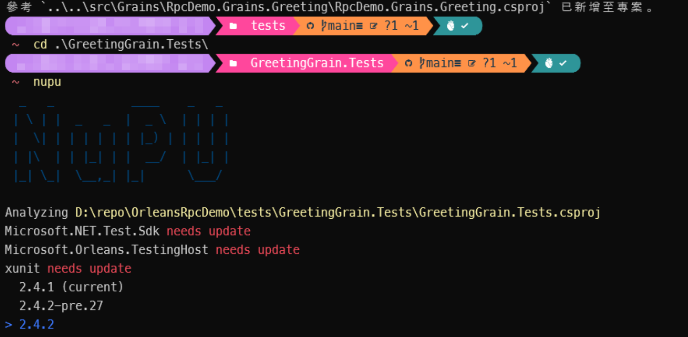
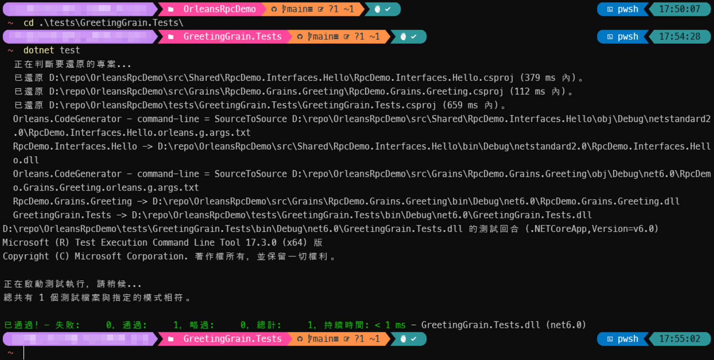

# Grain的呼叫方法與單元測試

## Grain的RPC呼叫方法

Grain實作的非同步RPC方法要被呼叫，分為三種情況：

1.  **從Client端呼叫**：從已連線的[`Orleans Client端`](https://learn.microsoft.com/dotnet/api/orleans.iclusterclient)呼叫`GetGrain<T>()`方法，取得Grain的RPC參考實體，再呼叫Grain的非同步RPC方法。

    ``` csharp
    await client.Connect();
    var grainProxy = client.GetGrain<IMyGrain>(a_identity_value);
    await grainProxy.MyMethod();
    ```

2.  **在Silo（Server端）的Grain內部呼叫自身或其他Grain RPC方法**：Grain類別本身提供一個 [`GrainFactory`](https://learn.microsoft.com/dotnet/api/orleans.grain.grainfactory) 屬性，透過此屬性取得其他Grain的RPC參考實體，就可呼叫Grain的非同步RPC方法。

    ``` csharp
    // inside a grain
    var grainProxy = GrainFactory.GetGrain<IMyGrain>(a_identity_value);
    await grainProxy.MyMethod();
    ```

3.  **在Co-Hosting的Server端呼叫**：以上兩種方法其實都是取得符合 [`IGrainFactory`](https://learn.microsoft.com/dotnet/api/orleans.igrainfactory) 介面的實體，才有辦法呼叫其定義的 `GetGrain<T>()` 方法取得RPC參考實體進行呼叫；在跟ASP.NET Core使用『Co-Hosting』的方式跑Silo時（也就是在ASP.NET Core的HostBuilder配置時呼叫 [`UseOrleans()`](https://learn.microsoft.com/dotnet/api/microsoft.extensions.hosting.generichostextensions.useorleans) 擴充方法），Orleans框架有註冊`IGrainFactory`服務進ASP.NET Core的依賴注入（Dependency Injection, DI）機制，因此，我們可藉由ASP.NET Core的DI機制取得`IGrainFactory`服務實體，接下來就如同上述方式來呼叫Grain的非同步RPC方法：

    ``` csharp
    // After hostBuilder.Build() and .Run() or StartAsync() in Program.cs
    var grainFactory = host.Services.GetRequiredService<IGrainFactory>();
    // Or inside a ASP.NET Core controller
    var grainFactory = HttpContext.RequestServices.GetService<IGrainFactory>();

    // Then we can get grain RPC proxy and call grain RPC method
    var grainProxy = grainFactory.GetGrain<IMyGrain>(a_identity_value);
    await grainProxy.MyMethod();
    ```



## Grain單元測試

要對Grain的RPC方法進行單元測試，Orleans框架有提供一個 [Microsoft.Orleans.TestingHost](https://www.nuget.org/packages/Microsoft.Orleans.TestingHost) Nuget套件，裡面的 [`TestCluster`](https://learn.microsoft.com/dotnet/api/orleans.testinghost.testcluster) 類別，用來模擬單一個Silo的測試環境，可在單元測試專案中，透過`TestCluster`類別的 [`GrainFactory`](https://learn.microsoft.com/dotnet/api/orleans.testinghost.testcluster.grainfactory) 屬性取得Grain的RPC參考實體，進行呼叫Grain的非同步RPC方法。

以下為對我們前天的Grain實作專案 **RpcDemo.Grains.Greeting** 中的 `HelloGrain` 進行單元測試範例：

### 建立單元測試專案

1.  在[昨天進度的原始碼](https://github.com/windperson/OrleansRpcDemo/tree/day07)根目錄中，建立一個 *tests* 目錄，然後在該目錄中建立一個 **GreetingGrain.Tests** 的xUnit單元測試專案：

    ``` shell
    dotnet new xunit --no-restore --name GreetingGrain.Tests
    ```

2.  安裝 [**Microsoft.Orleans.TestingHost**](https://www.nuget.org/packages/Microsoft.Orleans.TestingHost) 套件到這個單元測試專案中：

    ``` powershell
    dotnet add .\GreetingGrain.Tests\GreetingGrain.Tests.csproj package Microsoft.Orleans.TestingHost
    ```

3.  在這個單元測試專案加入對 **RpcDemo.Grains.Greeting** 專案的參考：

    ``` powershell
    dotnet add .\GreetingGrain.Tests\GreetingGrain.Tests.csproj reference ..\src\Grains\RpcDemo.Grains.Greeting\RpcDemo.Grains.Greeting.csproj
    ```

4.  （非必要步驟）更新單元測試專案中所用的Nuget套件，畢竟用 *dotnet new* 指令的專案範本產生出來的專案，原本記載的Nuget套件安裝版本不會是最近的，除了自己去 Nuget.org網站上查找對照的來修改 *.csproj* 檔之外，在命令列也可以使用 [NuPu](https://github.com/ThomasArdal/NuPU) 這個全域工具來引導更新專案中一個一個Nuget套件的版本：  
    （這個工具需要自行額外安裝 [.NET Core 3.1 runtime](https://aka.ms/dotnet-core-applaunch?framework=Microsoft.NETCore.App&framework_version=3.1.0)）  
    

5.  回到程式碼專案的根目錄，將此單元測試專案加入至方案並建立方案資料夾test之內：

    ``` powershell
    dotnet sln add .\tests\GreetingGrain.Tests\GreetingGrain.Tests.csproj --solution-folder tests
    ```

### 撰寫單元測試

1.  用Visual Studio Code打開程式碼專案目錄，將 **UnitTest1.cs** 檔案刪除，新增一個 **HelloGrainTest.cs** 檔案，並將以下程式碼貼上：

    ``` csharp
    using Orleans.TestingHost;
    using RpcDemo.Interfaces.Hello;

    namespace GreetingGrain.Tests;

    public class HelloGrainTest
    {
        [Fact]
        public async Task TestSimpleSayHello()
        {
            //Arrange
            var builder = new TestClusterBuilder();
            builder.AddSiloBuilderConfigurator<TestSiloConfigurator>();
            var cluster = builder.Build();
            await cluster.DeployAsync();

            //Act
            var helloGrain = cluster.GrainFactory.GetGrain<IHelloGrain>(0);
            var greeting = await helloGrain.SayHello("world");

            //Assert
            Assert.Equal("Hello world!", greeting);
        }
    }
    ```

    [`TestCluster`](https://learn.microsoft.com/en-us/dotnet/api/orleans.testinghost.testcluster)需要用 [`TestClusterBuilder`](https://learn.microsoft.com/en-us/dotnet/api/orleans.testinghost.testclusterbuilder) 來建置，而該種Builder在Silo方面的配置程式碼寫法，Orleans的設計是透過實作 [`ISiloConfigurator`](https://learn.microsoft.com/en-us/dotnet/api/orleans.testinghost.isiloconfigurator) 介面的自訂類別(Class)來進行，所以下一個步驟就是建立該類別。

2.  新增一個 **TestSiloConfigurator.cs** 檔案，並將以下程式碼貼上：

    ``` csharp
    using Orleans.Hosting;
    using Orleans.TestingHost;
    namespace GreetingGrain.Tests;
    public class TestSiloConfigurator : ISiloConfigurator
    {
        public void Configure(ISiloBuilder siloBuilder)
        {
          //Do silo configuration here 
        }
    }
    ```

    由於目前要測試的Grain **RpcDemo.Grains.Greeting.HelloGrain** 沒有使用Grain State, Streaming, Reminder等Orleans提供的框架功能，因此現在沒有需要特別的配置設定要做，此類別的SiloBuilder實際配置程式碼 [`void Configure(ISiloBuilder siloBuilder)`](https://learn.microsoft.com/en-us/dotnet/api/orleans.testinghost.isiloconfigurator.configure) 的實作就先留空。

### 執行單元測試

執行單元測試的方法有兩種：

- 在命令列中，切換到單元測試專案的目錄，執行單元測試：

  ``` powershell
  dotnet test
  ```

  

- 使用Visual Studio Code的擴充套件 [.NET Core Test Explorer](https://marketplace.visualstudio.com/items?itemName=formulahendry.dotnet-test-explorer) 其提供的UI中執行單元測試，這個方法需要新增一個在 .vscode 目錄裡的 **settings.json**，紀錄該擴充套件偵測測試專案的路徑：

  ``` json
  {
    "dotnet-test-explorer.testProjectPath": "tests/**/*Tests.@(csproj|vbproj|fsproj)"
  }
  ```

整個完成的範例程式GitHub專案在：<https://github.com/windperson/OrleansRpcDemo/tree/day08>

------------------------------------------------------------------------

明天會繼續介紹Orleans的Grain使用 .NET Core/.NET 5+ 內建的依賴注入外部服務的方法，以及對應的單元測試專案撰寫技巧。
