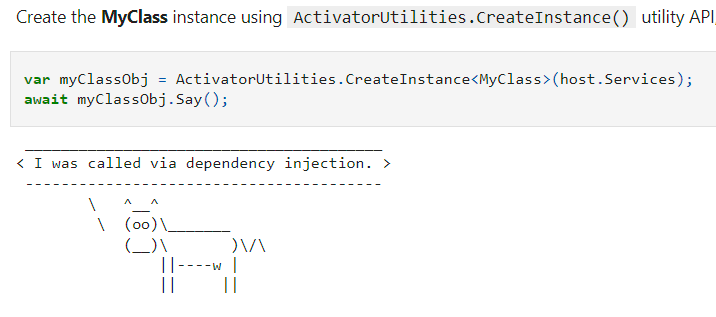
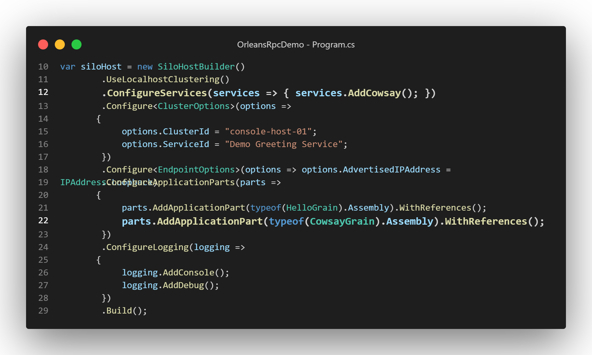
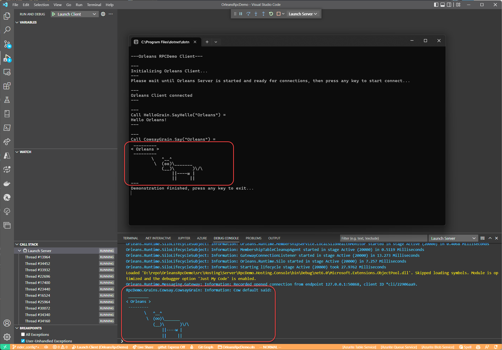

# Orleans的Grain實作專案使用.NET Core/.NET5+的依賴注入(DI)機制

Orleans的Grain實作專案可以使用.NET Core/.NET5的依賴注入(Dependency Injection, DI)機制，這樣可以讓Grain實作專案更容易測試，也可以藉此存取到框架核心的功能，Grain State的功能就需要使用依賴注入。

## 使用依賴注入

以下示範如何使用依賴注入做到：

- Grain實作專案可以使用框架核心的功能，如Grain的實作中寫應用程式Log至Silo的彙整Log記錄上。
- Grain使用第三方提供的函式庫/服務，如[Cowsay](https://github.com/rawsonm88/Cowsay) ，就有提供使用.NET Core/.NET5+依賴注入的方式來使用：  
    
  此函式庫的使用方法可以參考這個[.NET Interactive Notebook範例](https://github.com/windperson/jupyter_notebooks/blob/main/Cowsay_demo.ipynb)。

1.  建立新的示範Grain專案：在[昨天進度的原始碼git專案](https://github.com/windperson/OrleansRpcDemo/tree/day08)，分別建立新的RPC介面專案和Grain實作專案：

    |    路徑    | 專案名稱                        | 專案類型                     |
    |:----------:|:--------------------------------|:-----------------------------|
    | src/Shared | **RpcDemo.Interfaces.ASCIIArt** | .NET 6 類別庫(class library) |
    | src/Grains | **RpcDemo.Grains.Cowsay**       | .NET 6 類別庫(class library) |

    建議將這兩個專案各自加入根目錄的Orleans.sln方案的 Shared以及Grains方案資料夾(Solution Folder)中。

2.  各專案要安裝的Nuget套件：

    <table>
    <colgroup>
    <col style="width: 18%" />
    <col style="width: 81%" />
    </colgroup>
    <thead>
    <tr class="header">
    <th style="text-align: left;">專案名稱</th>
    <th style="text-align: left;">需安裝Nuget套件</th>
    </tr>
    </thead>
    <tbody>
    <tr class="odd">
    <td style="text-align: left;"><strong>RpcDemo.Interfaces.ASCIIArt</strong></td>
    <td style="text-align: left;"><ul>
    <li><a href="https://www.nuget.org/packages/Microsoft.Orleans.Core.Abstractions">Microsoft.Orleans.Core.Abstractions</a></li>
    <li><a href="https://www.nuget.org/packages/Microsoft.Orleans.CodeGenerator.MSBuild">Microsoft.Orleans.CodeGenerator.MSBuild</a></li>
    </ul></td>
    </tr>
    <tr class="even">
    <td style="text-align: left;"><strong>RpcDemo.Grains.Cowsay</strong></td>
    <td style="text-align: left;"><ul>
    <li><a href="https://www.nuget.org/packages/Cowsay.Abstractions">Cowsay.Abstractions</a></li>
    <li><a href="https://www.nuget.org/packages/Microsoft.Extensions.Logging.Abstractions">Microsoft.Extensions.Logging.Abstractions</a></li>
    <li><a href="https://www.nuget.org/packages/Microsoft.Orleans.Core">Microsoft.Orleans.Core</a></li>
    <li><a href="https://www.nuget.org/packages/Microsoft.Orleans.CodeGenerator.MSBuild">Microsoft.Orleans.CodeGenerator.MSBuild</a></li>
    </ul></td>
    </tr>
    <tr class="odd">
    <td style="text-align: left;"><strong>RpcDemo.Hosting.Console</strong></td>
    <td style="text-align: left;"><ul>
    <li><a href="https://www.nuget.org/packages/Cowsay.Extensions.DependencyInjection">Cowsay.Extensions.DependencyInjection</a></li>
    <li><a href="https://www.nuget.org/packages/Microsoft.Extensions.DependencyInjection.Abstractions">Microsoft.Extensions.DependencyInjection.Abstractions</a></li>
    </ul></td>
    </tr>
    </tbody>
    </table>

3.  將 **RpcDemo.Interfaces.ASCIIArt** 專案加入至 **RpcDemo.Grains.Cowsay** 和 **RpcDemo.Client.Console** 的專案對專案參考(project-to-project reference)中。

4.  將 **RpcDemo.Grains.Cowsay** 專案加入至 \*src的 **RpcDemo.Hosting.Console** 這個Silo專案的專案對專案參考(project-to-project reference)中。

5.  在 **RpcDemo.Interfaces.ASCIIArt** 專案中，*Class1.cs* 檔案移除，使用以下內容建立一個新的C#介面檔 **ICowsayGrain.cs** ：

    ``` csharp
    using Orleans;

    namespace RpcDemo.Interfaces.ASCIIArt;

    public interface ICowsayGrain : IGrainWithStringKey
    {
        Task<string> Say(string message);
    }
    ```

6.  在 **RpcDemo.Grains.Cowsay** 專案中，*Class1.cs* 檔案移除，使用以下內容建立一個新的C#檔 **CowsayGrain.cs** ：

    ``` csharp
    using Cowsay.Abstractions;
    using Microsoft.Extensions.Logging;
    using Orleans;
    using RpcDemo.Interfaces.ASCIIArt;

    namespace RpcDemo.Grains.Cowsay;

    public class CowsayGrain : Grain, ICowsayGrain
    {
        private readonly ICattleFarmer _cattleFarmer;
        private string? _grainId;
        private readonly ILogger<CowsayGrain> _logger;

        public CowsayGrain(ICattleFarmer cattleFarmer, ILogger<CowsayGrain> logger)
        {
            _cattleFarmer = cattleFarmer;
            _logger = logger;
        }

        public override Task OnActivateAsync()
        {
            _grainId = this.GetPrimaryKeyString();
            return base.OnActivateAsync();
        }

      //Demo using injected service
      public async Task<string> Say(string message)
      {
          var cattle = await _cattleFarmer.RearCowAsync(_grainId ?? "default");
          var saying = cattle.Say(message);
          _logger.LogInformation("Cow {0} said:\r\n{1}", _grainId, saying);
          return saying;
      }
    }
    ```

7.  修改**RpcDemo.Hosting.Console** Silo專案的 *`Program.cs`* 檔案為以下內容：

    ``` csharp
    using System.Net;
    using Microsoft.Extensions.DependencyInjection;
    using Microsoft.Extensions.Logging;
    using Orleans;
    using Orleans.Configuration;
    using Orleans.Hosting;
    using RpcDemo.Grains.Cowsay;
    using RpcDemo.Grains.Greeting;

    var siloHost = new SiloHostBuilder()
        .ConfigureServices(services => { services.AddCowsay(); })
        .UseLocalhostClustering()
        .Configure<ClusterOptions>(options =>
        {
            options.ClusterId = "console-host-01";
            options.ServiceId = "Demo Greeting Service";
        })
        .Configure<EndpointOptions>(options => options.AdvertisedIPAddress = IPAddress.Loopback)
        .ConfigureApplicationParts(parts =>
        {
            parts.AddApplicationPart(typeof(HelloGrain).Assembly).WithReferences();
            parts.AddApplicationPart(typeof(CowsayGrain).Assembly).WithReferences();
        })
        .ConfigureLogging(logging =>
        {
            logging.AddConsole();
            logging.AddDebug();
        })
        .Build();

    //Tricks to manually wait for Ctrl+C key press
    var waitForProcessShutdown = new ManualResetEvent(false);
    Console.CancelKeyPress += (sender, eventArgs) =>
    {
        eventArgs.Cancel = true;
        waitForProcessShutdown.Set();
    };

    await siloHost.StartAsync();
    Console.WriteLine("===\r\nOrleans Silo started and able to connect,\r\nPress Ctrl+C to shut down when client finish demonstration...\r\n===");
    waitForProcessShutdown.WaitOne();

    Console.WriteLine("Shutting down Silo...");
    await siloHost.StopAsync().ConfigureAwait(false);
    Console.WriteLine("===\r\nSilo shutdown complete, exiting...\r\n===");
    Environment.Exit(0);
    ```

    最主要的差異如下圖：  
      
    第12行增加了 [`ConfigureServices()`](https://learn.microsoft.com/en-us/dotnet/api/orleans.hosting.isilobuilder.configureservices) 方法的呼叫以便註冊依賴注入的元件，還有第22行將 `CowsayGrain` 加入Silo要載入的Grain類別之設定 。

8.  修改**RpcDemo.Client.Console** Client專案的 *`Program.cs`* 檔案為以下內容：

    ``` csharp
    using Orleans;
    using Orleans.Configuration;
    using RpcDemo.Interfaces.ASCIIArt;
    using RpcDemo.Interfaces.Hello;

    using static System.Console;

    WriteLine("\r\n---Orleans RPCDemo Client---");
    WriteLine("\r\n---\r\nInitializing Orleans Client...\r\n---");
    var client = new ClientBuilder()
        .UseLocalhostClustering()
        .Configure<ClusterOptions>(options =>
        {
            options.ClusterId = "console-client-01";
            options.ServiceId = "Demo Greeting Service";
        })
        .ConfigureApplicationParts(parts =>
        {
            parts.AddApplicationPart(typeof(IHelloGrain).Assembly).WithReferences();
            parts.AddApplicationPart(typeof(ICowsayGrain).Assembly).WithReferences();
        })
        .Build();

    WriteLine(
            "Please wait until Orleans Server is started and ready for connections, then press any key to start connect...");
    ReadKey();
    await client.Connect();
    WriteLine("\r\n---\r\nOrleans Client connected\r\n---");

    var helloGrain = client.GetGrain<IHelloGrain>(0);
    var helloResult = await helloGrain.SayHello("Orleans");
    WriteLine($"\r\n---\r\nCall HelloGrain.SayHello(\"Orleans\") =\r\n{helloResult}\r\n---");

    var cowsayGrain = client.GetGrain<ICowsayGrain>("default");
    var cowsayResult = await cowsayGrain.Say("Orleans");
    WriteLine($"\r\n---\r\nCall CowsayGrain.Say(\"Orleans\") =\r\n{cowsayResult}\r\n---");

    WriteLine("Demonstration finished, press any key to exit...");
    ReadKey();

    await client.Close();
    client.Dispose();
    ```

    在客戶端的程式碼也是類似Silo相對應的加了對 `ICowsayGrain` RPC介面的註冊，後續就是取得RPC參考實體和呼叫 `Say()` 方法，並且輸出結果。

實際執行起來的 Demo 畫面如下，可以看到CowsayGrain藉由DI注入的Logger可以把訊息w寫到Silo的Debug Console的Log訊息上：  


## 使用依賴注入Grain專案的單元測試

1.  在程式碼專案根目錄的 *tests* 目錄之下建立一個 **CowsayGrain.Tests** 的xUnit單元測試專案：

    ``` shell
    dotnet new xunit --no-restore --name CowsayGrain.Tests
    ```

2.  將 [**Microsoft.Orleans.TestingHost**](https://www.nuget.org/packages/Microsoft.Orleans.TestingHost) 、 [**ILogger.Moq**](https://www.nuget.org/packages/ILogger.Moq) 、 [**Moq**](https://www.nuget.org/packages/Moq) 這幾個Nuget套件安裝到測試專案中。

3.  將 **RpcDemo.Grains.Cowsay** 專案加入至此測試專案的專案對專案參考(project-to-project reference)中。

4.  將 **CowsayGrain.Tests** 測試專案的預設 *UnitTest1.cs* 檔刪除，新增 **`CowsayGrainTest.cs`** 檔案為以下內容：

    ``` csharp
    using Cowsay.Abstractions;
    using Microsoft.Extensions.DependencyInjection;
    using Microsoft.Extensions.Logging;
    using Moq;
    using Orleans.Hosting;
    using Orleans.TestingHost;
    using RpcDemo.Interfaces.ASCIIArt;
    using SUT = RpcDemo.Grains.Cowsay;

    namespace CowsayGrain.Tests;

    public class CowsayGrainTest
    {
        private static Mock<ILogger<SUT.CowsayGrain>>? _mockLogger;

        private class TestSiloConfigurator : ISiloConfigurator
        {
            public void Configure(ISiloBuilder siloBuilder)
            {
                _mockLogger = new Mock<ILogger<SUT.CowsayGrain>>();
                var mockLoggerFactory = new Mock<ILoggerFactory>();
                mockLoggerFactory
                    .Setup(x => x.CreateLogger(It.IsAny<string>()))
                    .Returns(() => _mockLogger.Object);

                var mockCow = new Mock<ICow>();
                mockCow
                    .Setup(x => x.Say(It.IsAny<string>(), It.IsAny<string>(), It.IsAny<string>(), It.IsAny<int>(),
                        It.IsAny<bool>()))
                    .Returns((string message, string eyes, string tongue, int cols, bool isThought) => message);

                var mockCattleFarmer = new Mock<ICattleFarmer>();
                mockCattleFarmer.Setup(x => x.RearCowAsync(It.IsAny<string>())).ReturnsAsync(mockCow.Object);

                siloBuilder
                    .ConfigureServices(services =>
                    {
                        services.AddSingleton(mockCattleFarmer.Object);
                        services.AddSingleton(mockLoggerFactory.Object);
                    });
            }
        }

        [Fact]
        public async Task SayTest()
        {
            //Arrange
            var builder = new TestClusterBuilder();
            builder.AddSiloBuilderConfigurator<TestSiloConfigurator>();
            var cluster = builder.Build();
            await cluster.DeployAsync();
            const string expected = "Hello Orleans!";

            //Act
            var grain = cluster.GrainFactory.GetGrain<ICowsayGrain>("default");
            var result = await grain.Say(expected);

            //Assert
            Assert.Equal(expected, result);

            _mockLogger!.VerifyLog(logger =>
                logger.LogInformation("Cow {0} said:\r\n{1}", It.IsAny<string>(), It.IsAny<string>()), Times.Exactly(1));
        }
    }
    ```

    [ILogger.Mq](https://github.com/adrianiftode/Moq.ILogger)可換掉實際被依賴注入的Logger實體以便在測試專案內檢驗Grain實作程式碼時是否有呼叫到寫Log的功能，如 `LogInformation()`；而使用[Moq](https://github.com/moq/moq4)來換掉原本Cowsay函式庫的依賴注入介面： `ICattleFarmer` 的 `RearCowAsync()` 方法和 `ICow`物件實體呼叫 `Say()` 方法提供的的結果，以便在測試專案內換掉原本Cowsay函式庫會印出ASCII圖案的行為，直接回傳原本輸入的訊息，方便做Assert驗證。

    而原本Cowsay函式庫提供用來簡化依賴注入註冊樣版程式碼的`service.AddCowSay()`擴充方法，其[內部的實作](https://github.com/rawsonm88/Cowsay/blob/f1f3dd153e3d1c9b951bfeafbcf575ea5d4fdef7/Cowsay.Extensions.DependencyInjection/ServiceCollectionExtensions.cs#L13)就是將`ICattleFarmer`以Singleton生命週期註冊到DI容器中；因此在測試Silo的配置設定程式碼，只需也做同樣的方式註冊預備好的mock物件，就可以在跑測試時換掉原本的依賴注入實體來使用，同樣的技巧也可以換掉 Orleans 一些提供公開介面(Interface)的框架層級物件，以方便測試。

整個完成的範例程式GitHub專案在：https://github.com/windperson/OrleansRpcDemo/tree/day09

------------------------------------------------------------------------

明天將繼續介紹Orleans最特殊的Grain State狀態儲存功能，敬請期待。
