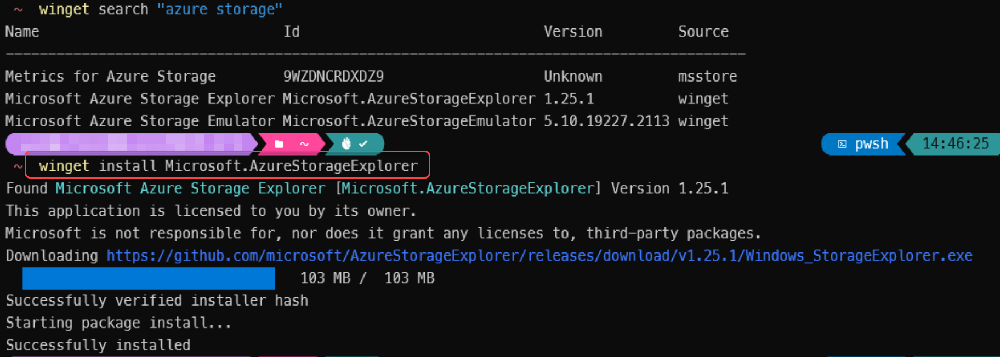
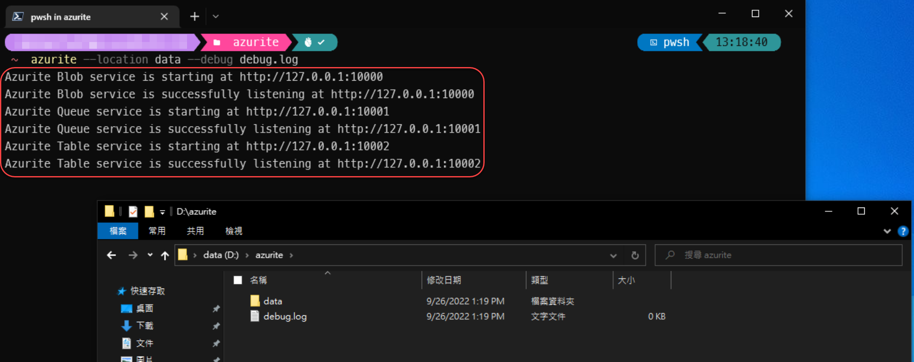
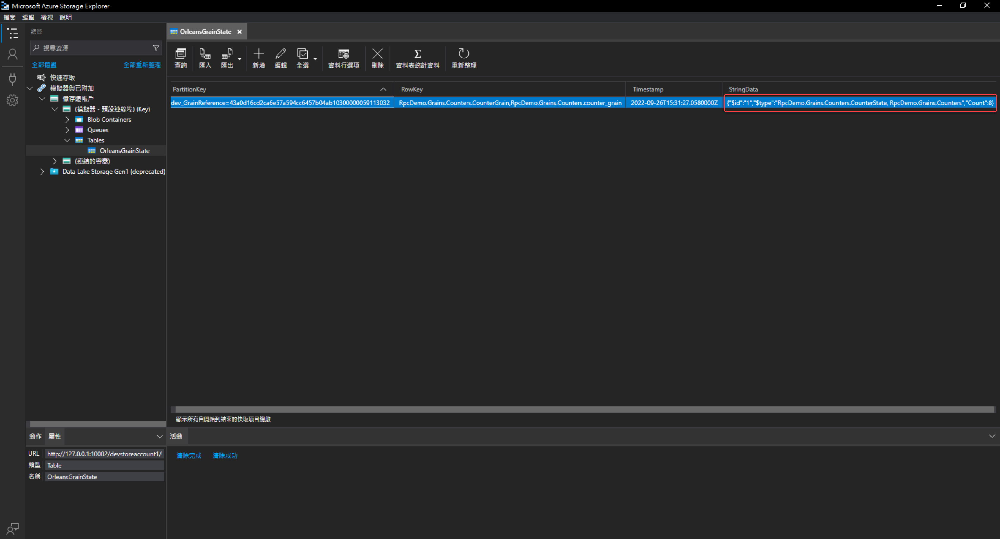

# Grain State狀態資料使用Azure Table/Blob Storage Provider和需注意事項

## 使用Azure Table Storage Provider

### 安裝地端測試用的Azure Storage Emulator

地端測試所需軟體在Windows/Linux/macOS都有支援：
* [Azurite](https://github.com/Azure/Azurite) 指令列工具 - Azure Storage的地端模擬器，提供 Blob/Quue/Table 的模擬服務，建議用[npm方式安裝](https://github.com/Azure/Azurite#npm)，這樣之後需要加掛HTTPS時可支援。  
* [mkcert](https://github.com/FiloSottile/mkcert) - 用來產生本機的CA憑證，並且將其加入到作業系統信任的CA清單中，這樣就可在本機測試HTTPS服務時，使用自簽的HTTPS憑證而不會有憑證信任錯誤警告。
* [Azure Storage Explorer](https://azure.microsoft.com/features/storage-explorer/) - 
如果你要看寫入資料實際長什麼樣子，可以使用這個工具來觀察，以及手動刪除/修改資料。

在Windows環境建議先安裝[scoop](https://scoop.sh/)這個指令列套件管理工具，假如你的系統槽(C:)太小空間已剩不多的話，可以[設定Scoop的安裝路徑到其他磁碟的空間](https://github.com/ScoopInstaller/Scoop/wiki/Quick-Start#installing-scoop-to-custom-directory)然後再安裝scoop。  
再來使用 `scoop install nvm` 指令安裝[nvm for windows](https://github.com/coreybutler/nvm-windows)，然後用 `nvm install lts; nvm use lts`安裝並指定命令列採用LTS版本的nodejs & npm版本，然後繼續用npm方式安裝Azurite指令列工具：
```powershell
npm install -g azurite
```

mkcert也可用scoop安裝：
```powershell
scoop bucket add extras
scoop install mkcert
```

這種安裝方式的好處是不需要系統Admin權限就可使用，且之後不需要這些指令列工具時，直接[反安裝scoop](https://github.com/ScoopInstaller/Scoop/wiki/Uninstalling-Scoop)即可。

Azure Storage Explorer在Windows環境可直接用 `winget install Microsoft.AzureStorageExplorer` 這個 [winget](https://learn.microsoft.com/en-us/windows/package-manager/winget) 指令安裝：


### 啟動Azure Storage Emulator

建立一個空目錄來放置Azure Storage Emulator的資料，例如 `d:\azurite`，然後在這個目錄下執行以下指令來啟動純http的Azure Storage Emulator：
```shell
azurite --location data --debug debug.log
```
當出現如下圖所示的訊息時，表示Azure Storage Emulator已啟動成功，並且在azurite目錄底下會產生 *data* 目錄用來存放模擬服務的資料，需要有訊息記錄log時也可從 *debug.log* 紀錄檔查找：
  
要結束服務，按Ctrl+C即可。

## Silo專案使用Azure Table Storage Provider的步驟

我們用一個新的 ASP.NET Core WebApi專案來示範如何使用Azure Table Storage Provider：

1. 使用指令列在 *src/Hosting/Server* ，建立一個空白 ASP.NET Core專案：
   ```shell
   dotnet new webapi --framework net6.0 --name RpcDemo.Hosting.AspNetCoreWebApi
   ```
   並將此專案加入至根目錄的OrleansDemo.sln方案中
2. 將 **RpcDemo.Grains.Counters** 專案加入至此專案的專案對專案參考(project-to-project reference)中。
3. 安裝 [**Microsoft.Orleans.Server**](https://www.nuget.org/packages/Microsoft.Orleans.Server) 和 [**Microsoft.Orleans.Persistence.AzureStorage**](https://www.nuget.org/packages/Microsoft.Orleans.Persistence.AzureStorage)這兩個Nuget套件。
4. 刪除 **RpcDemo.Hosting.AspNetCoreWebApi** 專案中 *WeatherForecast.cs*, *Controllers/WeatherForecastController.cs* 兩個檔案。
5. 修改 **RpcDemo.Hosting.AspNetCoreWebApi** 專案中 **Program.cs** 檔案為以下內容：
    ```csharp
    using Orleans.Hosting;
   
    var builder = WebApplication.CreateBuilder(args);
    // Add Orleans co-hosting
    builder.Host.UseOrleans(siloBuilder =>
    {
        siloBuilder.UseLocalhostClustering();
        siloBuilder.AddAzureTableGrainStorage(
          name: "demo_counters", options =>
          {
            options.UseJson = true;
            options.ConfigureTableServiceClient("UseDevelopmentStorage=true");
          });
    });

    // Add services to the container.

    builder.Services.AddControllers();
    // Learn more about configuring Swagger/OpenAPI at https://aka.ms/aspnetcore/swashbuckle
    builder.Services.AddEndpointsApiExplorer();
    builder.Services.AddSwaggerGen();

    var app = builder.Build();

    // Configure the HTTP request pipeline.
    if (app.Environment.IsDevelopment())
    {
        app.UseSwagger();
        app.UseSwaggerUI();
    }

    app.UseHttpsRedirection();

    app.UseAuthorization();

    app.MapControllers();

    app.Run();
    ```
   修改的部分為新增了Orleans的 ASP.NET Core co-hosting（使用擴充方法 [`UseOrleans()`](https://learn.microsoft.com/en-us/dotnet/api/microsoft.extensions.hosting.generichostextensions.useorleans)）配置程式碼：
     
   第8行的 [`AddAzureTableGrainStorage()`](https://learn.microsoft.com/en-us/dotnet/api/orleans.hosting.azuretablesilobuilderextensions.addazuretablegrainstorage#orleans-hosting-azuretablesilobuilderextensions-addazuretablegrainstorage(orleans-hosting-isilobuilder-system-string-system-action((orleans-configuration-azuretablestorageoptions)))) 擴充方法是位於 [**Microsoft.Orleans.Persistence.AzureStorage**](https://www.nuget.org/packages/Microsoft.Orleans.Persistence.AzureStorage) Nuget套件之中，第一個 `name` 參數要跟 **RpcDemo.Grains.Counters** 專案內 `CounterGrain` 建構子宣告的Grain State所裝飾的[`PersistentStateAttribute`](https://learn.microsoft.com/en-us/dotnet/api/orleans.runtime.persistentstateattribute) 屬性語法第二個參數的值一致：
   
6. 新增一個 **Controllers/CounterController.cs** 的C#檔案，內容如下：
    ```csharp
    using Microsoft.AspNetCore.Mvc;
    using Orleans;
    using RpcDemo.Interfaces.Counter;

    namespace RpcDemo.Hosting.AspNetCoreWebApi.Controllers;

    [ApiController]
    [Route("[controller]")]
    public class CounterController
    {
        private readonly IGrainFactory _grainFactory;

        public CounterController(IGrainFactory grainFactory)
        {
            _grainFactory = grainFactory;
        }

        [HttpGet]
        public async Task<int> GetCurrent(Guid id)
        {
            var counter = _grainFactory.GetGrain<ICounterGrain>(id);
            return await counter.GetCountAsync();
        }

        [HttpPost]
        public async Task Increment(Guid id)
        {
            var counter = _grainFactory.GetGrain<ICounterGrain>(id);
            await counter.IncrementAsync();
        }

        [HttpPatch]
        public async Task Reset(Guid id)
        {
            var counter = _grainFactory.GetGrain<ICounterGrain>(id);
            await counter.ResetAsync();
        }
    }
    ```
    這個CounterController的程式碼裡，藉由注入Orleans的 [`IGrainFactory`](https://learn.microsoft.com/en-us/dotnet/api/orleans.igrainfactory) 物件，配合Action方法輸入的參數來取得 `ICounterGrain` 的Grain實體，並呼叫其RPC方法來操作記數器（也就是Grain State的資料）。
7. 修改Visual Studio Code的 **.vscode/task.json**，多增加此WebApi專案的建置設定：
    ```json
    {
      "label": "build counter webapi",
      "command": "dotnet",
      "type": "process",
      "args": [
          "build",
          "${workspaceFolder}/src/Hosting/Server/RpcDemo.Hosting.AspNetCoreWebApi/  RpcDemo.Hosting.AspNetCoreWebApi.csproj",
          "/property:GenerateFullPaths=true",
          "/consoleloggerparameters:NoSummary"
      ],
      "problemMatcher": "$msCompile"
   }
   ```
8. 修改Visual Studio Code的 **.vscode/launch.json**，多增加此WebApi專案的偵錯設定：
    ```json
    {
       "name": "Launch WebApi",
       "type": "coreclr",
       "request": "launch",
       "preLaunchTask": "build webapi",
       // If you have changed target frameworks, make sure to update the program path.
       "program": "${workspaceFolder}/src/Hosting/Server/RpcDemo.Hosting.AspNetCoreWebApi/bin/Debug/net6.0/RpcDemo.Hosting.AspNetCoreWebApi.dll",
       "args": [],
       "cwd": "${workspaceFolder}",
       "stopAtEntry": false,
       // Enable launching a web browser when ASP.NET Core starts. For more information: https://aka.ms/VSCode-CS-LaunchJson-WebBrowser
       "serverReadyAction": {
          "action": "openExternally",
          "pattern": "\\bNow listening on:\\s+https://\\S+:([0-9]+)",
          "uriFormat": "https://localhost:%s/swagger/index.html"
        },
        "env": {
                "ASPNETCORE_ENVIRONMENT": "Development"
        },
        "console": "integratedTerminal"
    } 
    ```
然後開一個作業系統的命令列視窗啟動 Azurite，然後在Visual Studio Code的 Run And Debug 功能，選取 "Launch WebApi"，讓WebApi專案跑起來，跳出的Swagger網頁可以進行手動呼叫WebApi進行測試：  
（可使用[Online GUID Generator](https://www.uuidgenerator.net/guid)來產生測試用GUID字串值）
  
呼叫幾次使記數器增加或重設的WebApi之後，用Azure Storage Explorer來查看記數器的Grain State資料：


經過一些實際WebApi呼叫的操作後，可以發現有兩個注意點：
* Grain狀態資料會和其他輔助識別的資料（例如狀態Data Object的型別名稱）一起序列化，成為Azure Table Storage一筆資料的單一個欄位（由於先前在配置Azure Table的Grain Storage時指定 [`AzureTableStorageOptions`](https://learn.microsoft.com/en-us/dotnet/api/orleans.configuration.azuretablestorageoptions)的 `UseJson = true`，所以才會序列化為JSON字串以便於觀察）；所以，雖然理論上Orleans框架沒有限制Grain State的定義狀態資料的最大空間限制，但實際上還是會被其Silo的Persistence Storage Provider使用的儲存資料庫機制所限制。
* Grain狀態資料存取動作，假如一直只有讀取而沒有寫入改變的話，可能會就一直使用狀態Data Object宣告時所定義的預設值，而不會實際產生Azure Table Storage的一筆資料紀錄上去。

## Silo專案使用Azure Blob Storage Provider的步驟

基本上跟使用Azure Table Storage Provider的步驟一樣，只需要把原本呼叫 `AddAzureTableGrainStorage()` 的Azure Table Storage Provider配置程式碼改成呼叫 [`AddAzureBlobGrainStorage()`](https://learn.microsoft.com/en-us/dotnet/api/orleans.hosting.azureblobsilobuilderextensions.addazureblobgrainstorage) 指定用Azure Blob Storage Provider即可：
```csharp
siloBuilder.AddAzureBlobGrainStorage(
    name: "demo_counters", options =>
    {
        options.UseJson = false;
        options.ConfigureBlobServiceClient("UseDevelopmentStorage=true");
    });
```
這邊使用 `UseJson = false`，然後跑起來之後嘗試幾個WebApi呼叫讓CounterGrain存資料至Azure Blob之後，用Azure Storage Explorer觀察：
  
可以看到預設的Azure Blob Storage Provider的行為是序列化成二進位資料之後，再存為Blob檔案內容，可以有效縮小儲存Grain State所需空間。


整個完成的範例程式GitHub專案在：https://github.com/windperson/OrleansRpcDemo/tree/day11

---

明天會繼續介紹當正式環境的雲端Azure Table/Blob Storage使用[Managed Identity](https://learn.microsoft.com/en-us/azure/active-directory/managed-identities-azure-resources/overview)控制存取權限保護資源時，Orleans 的Silo要如何設定Table/Blob Storage Provider。
