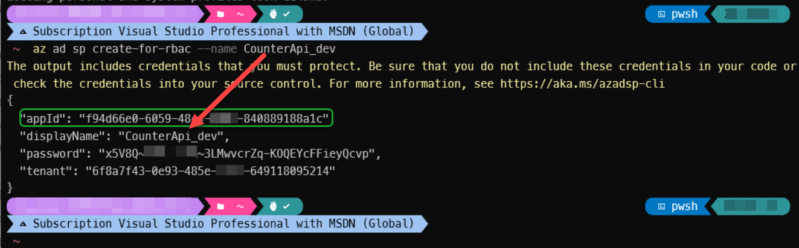
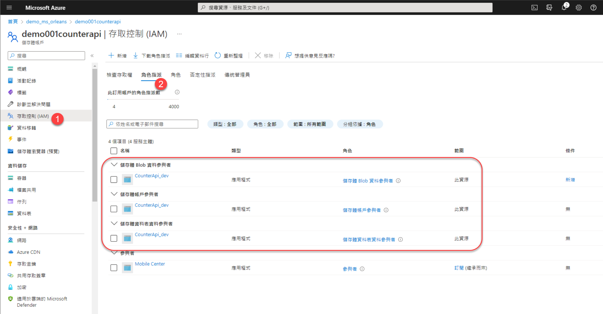
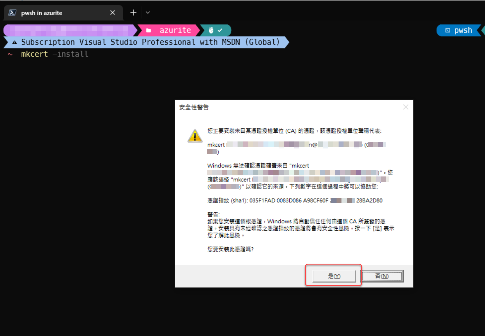
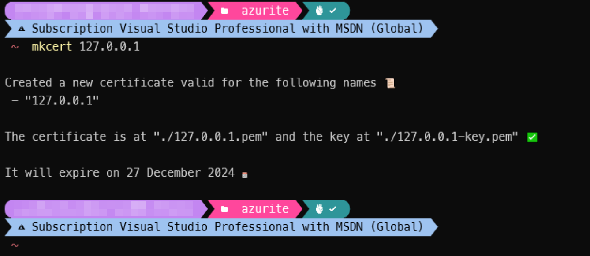
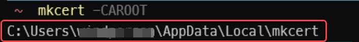
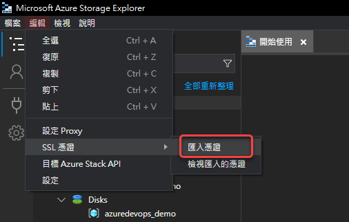
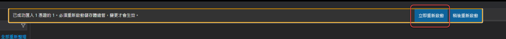
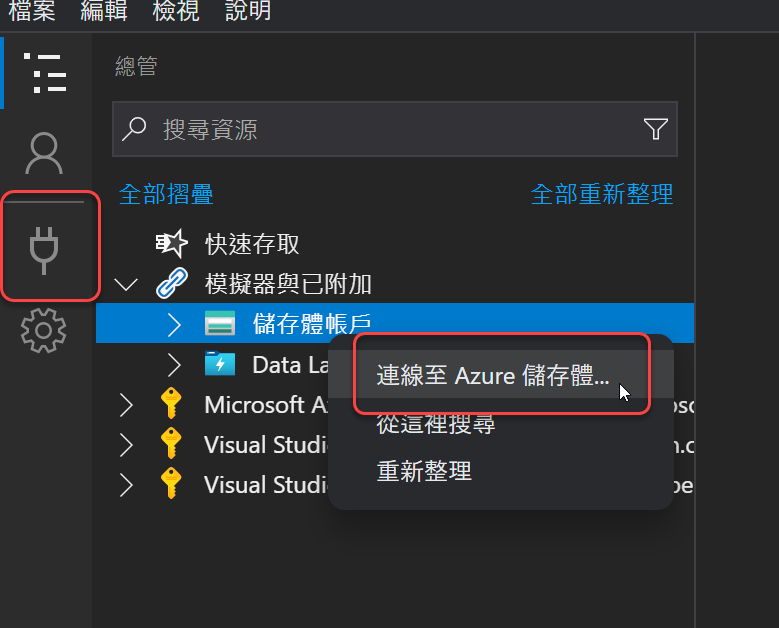
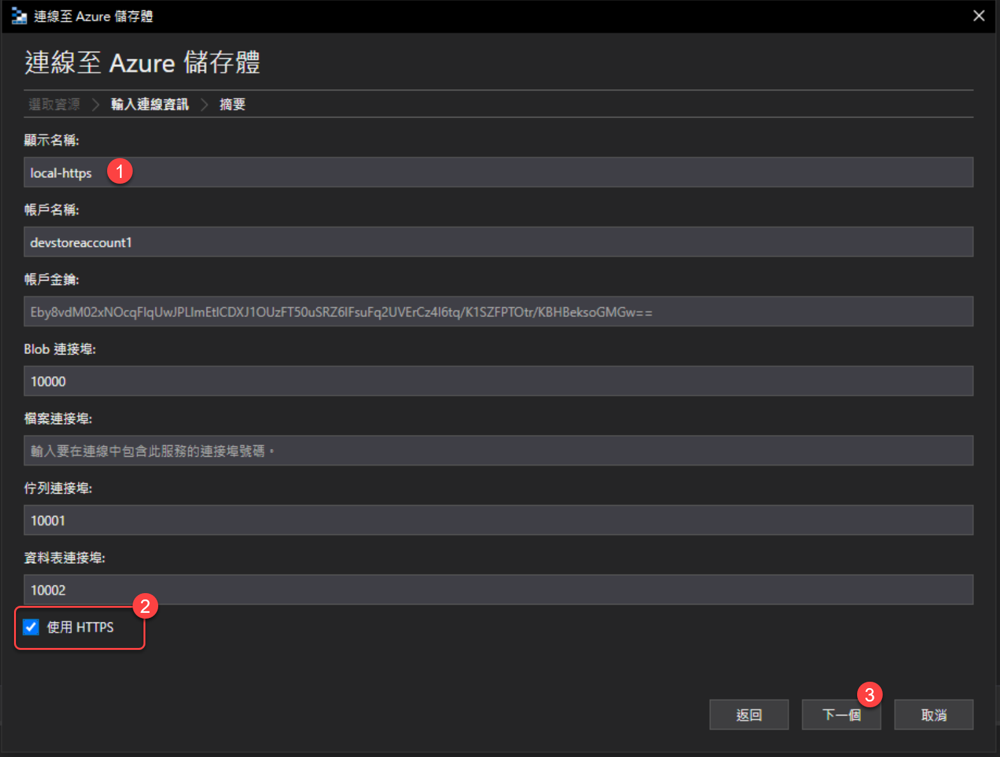
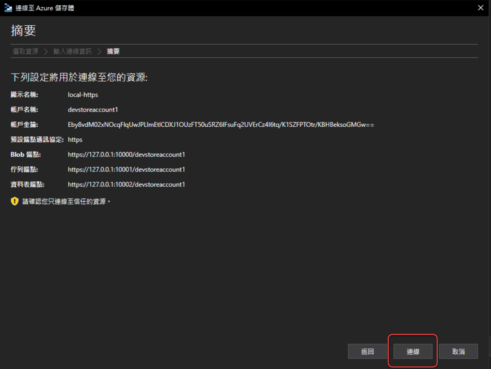

# Grain State設定使用Azure受控識別(Managed Identity)的Blob/Table Storage

## Azure受控識別(Managed Identity)介紹

受控識別(Managed Identity)是Azure雲端用來取代傳統連線字串(Connection String)裡寫使用者ID/密碼或API Key之類的雲端服務授權(Authorization)方式：先建立「受控識別(Managed Identity)」的雲端資源，然後該「受控識別」綁定至一個或多個Azure服務，當該Azure服務需要存取其他Azure服務時，使用這個受控識別的權限來存取其他資源。

使用受控識別的雲端架構時，當某個應用程式要存取保護的Azure資源時，其連線設定，只需指定服務所在的URL和Azure受控識別的Client ID，而不需要寫明密碼/API Key，這樣就可以避免被盜用的風險，也不需要在程式中寫入這些資訊密碼，避免在基礎Infra運營設定或程式撰寫時用了過高的存取權限，讓運營在Azure雲上的後端系統更加安全。

受控識別的Azure服務分為系統指派的身分識別(System Assigned Managed Identity)和使用者指派的身分識別(User Assigned Managed Identity)這兩種，後者為開放給開發者自行設計指派之用。

要在非雲端的環境(例如dev team開發者的開發機上)使用已有受控識別設定過存取權限的Azure服務時，得在Azure Active Directory建立一個服務主體(Service Principal)，該服務主體再於需要存取的Azure服務中設定正確的權限角色(Role)。如此就能在應用程式中，使用和雲端環境中套用受控識別相同的配置程式碼來存取該Azure服務資源（不過在非雲端環境執行應用程式時時要手動用環境變數指定服務主體建立時的Client ID）。  
這樣能運作的因為是，受控識別(Managed Identity)其實組成上就是Azure Active Directory的企業應用程式(Enterprise Application)加上由該企業應用程式負責維護/更新的服務主體(Service Principal)所組成，因此可以使用相同的認證函式庫和呼叫程式碼來存取Azure資源。

.NET 應用程式使用受控識別存取Azure資源的方式，可以參考[官方教學](https://learn.microsoft.com/en-us/dotnet/azure/sdk/authentication-azure-hosted-app)和[這個 Azure .NET SDK的說明](https://github.com/Azure/azure-sdk-for-net/tree/main/sdk/identity/Azure.Identity#specifying-a-user-assigned-managed-identity-with-the-defaultazurecredential)。

以下介紹如何建立有User Assigned Managed Identity保護的Blob/Table Storage。

### 建立 Azure Active Directory 的應用程式與服務主體(Service Principal)

使用[Azure CLI](https://learn.microsoft.com/en-us/cli/azure/)，建立一個Azure Active Directory的應用程式，並取得該應用程式的Client ID：
```shell
az ad sp create-for-rbac --name CounterApi_dev
```
執行之後，會得到類似以下的輸出：

其中 **appId** 就是之後會在程式中需要的Client ID。而 **password** 只會在這裡顯示一次，之後就無法再查看，所以要記得把它存起來。

### 建立雲端的Azure Blob Storage service服務
使用[Azure CLI](https://learn.microsoft.com/en-us/cli/azure/)，建立一個Azure Storage Account服務：  
（此處的範例參數：儲存帳戶為 **demo001counterapi**，資源群組為 **demo_ms_orleans**）
```shell
az storage account create --name demo001counterapi --resource-group demo_ms_orleans --sku Standard_LRS
```
執行成功之後的json輸出會有類似：
```json
"id": "/subscriptions/744c067b-5cfa-aabb-ooxx-8e83cd838d22/resourceGroups/demo_ms_orleans/providers/Microsoft.Storage/storageAccounts/demo001counterapi",

//other properties

"primaryEndpoints": {
    "blob": "https:// blob serving url...",
    "table": "https:// table serving url...",
    //other endpoints
},
```
的key-value值，這些值會在後續的程式碼設定和Azure CLI建立服務存取權限的指令中用到。

然後綁定Azure Active Directory的服務主體(Service Principal)到Azure Storage Account服務：
```shell
az role assignment create --assignee $my_service_principal_appId --role "Storage Account Contributor" --scope $my_storage_account_id;
az role assignment create --assignee $my_service_principal_appId --role "Storage Blob Data Contributor" --scope $my_storage_account_id;
az role assignment create --assignee $my_service_principal_appId --role "Storage Table Data Contributor" --scope $my_storage_account_id;
```
上面的三個Azure CLI指令中， **$my_service_principal_appId** 是前面建立的Azure Active Directory的應用程式的Client ID值，**$my_storage_account_id** 是剛剛建立的Azure Storage Account服務的id值。

設定好權限的Azure Storage Account服務，就可在Azure Portal中看到以下畫面：


### 修改Silo專案中BlobClient, TableClient的建立方式

1. 從[昨天進度的原始碼git專案](https://github.com/windperson/OrleansRpcDemo/tree/day11)，將 src/Hosting/Server目錄內 **RpcDemo.Hosting.AspNetCoreWebApi** 專案，安裝 [**Azure.Identity**](https://www.nuget.org/packages/Azure.Identity) Nuget套件。
2. 將原本的 **BlobClient** 建立方式，改為額外加入 **DefaultAzureCredential** 參數的重載(overload)方法呼叫：
    ```csharp 
    using Azure.Identity;
    using Orleans.Hosting;

    var builder = WebApplication.CreateBuilder(args);
    // Add Orleans co-hosting
    builder.Host.UseOrleans(siloBuilder =>
    {
        siloBuilder.UseLocalhostClustering();
        siloBuilder.AddAzureBlobGrainStorage(
            name: "demo_counters", options =>
            {
                options.ConfigureBlobServiceClient(new Uri("Blob serving url just created..."), new DefaultAzureCredential());
            });
    });

    /*
    other builder & app code...
    */
    ```
    上面程式碼中的 `new Url(...)`，是剛剛建立完Azure Storage Account後看到JSON輸出結果的 **primaryEndpoints** 節區內 **blob** 的值。
3. 將Visual Stuido Code的啟動設定檔 .vscode/launch.json 中原本 `"name": "Launch WebApi"` 區塊的環境變數設定，修改如下：
    ```json
    "env": {
        "ASPNETCORE_ENVIRONMENT": "Development",
        "AZURE_CLIENT_ID": "Azure Service Principal appId",
        "AZURE_CLIENT_SECRET": "Azure Service Principal Password",
        "AZURE_TENANT_ID":"Azure Active Directory Tenant Id"
    },
    ```
    **AZURE_CLIENT_ID"** 與 **AZURE_CLIENT_SECRET** 是剛剛建立的Azure Service Principal的appId與password值，**AZURE_TENANT_ID** 則是Azure Active Directory的Tenant Id值。

此時在Visual Studio Code的 Run And Debug 功能，選取 "Launch WebApi"，讓WebApi專案跑起來，跳出的Swagger網頁可以在沒有地端的Azure Storage Emulator服務的情況下進行手動呼叫WebApi進行測試。

而對應使用 **TableClient** 建立方式，也是類似的修改方式：
```csharp
    using Azure.Identity;
    using Orleans.Hosting;

    var builder = WebApplication.CreateBuilder(args);
    // Add Orleans co-hosting
    builder.Host.UseOrleans(siloBuilder =>
    {
        siloBuilder.UseLocalhostClustering();
        siloBuilder.AddAzureTableGrainStorage(
            name: "demo_counters", options =>
            {
                options.ConfigureTableServiceClient(new Uri("Blob serving url just created..."), new DefaultAzureCredential());
            });
    });

    /*
    other builder & app code...
    */

```

同樣的程式碼，要改接地端的測試用Azurite服務，也是可以的，不過Azurite需要設定啟用HTTPS。

### Azurite 啟用HTTPS

使用昨天介紹的 [mkcert](https://github.com/FiloSottile/mkcert) 命令列程式，產生一組本機的憑證，並將憑證安裝到本機的信任憑證庫(Certificate Store)：
```shell
mkcert -install
```
假如有跳出是否要信任憑證的話，選擇 **是(Y)**：

安裝完後如下圖：


然後將工作目錄切換到azurite的目錄（ex: D:\azurite），產生一組Azurite用的本機憑證檔：
```shell
mkcert 127.0.0.1
```


然後以下列指令啟動Azurite，就會是以HTTPS的方式提供storage emulator服務：
```shell
azurite --location data --debug debug.log --oauth basic --cert 127.0.0.1.pem --key 127.0.0.1-key.pem
```

這個時候如果要用Azure Storage Explorer來連線Azurite，需要匯入剛剛使用mkcert產生的本機憑證檔，作法如下：

1. 首先以 `mkcert -CAROOT` 指令取得mkcert產生之根憑證檔所在的目錄位置：
    
2. 使用Azure Storage Explorer 主畫面的 [**編輯**]/[**SSL憑證**]/[**匯入憑證**]* 功能：
      
    匯入第一個步驟目錄中的 **rootCA.pem** 檔案之後，重啟Azure Storage Explorer：
    
3. 依照上一個步驟的方法，匯入先前在Azurite目錄中的 **127.0.0.1.pem** 檔案，然後重啟Azure Storage Explorer。
4. 在Azure Storage Explorer主畫面的左側工具欄連線按鈕或在儲存體帳戶樹狀列表按右鍵選 [**連線至Azure儲存體...**]：
    
5. 在設定連線畫面上取個自訂的顯示名稱，然後最底下的 **使用HTTPS** 選項打勾，然後按 [**下一步**] 按鈕：
    
6. 按 [**連線**] 按鈕，結束設定：
    

之後在程式碼中只需要將Url改成地端Azurite emulator的位置，就可以使用了：
```csharp 
using Azure.Identity;
using Orleans.Hosting;

var builder = WebApplication.CreateBuilder(args);
// Add Orleans co-hosting
builder.Host.UseOrleans(siloBuilder =>
{
    siloBuilder.UseLocalhostClustering();
    siloBuilder.AddAzureBlobGrainStorage(
        name: "demo_counters", options =>
        {
            options.ConfigureBlobServiceClient(new Uri("https://127.0.0.1:10000/devstoreaccount1"), new DefaultAzureCredential());
        });
});

/*
other builder & app code...
*/
```
使用Table Storage的配置程式碼：
```csharp
using Azure.Identity;
using Orleans.Hosting;

var builder = WebApplication.CreateBuilder(args);
// Add Orleans co-hosting
builder.Host.UseOrleans(siloBuilder =>
{
    siloBuilder.UseLocalhostClustering();
    siloBuilder.AddAzureTableGrainStorage(
        name: "demo_counters", options =>
        {
            options.ConfigureTableServiceClient(new Uri("https://127.0.0.1:10002/devstoreaccount1"), new DefaultAzureCredential());
        });
 });

/*
other builder & app code...
*/
```            

---

明天再來介紹使用SQL資料庫儲存Grain State的方法。
