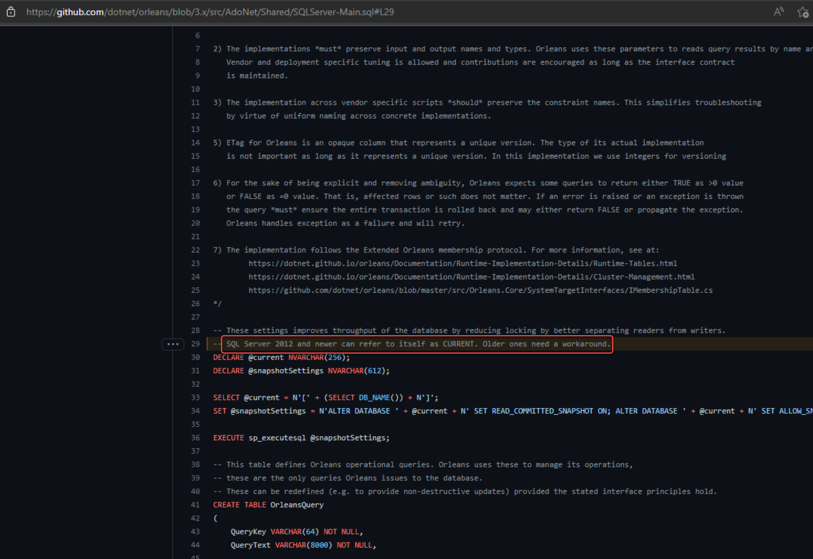
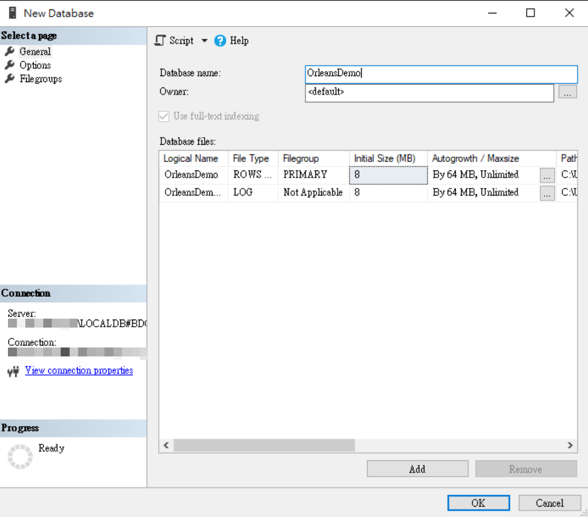
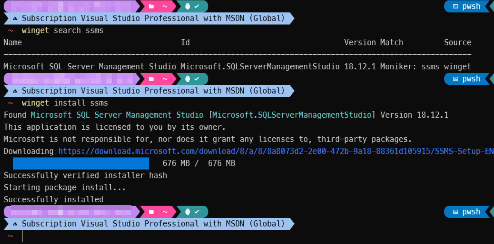
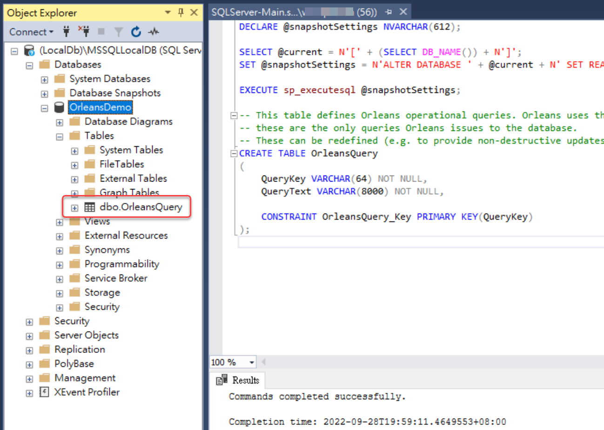

# Grain State狀態資料使用SQL資料庫儲存(ADO.NET)

Orleans官方提供的Nuget套件 [**Microsoft.Orleans.Persistence.AdoNet**](https://www.nuget.org/packages/Microsoft.Orleans.Persistence.AdoNet)，讓 MS-SQL / MySQL / MariaDB / PostgreSQL / Oracle 等SQL-base的資料庫以 [ADO.NET](https://learn.microsoft.com/en-us/dotnet/framework/data/adonet/ado-net-overview) 資料庫連線技術儲存Grain State的資料。

不過資料庫其儲存用Table Schema和資料操作之Store Procedure，需要自己手動執行一些[官方提供的SQL script指令檔](https://learn.microsoft.com/en-us/dotnet/orleans/host/configuration-guide/adonet-configuration)建立，這些script檔案位於官方GitHub檔案庫的 **src/AdoNet** 目錄之下。

以下使用MS-SQL資料庫的地端開發用[LocalDB](https://learn.microsoft.com/en-us/sql/database-engine/configure-windows/sql-server-express-localdb)做示範。

## 建立資料庫資料表以便儲存Grain State

官方提供的SQL script指令檔分為兩類，在 *Main* 的是用於建立基礎資料表/Store Procedure，在 *Persistance* 是建立用於Grain State Persistance，儲存Grain State狀態資料表相關的。

目前 Orleans 3.x對於MS-SQL Server的系統需求是 SQL Server 2012 以上，詳情可以直接看官方Github的原始檔內容註釋：
[https://github.com/dotnet/orleans/blob/3.x/src/AdoNet/Shared/SQLServer-Main.sql#L29](https://github.com/dotnet/orleans/blob/3.x/src/AdoNet/Shared/SQLServer-Main.sql#L29)：


建立LocalDB資料庫的步驟如下：

1. 以 [SQL Server Management Studio (SSMS)](https://learn.microsoft.com/en-us/sql/ssms/sql-server-management-studio-ssms) 連線到LocalDB的SQL Server資料庫，並建立一個新的資料庫，例如：OrleansDemo
   
   SSMS可以使用winget的指令列方式安裝：
   ```powershell
   winget install --id  Microsoft.SQLServerManagementStudio
   ```
   
2. 下載 [官方提供SQL script的 **Main scripts**](https://learn.microsoft.com/en-us/dotnet/orleans/host/configuration-guide/adonet-configuration#main-scripts)，並執行，以建立基礎Orleans指令動作資料表(**dbo.OrleansQuery**)：
   
   **注意**：此script在執行時會需要沒有其他正在連線操作資料的情況，建議先確定沒有其他人/程式正在存取該資料庫，再執行此script。
3. 下載 [官方提供SQL script的 **Persistance**](https://learn.microsoft.com/en-us/dotnet/orleans/host/configuration-guide/adonet-configuration#persistence)，並執行，以建立基礎Orleans指令動作資料表(**dbo.OrleansStorage**)：
   

## 使用ADO.NET Storage Provider儲存Grain State

1. 在[前天進度的原始碼git專案](https://github.com/windperson/OrleansRpcDemo/tree/day11)，將 [**Microsoft.Orleans.Persistence.AdoNet**](https://www.nuget.org/packages/Microsoft.Orleans.Persistence.AdoNet) 和 [**System.Data.SqlClient**](https://www.nuget.org/packages/System.Data.SqlClient) 這兩個Nuget套件安裝到 *src/Hosting/Server* 路徑下的 **RpcDemo.Hosting.AspNetCoreWebApi** 專案，並將原本安裝的 [Microsoft.Orleans.Persistence.AzureStorage](https://www.nuget.org/packages/Microsoft.Orleans.Persistence.AzureStorage) 套件移除。
2. 將**RpcDemo.Hosting.AspNetCoreWebApi** 專案中的 *Program.cs* 檔案內容修改如下：
   ```csharp
   using Orleans.Hosting;

   var builder = WebApplication.CreateBuilder(args);
   // Add Orleans co-hosting
   builder.Host.UseOrleans(siloBuilder =>
   {
      siloBuilder.UseLocalhostClustering();
      siloBuilder.AddAdoNetGrainStorage("demo_counters", options =>
      {
         options.Invariant = "System.Data.SqlClient";
         options.ConnectionString = "Server=(localdb)\\mssqllocaldb;Database=OrleansDemo;Trusted_Connection=True;";
         options.UseJsonFormat = true;
      });

   });

    /*
    other builder & app code...
    */
   ```

然後就可以跟先前使用Azure Table/Blob Storage的版本一樣跑起來，使用WebAPI專案的Swagger UI來測試Grain State的讀寫。
   

### 建立測試用Silo

```shell
dotnet new blazorserver --framework net6.0 --no-restore --name RpcDemo.Hosting.BlazorServer
```

