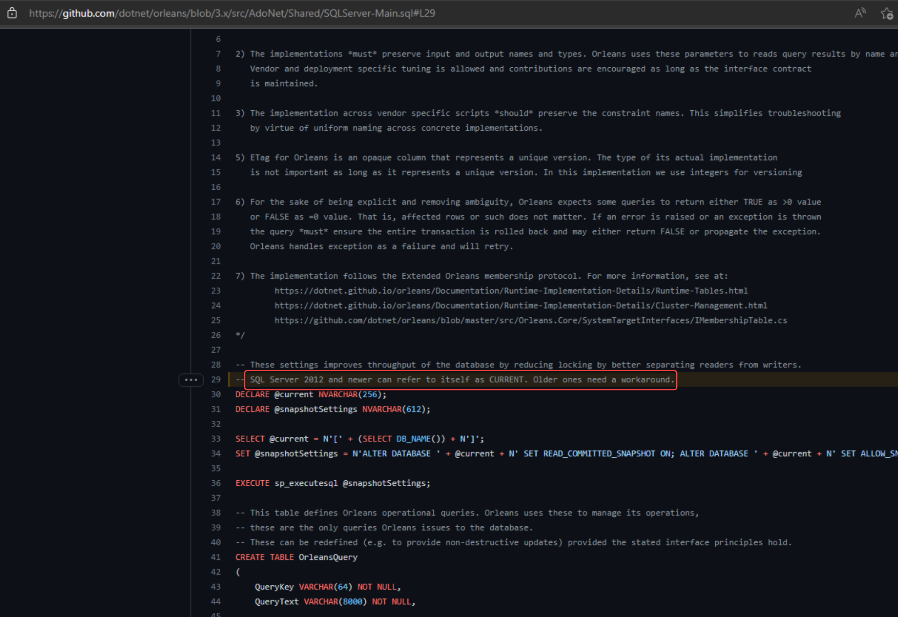
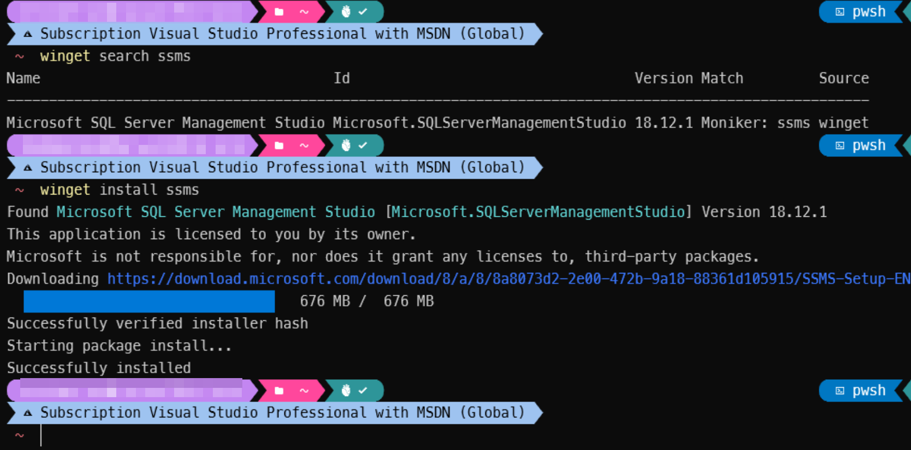
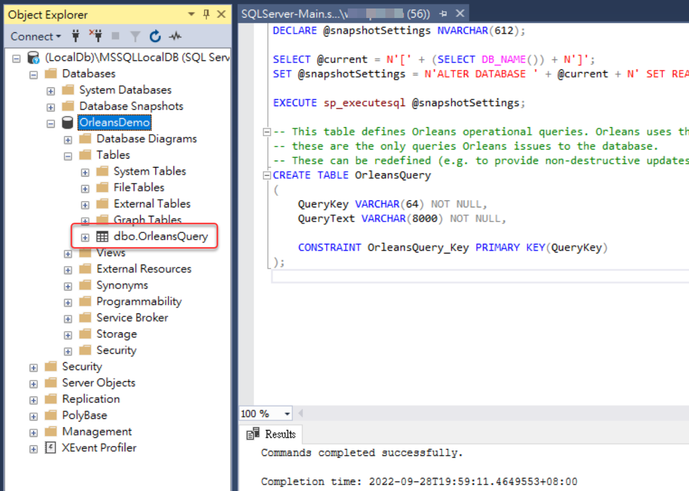
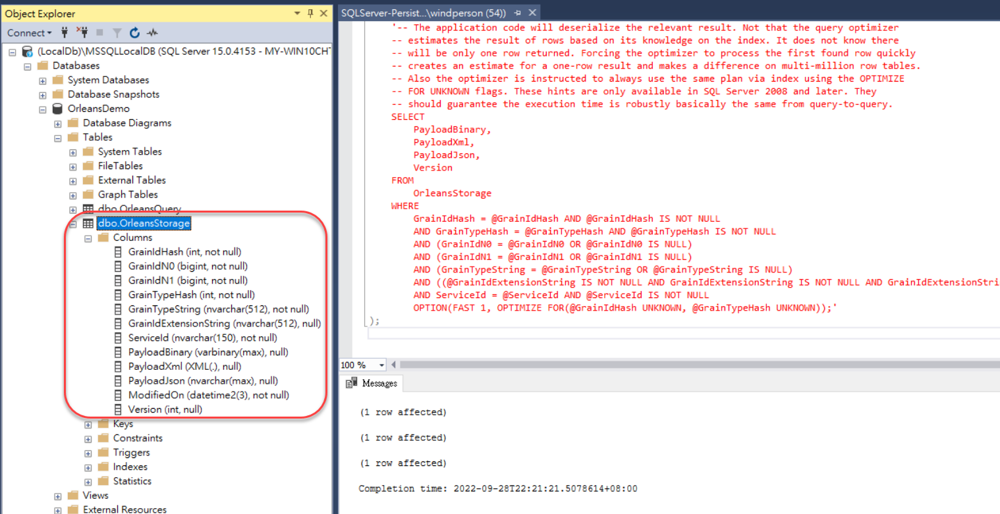

# Grain State狀態資料使用SQL資料庫儲存(ADO.NET)

Orleans官方提供的Nuget套件 [**Microsoft.Orleans.Persistence.AdoNet**](https://www.nuget.org/packages/Microsoft.Orleans.Persistence.AdoNet)，讓 MS-SQL / MySQL / MariaDB / PostgreSQL / Oracle 等SQL-base的資料庫以 [ADO.NET](https://learn.microsoft.com/dotnet/framework/data/adonet/ado-net-overview) 資料庫連線技術儲存Grain State的資料。

不過資料庫其儲存用Table Schema和資料操作之Store Procedure，需要自己手動執行一些[官方提供的SQL script指令檔](https://learn.microsoft.com/dotnet/orleans/host/configuration-guide/adonet-configuration)建立，這些script檔案位於官方GitHub檔案庫的 **src/AdoNet** 目錄之下。

以下使用MS-SQL資料庫的地端開發用[LocalDB](https://learn.microsoft.com/sql/database-engine/configure-windows/sql-server-express-localdb)做示範。

## 建立資料庫資料表以便儲存Grain State

官方提供的SQL script指令檔分為兩類，在 *Main* 的是用於建立基礎資料表以及相關的DB Store Procedure，在 *Persistance* 是建立用於Grain State Persistance，儲存Grain State狀態資料表相關的。

目前 Orleans 3.x對於MS-SQL Server的系統需求是 SQL Server 2012 以上，詳情可以直接看官方Github的原始檔內容註釋（<https://github.com/dotnet/orleans/blob/3.x/src/AdoNet/Shared/SQLServer-Main.sql#L29>）：  


建立LocalDB資料庫的步驟如下：

1.  以 [SQL Server Management Studio (SSMS)](https://learn.microsoft.com/sql/ssms/sql-server-management-studio-ssms) 連線到LocalDB的SQL Server資料庫，並建立一個新的資料庫，例如：OrleansDemo

      
    SSMS可以使用winget的指令列方式安裝：

    ``` powershell
    winget install --id  Microsoft.SQLServerManagementStudio
    ```

    

2.  下載 [官方提供SQL script的 **Main script**](https://learn.microsoft.com/dotnet/orleans/host/configuration-guide/adonet-configuration#main-scripts)：選SQL Server的script檔（**SQLServer-Main.sql**），並執行，以建立基礎Orleans指令動作資料表(**dbo.OrleansQuery**)：

      
    **注意**：此script在執行時會需要沒有其他正在連線操作資料的情況，建議先確定沒有其他人/程式正在存取該資料庫，再執行此script。

3.  下載 [官方提供SQL script的 **Persistance script**](https://learn.microsoft.com/dotnet/orleans/host/configuration-guide/adonet-configuration#persistence)：選SQL Server的script檔（SQLServer-Persistence.sql），並執行，以建立儲存Orleans Grain State用資料表(**dbo.OrleansStorage**)：

    



## 使用ADO.NET Storage Provider儲存Grain State

1.  在[前天進度的原始碼git專案](https://github.com/windperson/OrleansRpcDemo/tree/day11)，將 [**Microsoft.Orleans.Persistence.AdoNet**](https://www.nuget.org/packages/Microsoft.Orleans.Persistence.AdoNet) 和 [**System.Data.SqlClient**](https://www.nuget.org/packages/System.Data.SqlClient) 這兩個Nuget套件安裝到 *src/Hosting/Server* 路徑下的 **RpcDemo.Hosting.AspNetCoreWebApi** 專案，並將原本安裝的 [Microsoft.Orleans.Persistence.AzureStorage](https://www.nuget.org/packages/Microsoft.Orleans.Persistence.AzureStorage) 套件移除。

2.  將**RpcDemo.Hosting.AspNetCoreWebApi** 專案中的 *Program.cs* 檔案內容修改如下：

    ``` csharp
    using Orleans.Hosting;

    var builder = WebApplication.CreateBuilder(args);
    // Add Orleans co-hosting
    builder.Host.UseOrleans(siloBuilder =>
    {
       siloBuilder.UseLocalhostClustering();
       siloBuilder.AddAdoNetGrainStorage("demo_counters", options =>
       {
          options.Invariant = "System.Data.SqlClient";
          options.ConnectionString = "Server=(localdb)\\mssqllocaldb;Database=OrleansDemo;Trusted_Connection=True;";
          options.UseJsonFormat = true;
       });

    });

     /*
     other builder & app code...
     */
    ```

    在呼叫 `AddAdoNetGrainStorage()` 設定 `AdoNetGrainStorageOptions` 型別的 `options => { ... }` Lambda表示式中，`Invariant`要對應填入[官網說明指定的 **ADO.NET invariant**](https://learn.microsoft.com/dotnet/orleans/host/configuration-guide/adonet-configuration#persistence)，所以就填入 **System.Data.SqlClient**。

然後就可以跟先前使用Azure Table/Blob Storage的版本一樣跑起來，使用WebAPI專案的Swagger UI來測試Grain State的讀寫。

### Azure雲端有使用AzureAD或受控識別(Managed Identity)的SQL Server設定

當需要使用Azure雲端有Azure AD驗證或『受控識別(Managed Identity)』權限保護的SQL Server資料庫時，Silo專案還需多安裝 [**Azure.Identity**](https://www.nuget.org/packages/Azure.Identity) Nuget套件，並且 在 `AddAdoNetGrainStorage()` 擴充方法中 [AdoNetGrainStorageOptions](https://learn.microsoft.com/dotnet/api/orleans.configuration.adonetgrainstorageoptions) 型別的option設定，其連線字串格式要改成如下：

``` csharp
options.ConnectionString = "Server=tcp:<my-sql-server>.database.windows.net;Authentication=Active Directory Default; Database=<target-database-name>;"
```

將上述的 `<my-sql-server>.database.windows.net` 和 `<target-database-name>` 替換成Azure雲端SQL Server的URL位址和目的資料庫，其中 **Authentication=Active Directory Default** 代表使用AzureAD驗證，這個在地端執行時，SQL資料庫連線會使用當時該執行者的Azure AD User權限，而部署上Azure雲端環境之後會自動使用在部署端設定好的受控識別(Managed Identity)身份來驗證。

------------------------------------------------------------------------

今天講述的都是Windows Only環境，有點不公平，而且原本 .NET 6上使用Orleans就是跨Windows/macOS/Linux這三種OS的，明天繼續介紹如何使用ADO.NET Storage Provider在另一個跨平台的開源PostgreSQL資料庫來儲存Grain State。
