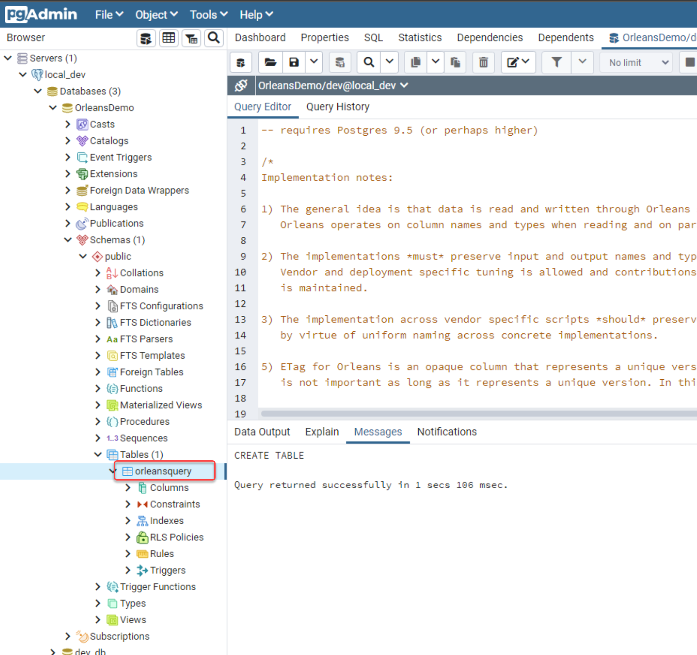
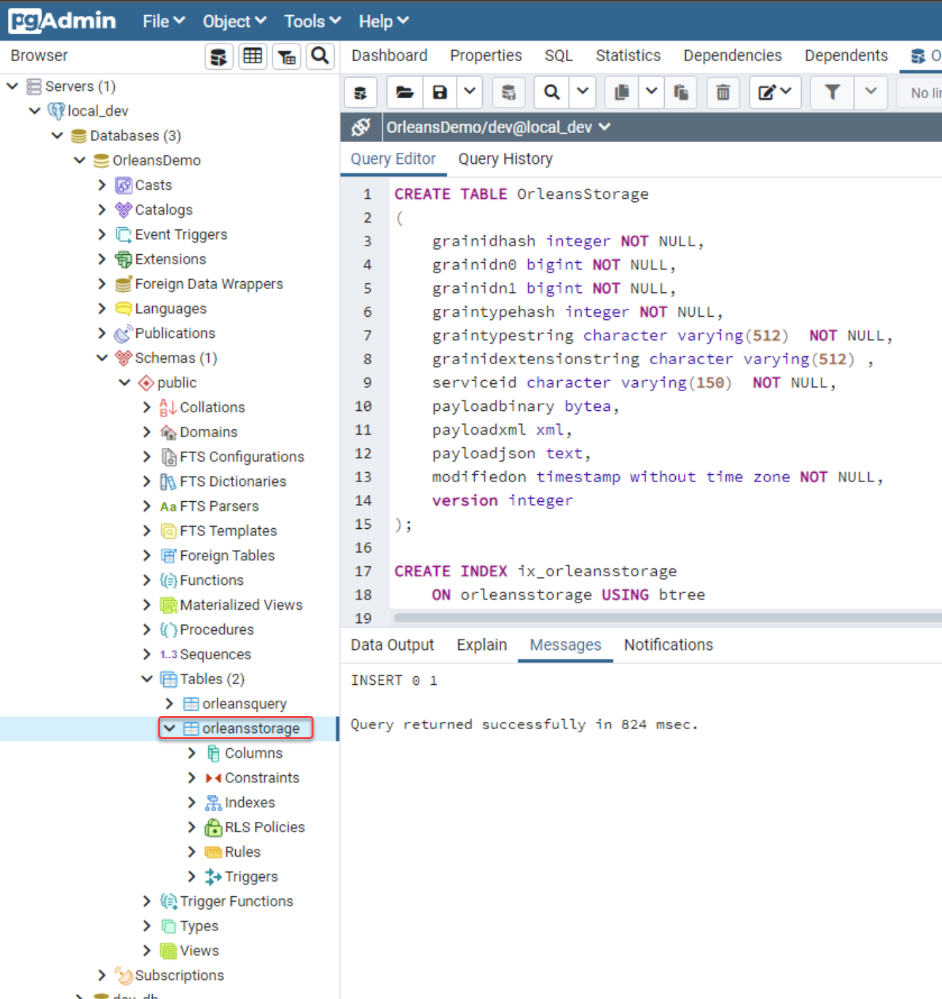
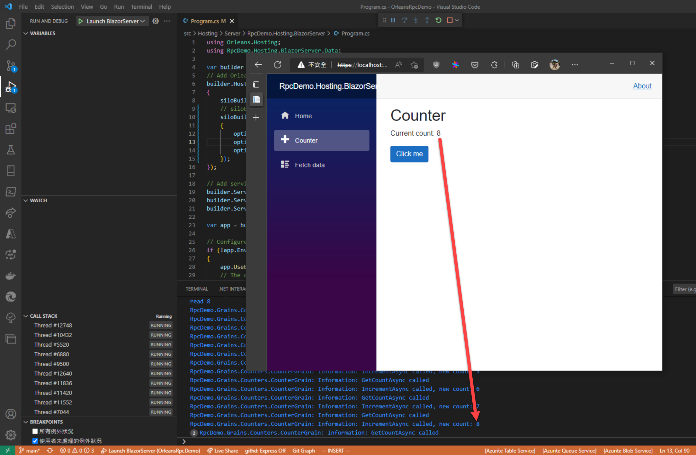

# Grain State狀態資料使用PostgreSQL資料庫儲存(ADO.NET)

今天我們示範 [ASP.NET Core Blazor Server](https://learn.microsoft.com/en-us/aspnet/core/blazor#blazor-server) 的web app專案，其範例記數器後端使用CounterGrain實作，並將Grain State的狀態資料以PostgreSQL資料庫儲存。

## 建立PostgreSQL資料庫資料表以便儲存Grain State

目前 Orleans 3.x對於PostgreSQL的系統需求是版本9.5 以上，詳情可以直接看官方Github的原始檔內容註釋：  
[https://github.com/dotnet/orleans/blob/3.x/src/AdoNet/Shared/PostgreSQL-Main.sql#L1](https://github.com/dotnet/orleans/blob/3.x/src/AdoNet/Shared/PostgreSQL-Main.sql#L1)

1. 下載 [官方提供SQL script的 **Main script**](https://learn.microsoft.com/en-us/dotnet/orleans/host/configuration-guide/adonet-configuration#main-scripts)：選PostgreSQL的script檔（**PostgreSQL-Main.sql**），並執行，以建立基礎Orleans指令動作資料表(**orleansquery**)：
    
2. 下載 [官方提供SQL script的 **Persistance script**](https://learn.microsoft.com/en-us/dotnet/orleans/host/configuration-guide/adonet-configuration#persistence)：選選PostgreSQL的script檔（PostgreSQL-Persistence.sql），並執行，以建立儲存Orleans Grain State用資料表(**orleansstorage**)：
   

### 建立測試用Silo

1. 在[前天進度的原始碼git專案](https://github.com/windperson/OrleansRpcDemo/tree/day11)，在 *src/Hosting/Server* ，建立一個Blazor Server專案名為 **RpcDemo.Hosting.BlazorServer**：
    ```shell
    dotnet new blazorserver --framework net6.0 --no-restore --name RpcDemo.Hosting.BlazorServer
    ```
    並將此專案加入至根目錄的OrleansDemo.sln方案中
2. 將 **RpcDemo.Grains.Counters** 專案加入至此專案的專案對專案參考(project-to-project reference)中。
3. 安裝 [**Microsoft.Orleans.Server**](https://www.nuget.org/packages/Microsoft.Orleans.Server) 、 [**Microsoft.Orleans.Persistence.AdoNet**](https://www.nuget.org/packages/Microsoft.Orleans.Persistence.AdoNet) 、 [**Npgsql**](https://www.nuget.org/packages/Npgsql) 這三個套件到 **RpcDemo.Hosting.BlazorServer** 專案。
4. 修改專案中的 **Program.cs** 為下列內容：
    ```csharp
    using Orleans.Hosting;
    using RpcDemo.Hosting.BlazorServer.Data;

    var builder = WebApplication.CreateBuilder(args);
    // Add Orleans co-hosting
    builder.Host.UseOrleans(siloBuilder =>
    {
        siloBuilder.UseLocalhostClustering();
        siloBuilder.AddAdoNetGrainStorage("demo_counters", options =>
        {
            options.Invariant = "Npgsql";
            options.ConnectionString = "Server=localhost;Port=5432;Username=dev;Password=P@ss1234;Database=OrleansDemo;";
            options.UseJsonFormat = true;
        });
    });

    /*
    other builder & app code...
    */

    ```
    在呼叫 `AddAdoNetGrainStorage()` 設定 `AdoNetGrainStorageOptions` 型別的 `options => { ... }` Lambda表示式中， `Invariant`要對應填入[官網說明指定的 **ADO.NET invariant** ](https://learn.microsoft.com/en-us/dotnet/orleans/host/configuration-guide/adonet-configuration#persistence)，所以就填入 **Npgsql**。

5. 修改專案中 *Pages* 目錄內的 **Counter.razor** 檔案為下列內容：
    ```razor
    @page "/counter"
    @using Orleans
    @using RpcDemo.Interfaces.Counter
    @inject IClusterClient ClusterClient

    <PageTitle>Counter</PageTitle>

    <h1>Counter</h1>

    <p role="status">Current count: @currentCount</p>

    <button class="btn btn-primary" @onclick="IncrementCount">Click me</button>

    @code {
        private ICounterGrain? counter;
        private int currentCount = 0;

        protected override async Task OnInitializedAsync()
        {
            await base.OnInitializedAsync();
            counter = ClusterClient.GetGrain<ICounterGrain>(Guid.Empty);
            currentCount = await counter.GetCountAsync();
        }

        private async void IncrementCount()
        {
            await counter!.IncrementAsync();
            currentCount = await counter.GetCountAsync();
            StateHasChanged();
        }

    }
    ```
    要用來取得呼叫Grain RPC方法實體的 [`IClusterClient`](https://learn.microsoft.com/en-us/dotnet/api/orleans.iclusterclient) 物件可藉由依賴注入的方式： ` @inject IClusterClient ClusterClient` ，並在 [`OnInitializedAsync()`](https://learn.microsoft.com/en-us/dotnet/api/microsoft.aspnetcore.components.componentbase.oninitializedasync) 方法中取得Grain實體，並取得第一次頁面顯示出來時的記數值。  
    在按鈕的事件處理函式中呼叫Grain增加計數值的RPC方法，並在呼叫完畢後，呼叫Grain取得當前計數值的RPC方法取得最新值指派給UI綁定參數，來更新畫面。
6. 修改Visual Studio Code的 .vscode/tasks.json 新增此專案的建置設定：
    ```json
    {
        "label": "build blazor server",
        "command": "dotnet",
        "type": "process",
        "args": [
            "build",
            "${workspaceFolder}/src/Hosting/Server/RpcDemo.Hosting.BlazorServer/RpcDemo.Hosting.BlazorServer.csproj",
            "/property:GenerateFullPaths=true",
            "/consoleloggerparameters:NoSummary"
        ],
        "problemMatcher": "$msCompile"
    }
    ```
7. 修改Visual Studio Code的 .vscode/launch.json 新增此專案的啟動除錯設定：
    ```json
    {
      "name": "Launch BlazorServer",
      "type": "coreclr",
      "request": "launch",
      "preLaunchTask": "build blazor server",
      // If you have changed target frameworks, make sure to update the program path.
      "program": "${workspaceFolder}/src/Hosting/Server/RpcDemo.Hosting.BlazorServer/bin/Debug/net6.0/RpcDemo.Hosting.BlazorServer.dll",
      "args": [],
      "cwd": "${workspaceFolder}/src/Hosting/Server/RpcDemo.Hosting.BlazorServer",
      "stopAtEntry": false,
      // Enable launching a web browser when ASP.NET Core starts. For more information: https://aka.ms/VSCode-CS-LaunchJson-WebBrowser
      "serverReadyAction": {
          "action": "openExternally",
          "pattern": "\\bNow listening on:\\s+(https?://\\S+)",
      },
      "env": {
          "ASPNETCORE_ENVIRONMENT": "Development"
      },
      "sourceFileMap": {
          "/Views": "${workspaceFolder}/src/Hosting/Server/RpcDemo.Hosting.BlazorServer/Views"
      },
      "console": "integratedTerminal"
    }
    ```   

在Visual Studio Code執行偵錯，並在瀏覽器畫面按中間的Counter切換到記數器 ，按下按鈕後，可以看到計數值會增加：
  
原本預設的Blazor Server專案記數器，切換到其他畫面後再換回來，計數值會被重置，這是因為Blazor Server專案預設沒儲存狀態，而我們改寫把記數器機制用Grain狀態存，所以當切換到其他畫面再回來時，記數器還可繼續計數。甚至網頁關掉重開回來，計數值也仍保持。

完成的範例程式GitHub專案在：https://github.com/windperson/OrleansRpcDemo/tree/day14

---

明天講述一些Grain的RPC方法細部討論，如例外處理和非同步方法取消呼叫的技巧等。