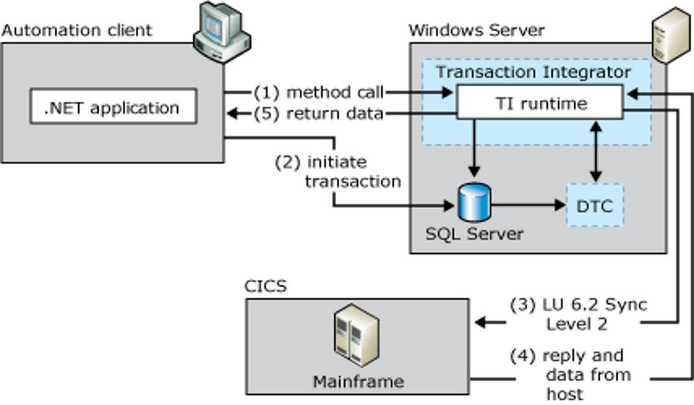
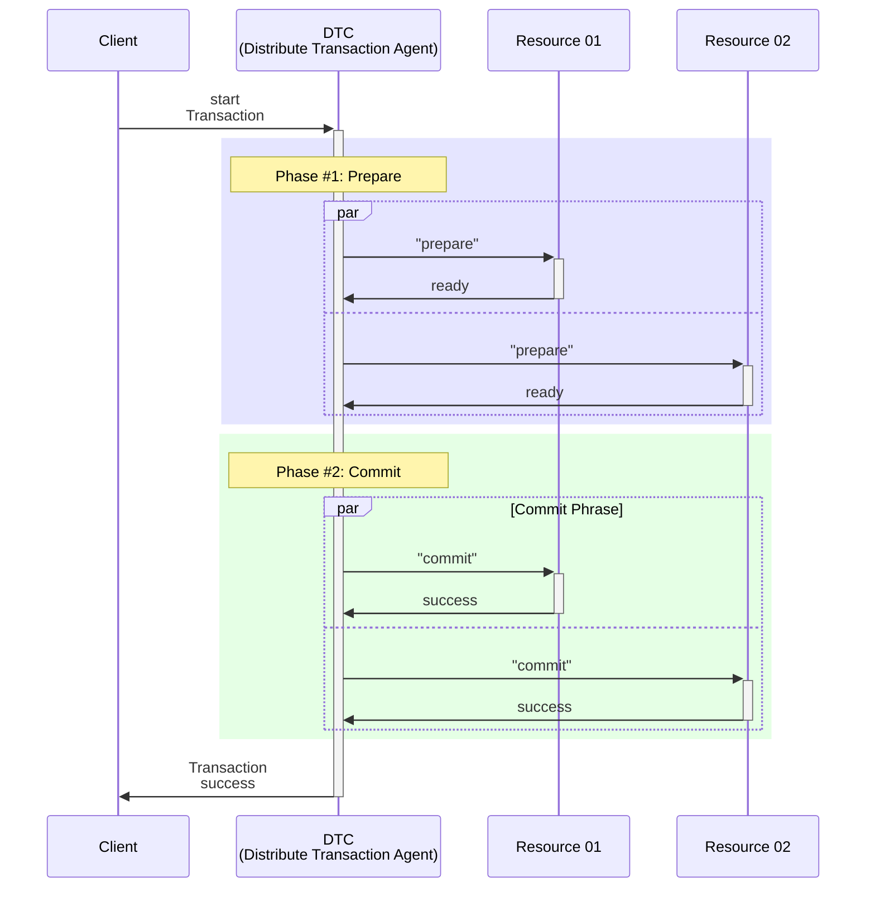
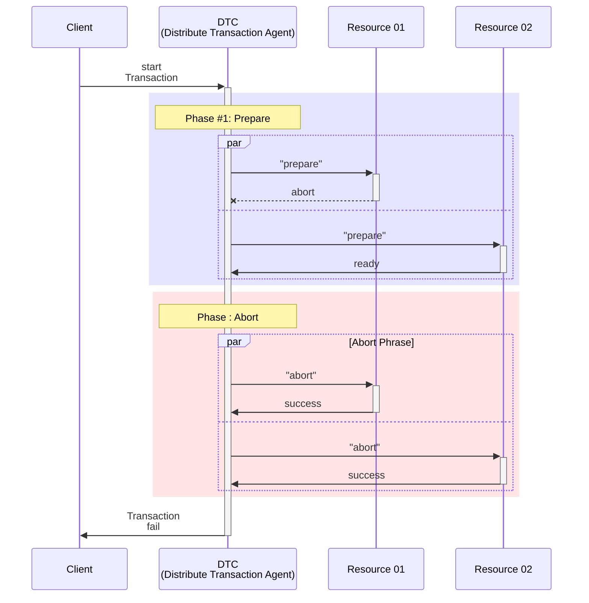
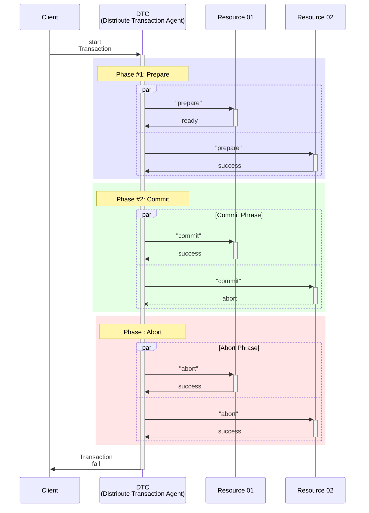

# Orleans Grain的 RPC Transaction功能介紹

## Orleans ACID Transaction 概述

Orleans的分布式交易(Distributed ACID Transaction)最早的討論出於西元2016年微軟研究院的一個研究論文：
> Transactions for Distributed Actors in the Cloud  
https://www.microsoft.com/en-us/research/publication/transactions-distributed-actors-cloud-2/

後來在 v3.0 於2019年正式發佈時才成為正式功能，基本上是一個[使用時間戳記(timestamp)來達到『兩階段提交(two-phase commit)』演算法的分布式交易](https://github.com/dotnet/orleans/issues/3369)，符合資料庫ACID特性（Atomicity, Consistency, Isolation, Durability）的支援多個Grain之間聯合RPC呼叫的交易機制。

Transaction要在運營面可運作，必須要在Silo層配置用來儲存交易中間狀態相關資訊的 "transactional state storage provider" ，目前的官方Provider，只有 [**Microsoft.Orleans.Transactions.AzureStorage**](https://www.nuget.org/packages/Microsoft.Orleans.Transactions.AzureStorage) Nuget套件提供的 [`AddAzureTableTransactionalStateStorage()`](https://learn.microsoft.com/en-us/dotnet/api/orleans.hosting.azuretablesilobuilderextensions.addazuretabletransactionalstatestorage) 擴充方法，呼叫以便使用Azure Table Storage來儲存交易狀態資訊；不過在執行單元測試等的測試專案時，Orleans Runtime在沒有Azure Table Transactional State Provider的環境，會自動嘗試用當時設為預設儲存Grain狀態的Grain Storage Provider來轉接使用。

## 兩階段提交演算法解析

two-phase commit除了在分散式交易之外，像是MS SQL提供的MS DTC(Microsoft Distributed Transaction Coordinator)也有提供相似的功能：

*圖片來源: [微軟官方文件](https://learn.microsoft.com/zh-tw/host-integration-server/core/two-phase-commit2)*

從系統架構面來說，這類系統通常會有一個負責與其他需要保護資料一致性資料庫溝通的中間角色，稱為協調者(coordinator)，協調者會負責協調所有參與者(participant)的交易狀態，並且在所有參與者都完成交易後，才會決定是否要正式提交狀態或是取消且退回交易前的狀態。

一個成功的two-phase commit交易，會有以下的流程：
1. 協調者向所有參與者發出準備交易的請求(prepare)，並等待所有參與者回應準備完成。
2. 當所有參與者都準備完成後，協調者向所有參與者發出確認交易的請求(commit)，並等待所有參與者回應確認完成。
3. 當協調者確認所有參與者都回應完成後，交易即為成功。


當然，如果在準備或確認階段，有任何一個參與者（假設是Resource 01）回應失敗，協調者就會向所有參與者發出取消交易的請求(abort)，並等待所有參與者回應取消完成，交易即為失敗：


假設當Resource 02在第二階段失敗時，Resource 01也會配合roll back：


在Orleans的分布式交易中，協調者的角色為Orleans Runtime，而參與者則是被呼叫的Grain，當開始進行Transaction時，Orleans Runtime會執行[Transaction Agent](https://github.com/dotnet/orleans/blob/3.x/src/Orleans.Transactions/DistributedTM/TransactionAgent.cs)來協調交易的狀態，包括命令是否要參與的Grain退回交易前狀態；Transaction Agent在執行每個階段時，會有Timeout機制，當時間超過而參與的Grain還沒有回應時，也會視為失敗。

## Orleans Transaction API 簡介

首先，要支援Transaction，需要在Grain建構子的依賴注入加上[ITransactionalState<T>](https://learn.microsoft.com/en-us/dotnet/api/orleans.transactions.abstractions.itransactionalstate-1)型態的Grain State變數，這個就是當交易成功時會成功更新，而交易失敗時會被還原的資料，例如這個銀行帳戶的Grain實作部分程式碼：
```csharp
public class AccountGrain : Grain, IAccountGrain
{
    private readonly ITransactionalState<Balance> _balance;

    public AccountGrain(
        [TransactionalState("balance", "TransactionStore")]
        ITransactionalState<Balance> balance)
    {
        _balance = balance;
    }

    // other Grain methods
}
```
並且此Grain狀態變數就不是用一般Grain State的`[PersistentState]`屬性，而是用 [\[TransactionalState\]](https://learn.microsoft.com/en-us/dotnet/api/orleans.transactions.abstractions.transactionalstateattribute) 屬性修飾，並且需要指定狀態儲存的名稱，以及Transaction Store Provider的名稱，到時候在在Silo端需要設定該Provider以便生效。

要注意的是，此種Grain狀態變數不能在Grain的`OnActivateAsync()` 生命週期方法內呼叫，並且此種變數不會在該方法內就自動被賦予原始儲存的值，需要存取此狀態變數時，需要呼叫 `ITransactionalState<T>` 的 [`PerformRead<TResult>()`](https://learn.microsoft.com/en-us/dotnet/api/orleans.transactions.abstractions.itransactionalstate-1.performread) 非同步方法來取得值，而需要寫入時，則是呼叫 [`PerformUpdate<TResult>()`](https://learn.microsoft.com/en-us/dotnet/api/orleans.transactions.abstractions.itransactionalstate-1.performupdate) 的非同步方法

然後，在Grain的RPC介面宣告時，需支援交易的RPC方法宣告要加上 [\[Transaction\]](https://learn.microsoft.com/en-us/dotnet/api/orleans.transactionattribute) 屬性，並配合其建構子參數[`TransactionOption`](https://learn.microsoft.com/en-us/dotnet/api/orleans.transactionoption)來設定該方法是否要參與交易以及參與的種類，如下：
```csharp
public interface IAccountGrain : IGrainWithGuidKey
{
    [Transaction(TransactionOption.Join)]
    Task Deposit(decimal amount);

    [Transaction(TransactionOption.Join)]
    Task Withdraw(decimal amount);

    [Transaction(TransactionOption.Join)]
    Task Transfer(IAccountGrain to, decimal amount);

    [Transaction(TransactionOption.CreateOrJoin)]
    Task<decimal> GetBalance();
}
```
[`TransactionOption`](https://learn.microsoft.com/en-us/dotnet/api/orleans.transactionoption) 有六種選項：

* **TransactionOption.Create**：呼叫此種方法時，會建立一個新的交易階段，並且此方法會參與。
* **TransactionOption.Join**：呼叫此種方法時，會加入現有的交易階段，並且此方法會參與。
* **TransactionOption.CreateOrJoin**：前面兩種的複合，呼叫此種方法時，會建立一個新的交易階段，或是加入現有的交易階段，並且此方法會參與。
* **TransactionOption.Suppress**：呼叫此種方法時，不會建立新的交易階段，也不會加入現有的交易階段，不過此方法可以在交易階段內呼叫。
* **TransactionOption.Supported**：呼叫此種方法時，不會建立新的交易階段，也不會加入現有的交易階段，不過此方法可以在交易階段內呼叫，並且此方法可以存取到交易階段的環境資訊。
* **TransactionOption.NotAllowed**：在交易階段不允許呼叫此方法，呼叫的話會拋出[NotSupportedException](https://learn.microsoft.com/en-us/dotnet/api/system.notsupportedexception)例外。

---

明天以實際範例來說明如何使用Orleans的交易功能。