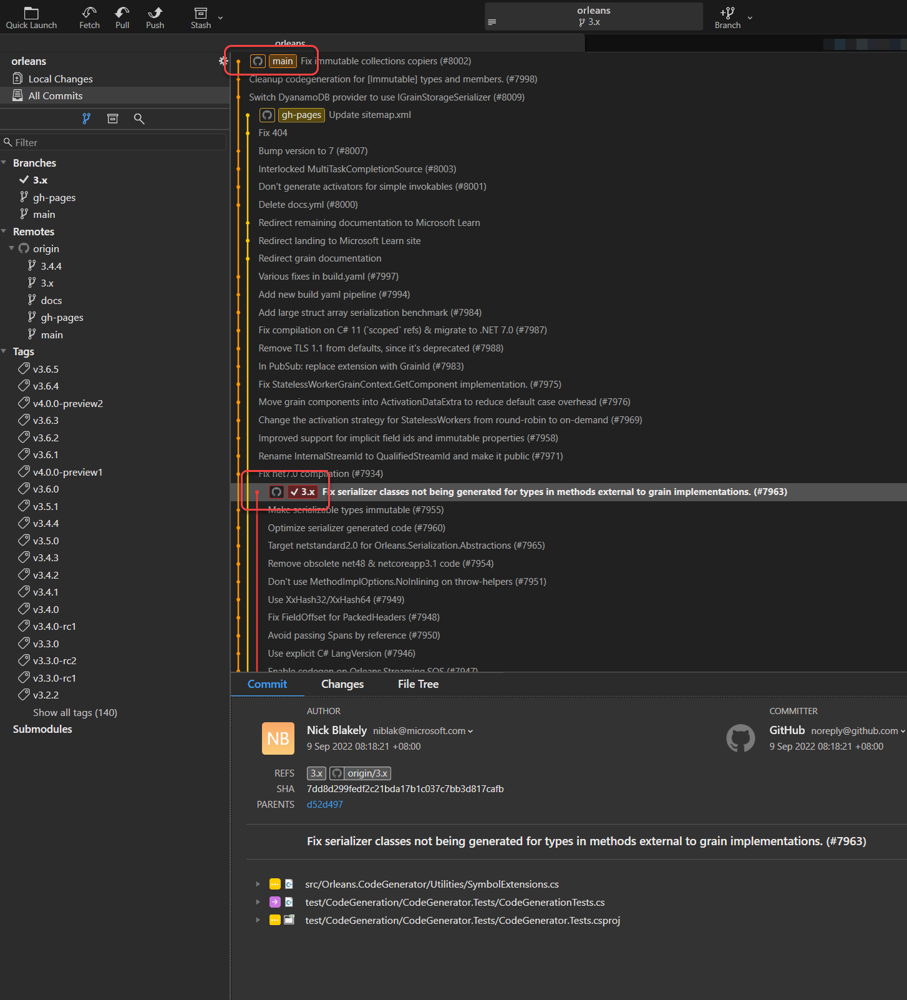
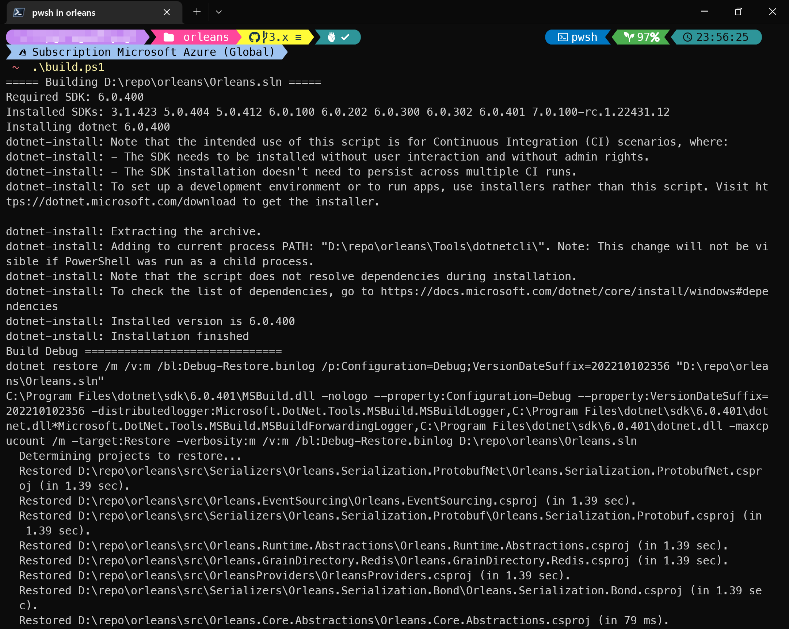
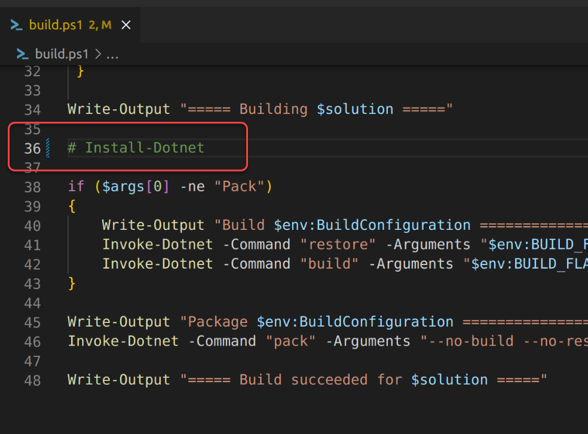
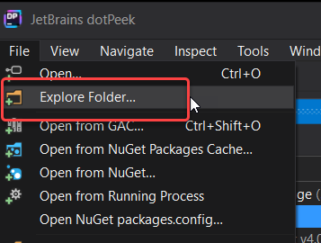
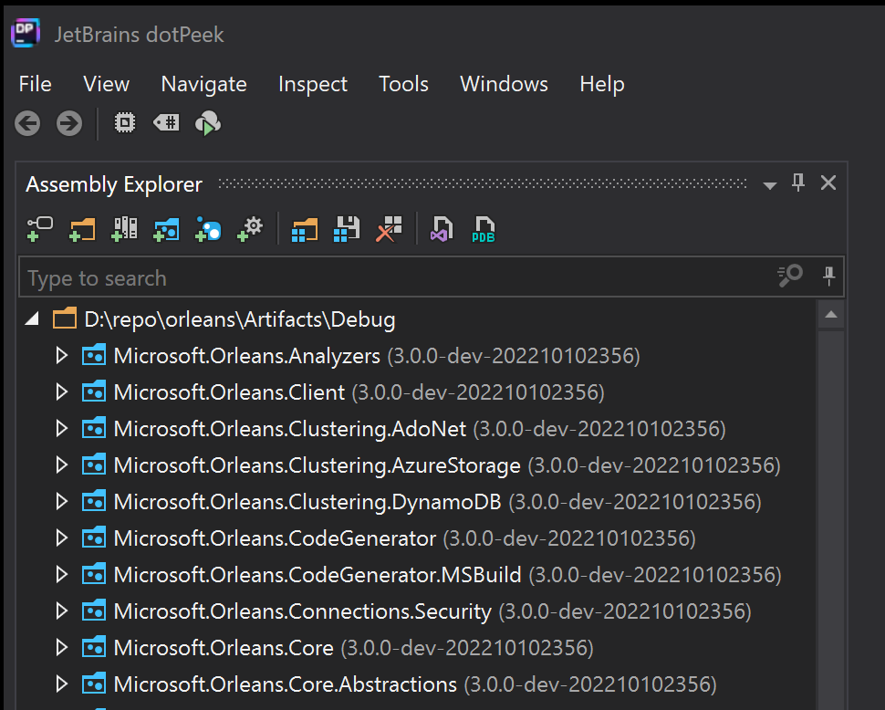
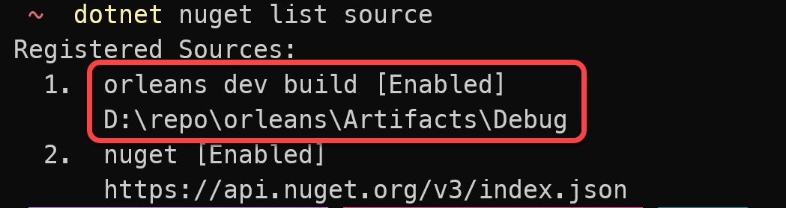

# Orleans 的GitHub原始碼建置方法與 POCO Grain 開發方法

雖然現在 Microsoft Orleans已經有提供SourceLink支援，可以在執行偵錯模式時用除錯器直接『逐步執行(Step In)』到Orleans的核心原始碼，但是有時候還是需要自行建置測試版原始碼，例如想要提供貢獻發GitHub PR(Pull Request)，或是要使用目前還沒有正式版的 Orleans v4.0的 POCO Grain功能。

## Orleans 的原始碼建置方法

目前 Orleans的原始碼分為兩個主要分支，一個是 `v3.x` 為目前穩定版的原始碼，另一個 `main` 為目前開發版的原始碼，也就是 Orleans v4.0的原始碼：


### v3.x 分支建置及使用方法

#### 建置除錯版Nuget套件
Orleans是以Nuget套件方式發佈，我們可以在自己的開發電腦上建置除錯版的Nuget來使用，建置方法如下：  

0. 安裝 [.NET 6 SDK](https://dotnet.microsoft.com/en-us/download/dotnet/6.0)。
1. 在Orleans原始碼根目錄有個官方提供的 **build.ps1** 指令檔，可在 PowerShell Core or v7+ 的命令列下執行以便建置除錯版的Nuget套件：
    ```powershell
    .\build.ps1 
    ```
    
    假如在有些Linux的執行環境不是其script呼叫的dotnet-install.ps1所支援的，可以把build.ps1檔案後半段的 `Install-Dotnet` 指令註解掉再執行：
    
2. 跑完建置指令後，除錯版的Nuget套件會存在git clone下來的專案根目錄底下新建的子目錄 **/Artifacts/Debug** 內，可使用免費的反組譯工具 [dotPeek](https://www.jetbrains.com/decompiler) 的 `[File]/[Explore Folder...]` 的功能選取該目錄確認：  
      
    建置的Nuget套件版本號會在末尾加上 **dev-建置日期** 使其變為搶先版(Preview)版號：  
    

#### 使用除錯版Nuget套件

除錯版的Nuget套件可以在自己的專案中使用，方法如下：
1. 使用 [`dotnet new nugetconfig`](https://learn.microsoft.com/en-us/nuget/reference/dotnet-commands) 指令在自己的 .NET專案根目錄下產生一個 [**nuget.config**](https://learn.microsoft.com/en-us/nuget/reference/nuget-config-file) 檔案。
2. 修改 **nuget.config** 檔案的內容為如下：
    ```xml
    <?xml version="1.0" encoding="utf-8"?>
    <configuration>
      <packageSources>
        <!--To inherit the global NuGet package sources remove the <clear/> line below -->
        <clear />
        <add key="orleans dev build" value="D:\repo\orleans\Artifacts\Debug" />
        <add key="nuget" value="https://api.nuget.org/v3/index.json" />
      </packageSources>
    </configuration>
    ```
    新增的 `<add key="orleans dev build" value="D:\repo\orleans\Artifacts\Debug" />` 這一行是新增一個除錯版的Nuget套件所在的目錄成為Nuget套件來源，在此的範例中，`key` 是自行指定的任意名稱，`value` 則是Orleans原始碼建置出來除錯版Nuget套件所在的目錄路徑。
3. 使用 `dotnet nuget list source` 指令驗證是否有新增成功：
    

如此之後在該專案目錄內以 `dotnet add package Orleans套件名稱 --version 3.0.0-dev-建置日期戳記 --prerelease` 指令便會從除錯版的Nuget套件來源下載除錯版的Nuget套件來使用。

## POCO Grain 開發方法

