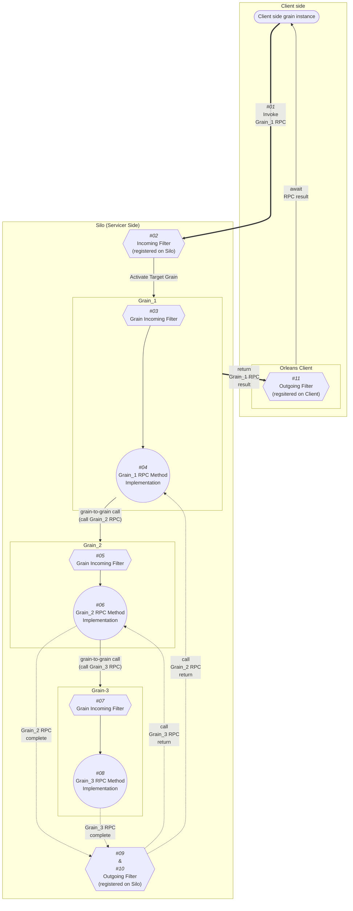

# Orleans Grain的Call Filter介紹

## Call Filter的概念

Filter是Orleans Grain的一個功能，可以在Grain的方法被呼叫前後，執行一些自訂的邏輯。以便讓我們在Grain的方法被呼叫前後做例如：存取權限、Grain呼叫記錄、錯誤處理、紀錄RPC執行時間資料等事項。

例如 [OrleansDashbaord](https://github.com/OrleansContrib/OrleansDashboard) 這個第三方元件，就是利用Call Filter來實現記錄Grain呼叫執行時間的功能：  
https://github.com/OrleansContrib/OrleansDashboard/blob/master/OrleansDashboard/Implementation/GrainProfilerFilter.cs

Filter可存取到：
1. Grain呼叫RPC方法時的呼叫資訊（被呼叫的Grain型別、呼叫的輸入參數、[MethodInfo](https://learn.microsoft.com/en-us/dotnet/api/system.reflection.methodinfo)、以及儲存在 [`RequestContext`](https://learn.microsoft.com/en-us/dotnet/api/orleans.runtime.requestcontext) 內的key-value值）。
2. Grain RPC方法的回傳值、執行時拋出的例外。

### Filter的種類

依照呼叫的順序，Filter分為 Incoming & Outgoing Filter兩種；而依照實作程式宣告位置和註冊的方式，Filter也分為 Client/Silo & per Grain Filter兩種；以下依照一個模擬的完整Grain RPC方法呼叫流程順序，解說Filter的執行順序圖解如下：

這是一個呼叫 Grain_1的RPC，而其中RPC實作又去呼叫Grain_2、Grain_3的RPC完整流程（順序 *#01* 到 *#11*）圖解。  
圖中六角型的方塊代表Filter，方塊中的文字代表Filter的種類。

從Client端藉由RPC呼叫參考實體開始：

*#01* 呼叫Grain的RPC方法後，Server端Silo第一個會處理的是註冊在 *#02* Silo層級的Incoming Filter，再來是註冊在 *#03* Grain_1層級的Grain Incoming Filter，接著就跑定義在Grain_1裡的 *#04* RPC方法實作，在Grain_1的RPC實作裡去呼叫了另一個Grain_2的RPC方法，就會通過註冊在Grain_2的 *#05* Grain Incoming Filter，接著跑定義在Grain_2的 *#06* RPC方法實作；

在Grain_2的RPC實作裡，又去呼叫了另一個Grain_3的RPC方法，就會通過註冊在Grain_3的 *#07* Grain Incoming Filter，接著跑定義在Grain_3的 *#08* RPC方法實作，當Grain_3的RPC回傳結果即將送回給Grain_2前，會通過 *#09* Silo層級的Outgoing Filter；
而當Grain_2的RPC回傳結果即將送回給Grain_1前，會再一次通過 *#10* Silo層級的Outgoing Filter。
最後，當Grain_1的RPC運算結果回傳給Client端，在使用C#的非同步 `await`語法取得真正回傳值之前，還會經過註冊在 *#11* Orleans Client物件的Outgoing Filter。

總結來說，Incoming Filter的執行順序是先Silo層級的，然後是Grain各自定義的。而 Outgoing Filter的執行順序是，假如是在Silo內的Grain-to-Grain RPC，就會呼叫到Silo層級的 Outgoing filter，而當Grain RPC方法是被Client端所呼叫的，就會在Client端RPC參考實體得到非同步回傳結果前，呼叫到Client層級註冊的Outgoing Filter。

### Filter的定義與註冊方法

Incoming Filter為實作 [`IIncomingGrainCallFilter`](https://learn.microsoft.com/en-us/dotnet/api/orleans.iincominggraincallfilter) 介面的自定義類別；Outgoing Filter 則為 [`IOutgoingGrainCallFilter`](https://learn.microsoft.com/en-us/dotnet/api/orleans.ioutgoinggraincallfilter) 介面的自定義類別。

Silo層級的Filter可從Silo的配置程式碼中以DI依賴注入Singleton的方式，來註冊Silo層級的Incoming & Outgoing Filter；或是使用SiloBuilder的 [`AddIncomingGrainCallFilter()`](https://learn.microsoft.com/en-us/dotnet/api/orleans.hosting.silohostbuildergraincallfilterextensions.addincominggraincallfilter) 和 [`AddOutgoingGrainCallFilter()`](https://learn.microsoft.com/en-us/dotnet/api/orleans.hosting.silohostbuildergraincallfilterextensions.addoutgoinggraincallfilter) 這兩個擴充方法來註冊。  

Grain層級的Filter，每個Grain可由實作 `IIncomingGrainCallFilter` 介面來實現Grain級的Incoming Filter。

Client端的Filter，實作 `IOutgoingGrainCallFilter` 介面的自定義類別可由 [`ClientBuilder`](https://learn.microsoft.com/en-us/dotnet/api/orleans.clientbuilder) 的 [`AddOutgoingGrainCallFilter()`](https://learn.microsoft.com/en-us/dotnet/api/orleans.clientbuildergraincallfilterextensions.addoutgoinggraincallfilter) 擴充方法呼叫註冊 Outgoing Filter。

## Filter實作範例

我們把昨天實作的GrainService記錄特定Grain執行記錄的功能，原本在Grain方法實作裡去呼叫GrainService的方式，改為由Filter來實現。