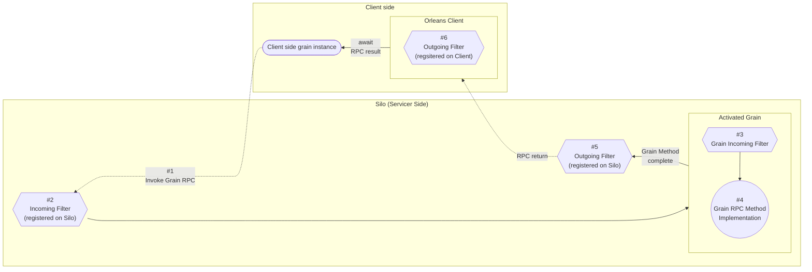

# Orleans Grain的Call Filter介紹

## Call Filter的概念

Filter是Orleans Grain的一個功能，可以在Grain的方法被呼叫前後，執行一些自訂的邏輯。以便讓我們在Grain的方法被呼叫前後做例如：存取權限、Grain呼叫記錄、錯誤處理、紀錄RPC執行時間資料等事項。

例如 [OrleansDashbaord](https://github.com/OrleansContrib/OrleansDashboard) 這個第三方元件，就是利用Call Filter來實現記錄Grain呼叫執行時間的功能：  
https://github.com/OrleansContrib/OrleansDashboard/blob/master/OrleansDashboard/Implementation/GrainProfilerFilter.cs

Filter可存取到：
1. Grain呼叫RPC方法時的呼叫資訊（被呼叫的Grain型別、呼叫的輸入參數、[MethodInfo](https://learn.microsoft.com/en-us/dotnet/api/system.reflection.methodinfo)、以及儲存在 [`RequestContext`](https://learn.microsoft.com/en-us/dotnet/api/orleans.runtime.requestcontext) 內的key-value值）。
2. Grain RPC方法的回傳值、執行時拋出的例外。

### Call Filter的種類

依照呼叫的順序，Filter分為 Incoming & Outgoing Filter兩種；而依照實作程式註冊的方式，分為 Silo  & Grain Filter兩種；依照一整個Grain RPC方法呼叫的流程順序，Filter的執行順序圖解如下：

圖中六角型的方塊代表Filter，方塊中的文字代表Filter的種類。  
從Client端藉由RPC呼叫參考實體開始 #1 呼叫Grain的RPC方法後，Server端Silo第一個會處理的是註冊在 #2 Silo層級的Incoming Filter，再來是註冊在 #3 Grain層級的Grain Incoming Filter，接著就跑原本定義在Grain裡的 #4 RPC方法實作，方法實作的電腦運算跑完，回傳結果即將送出前，會通過註冊在 #5 Silo層級的Outgoing Filter，然後回傳給Client端，在使用C#的非同步 `await`語法取得真正回傳值之前，還會經過註冊在 #6 Orleans Client物件的Outgoing Filter。

Incoming Filter為實作 [`IIncomingGrainCallFilter`](https://learn.microsoft.com/en-us/dotnet/api/orleans.iincominggraincallfilter) 介面的自定義類別；Outgoing Filter 則為 [`IOutgoingGrainCallFilter`](https://learn.microsoft.com/en-us/dotnet/api/orleans.ioutgoinggraincallfilter) 介面的自定義類別。

Silo層級的Filter可從Silo的配置程式碼中以DI依賴注入Singleton的方式，來註冊Silo層級的Incoming & Outgoing Filter；或是使用SiloBuilder的 [`AddIncomingGrainCallFilter()`](https://learn.microsoft.com/en-us/dotnet/api/orleans.hosting.silohostbuildergraincallfilterextensions.addincominggraincallfilter) 和 [`AddOutgoingGrainCallFilter()`](https://learn.microsoft.com/en-us/dotnet/api/orleans.hosting.silohostbuildergraincallfilterextensions.addoutgoinggraincallfilter) 這兩個擴充方法來註冊。  

Grain層級的Filter，每個Grain可由實作 `IIncomingGrainCallFilter` 介面來實現Grain級的Incoming Filter。

Client端的Filter，實作 `IOutgoingGrainCallFilter` 介面的自定義類別可由 [`ClientBuilder`](https://learn.microsoft.com/en-us/dotnet/api/orleans.clientbuilder) 的 [`AddOutgoingGrainCallFilter()`](https://learn.microsoft.com/en-us/dotnet/api/orleans.clientbuildergraincallfilterextensions.addoutgoinggraincallfilter) 擴充方法呼叫註冊 Outgoing Filter。

## Filter實作範例

我們把昨天實作的GrainService記錄特定Grain執行記錄的功能，原本在Grain方法實作裡去呼叫GrainService的方式，改為由Filter來實現。