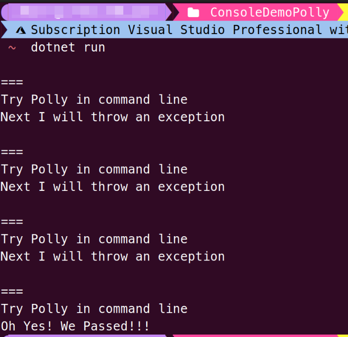

# Orleans Client套用Polly做連線重試和運營相關Silo配置說明

## Orleans Client套用Polly做連線重試

[Polly](https://github.com/App-vNext/Polly)是一個.NET的[Nuget套件](https://www.nuget.org/packages/Polly)，有內建不少設計軟體強固架構的『Policy』函式庫，例如 [Retry](https://github.com/App-vNext/Polly/wiki/Retry) / [Circuit Breaker](https://github.com/App-vNext/Polly/wiki/Advanced-Circuit-Breaker) / [Timeout](https://github.com/App-vNext/Polly/wiki/Timeout) 等等，讓你的程式碼可以設計成比較有架構的方式來做各種錯誤復原、故障防護或是連線逾時重試的機能。

Polly的Policy創建方式是使用類似於SiloBuilder/ClientBuilder配置的"Fluent API"語法，例如：
```csharp
using Polly;

var retryPolicy = Policy
    .Handle<MyException>()
    .Retry(3);
```
這樣就會創建一個，在餵給它任意程式碼執行時，假如遭遇MyException，會重試3次的Policy物件。

然後這個retryPolicy物件就可以套用到你的程式碼中，例如：
```csharp
int executionCount = 0;
retryPolicy.Execute(() =>
{
    Console.WriteLine("\r\n===\r\nTry Polly in command line");
    if (executionCount < 3)
    {
        Console.WriteLine("Next I will throw an exception");
        executionCount++;
        throw new MyException($"This is the {executionCount} time(s) exception");
    }
    Console.WriteLine("Oh Yes! We Passed!!!");
});

public class MyException : Exception
{
    public MyException(string message) : base(message) { }
}
```
執行結果如下：


可以看到，Polly會執行在 `Execute()`中輸入的Lambda敘述式程式碼，並且自動在拋出 `MyException`例外時，幫你接住這個例外並重新嘗試執行整段Lambda敘述式，總共重試3次，而第四次跑此段的時候，就依照設計好的 `if(executionCount < 3){...}`判斷區塊，不再丟出例外，順利執行最後一行。

同樣地，在Orleans專案上使用時，Polly的另外一個 [`AsyncRetryPolicy`](https://github.com/App-vNext/Polly/blob/master/src/Polly/Retry/AsyncRetryPolicy.cs)，拿來套用在Orleans Client端連線程式碼，就可做到一開始呼叫 `client.Connect()` 和Silo端的建立連線重試，避免因為Client端與Silo端網路不穩定而連線失敗的問題。

作法如下：
1. 在Client端專案安裝[Polly的Nuget套件](https://www.nuget.org/packages/Polly):
    ```shell
    dotnet add package Polly
    ```
2. 建立一個 **OrleansClientConnectExtension.cs** 程式碼檔案，建立一個定義擴充方法的靜態類別，內容如下：
    ```csharp
    public static Task ConnectWithRetryAsync(this IClusterClient client, int retryCount = 5, AsyncRetryPolicy policy = null, ILogger logger = null)
    {
        var retryPolicy = policy;
        if (retryPolicy == null)
        {
            var random = new Random();
            retryPolicy = CreateRetryPolicy(random, retryCount);
        }

        if (logger == null)
        {
            logger = NullLogger.Instance;
        }

        return retryPolicy.ExecuteAsync(() => client.Connect((ex) =>
        {
            logger.LogDebug(ex, "Jitter error occurred");

            return Task.FromResult(true);
        }));
    }

    private static AsyncRetryPolicy CreateRetryPolicy(Random random, int retryCount)
    {
        // use exponential back off + jitter strategy to the retry policy
        // see: 
        // https://learn.microsoft.com/en-us/dotnet/architecture/microservices/implement-resilient-applications/implement-http-call-retries-exponential-backoff-polly
        return Policy.Handle<SiloUnavailableException>()
            .WaitAndRetryAsync(retryCount, retryAttempt =>
                TimeSpan.FromSeconds(Math.Pow(2, retryAttempt)) + TimeSpan.FromMilliseconds(random.Next(0, 100)));
    }
    ``` 


## 運營相關Silo配置事項

### OrleansDashboard介紹

### Silo包裝成容器映像檔運營的注意事項