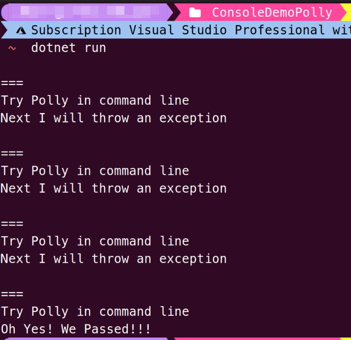

# Orleans Client套用Polly做連線重試和運營相關Silo配置說明

## Orleans Client套用Polly做連線重試

[Polly](https://github.com/App-vNext/Polly)是一個.NET的[Nuget套件](https://www.nuget.org/packages/Polly)，有內建不少設計軟體強固架構的『Policy』函式庫，例如 [Retry](https://github.com/App-vNext/Polly/wiki/Retry) / [Circuit Breaker](https://github.com/App-vNext/Polly/wiki/Advanced-Circuit-Breaker) / [Timeout](https://github.com/App-vNext/Polly/wiki/Timeout) 等等，讓你的程式碼可以設計成比較有架構的方式來做各種錯誤復原、故障防護或是連線逾時重試的機能。

Polly的Policy創建方式是使用類似於SiloBuilder/ClientBuilder配置的”Fluent API”語法，例如：

``` csharp
using Polly;

var retryPolicy = Policy
    .Handle<MyException>()
    .Retry(3);
```

這樣就會創建一個，在餵給它任意程式碼執行時，假如遭遇MyException，會重試3次的Policy物件。

然後這個retryPolicy物件就可以套用到你的程式碼中，例如：

``` csharp
int executionCount = 0;
retryPolicy.Execute(() =>
{
    Console.WriteLine("\r\n===\r\nTry Polly in command line");
    if (executionCount < 3)
    {
        Console.WriteLine("Next I will throw an exception");
        executionCount++;
        throw new MyException($"This is the {executionCount} time(s) exception");
    }
    Console.WriteLine("Oh Yes! We Passed!!!");
});

public class MyException : Exception
{
    public MyException(string message) : base(message) { }
}
```

執行結果如下：



可以看到，Polly會執行在 `Execute()`中輸入的Lambda敘述式程式碼，並且自動在拋出 `MyException`例外時，幫你接住這個例外並重新嘗試執行整段Lambda敘述式，總共重試3次，而第四次跑此段的時候，就依照設計好的 `if(executionCount < 3){...}`判斷區塊，不再丟出例外，順利執行最後一行。

同樣地，在Orleans專案上使用時，Polly的另外一個 [`AsyncRetryPolicy`](https://github.com/App-vNext/Polly/blob/master/src/Polly/Retry/AsyncRetryPolicy.cs)，拿來套用在Orleans Client端連線程式碼，就可做到一開始呼叫 `client.Connect()` 和Silo端的建立連線重試，避免因為Client端與Silo端網路不穩定而連線失敗的問題。

作法如下：

1.  在Client端專案安裝[Polly的Nuget套件](https://www.nuget.org/packages/Polly):

    ``` sh
    dotnet add package Polly
    ```

2.  建立一個 **OrleansClientConnectExtension.cs** 程式碼檔案，建立一個定義擴充方法的靜態類別，內容如下：

    ``` csharp
    using Microsoft.Extensions.Logging;
    using Microsoft.Extensions.Logging.Abstractions;
    using Orleans;
    using Orleans.Runtime;
    using Polly;
    using Polly.Retry;

    namespace OrleansPollyConsole;

    public static class OrleansClientConnectExtension
    {
        public static Task ConnectWithRetryAsync(this IClusterClient client, int retryCount = 5, AsyncRetryPolicy? policy = null,
            ILogger? logger = null)
        {
            var retryPolicy = policy;
            if (retryPolicy == null)
            {
                var random = new Random();
                retryPolicy = CreateRetryPolicy(random, retryCount);
            }

            logger ??= NullLogger.Instance;

            return retryPolicy.ExecuteAsync(() => client.Connect((ex) =>
            {
                logger.LogDebug(ex, "Jitter error occurred");

                return Task.FromResult(true);
            }));
        }

        private static AsyncRetryPolicy CreateRetryPolicy(Random random, int retryCount)
        {
            // use exponential back off + jitter strategy to the retry policy
            // see: 
            // https://learn.microsoft.com/en-us/dotnet/architecture/microservices/implement-resilient-applications/implement-http-call-retries-exponential-backoff-polly
            return Policy.Handle<SiloUnavailableException>()
                .WaitAndRetryAsync(retryCount, retryAttempt =>
                    TimeSpan.FromSeconds(Math.Pow(2, retryAttempt)) + TimeSpan.FromMilliseconds(random.Next(0, 100)));
        }
    }
    ```

    這邊私有靜態方法 `CreateRetryPolicy()`，目的是建立處理 [`SiloUnavailableException`](https://learn.microsoft.com/dotnet/api/orleans.runtime.silounavailableexception)（當Client端連線失敗會拋出這個例外）的Polly Policy，其重試的規則參考了[這篇文章](https://learn.microsoft.com/dotnet/architecture/microservices/implement-resilient-applications/implement-http-call-retries-exponential-backoff-polly)的寫法，使用 “[*Exponential Backoff*](https://en.wikipedia.org/wiki/Exponential_backoff)” + 隨機等待重試間隔(Jitter) 的方式來建立Policy的執行規則，以避免當萬一很多Client端在短時間內太頻繁的重試，造成Server端連線癱瘓或誤認為DoS攻擊而被禁止存取。  
    在擴充方法 `ConnectWithRetryAsync()` 中，使用了Polly的 `ExecuteAsync()` 方法，來執行一段Lambda敘述式，敘述式中使用Client端的 [`Connect()`](https://learn.microsoft.com/dotnet/api/orleans.iclusterclient.connect) 方法，可以接受一個 `Func<Exception, Task<Boolean>>`的選擇性參數，這個參數是一個Lambda敘述式，當Client端的 `Connect()` 方法發生例外時，就會呼叫這個Lambda敘述式，並且將例外物件傳入，在此時就能將此例外記錄在最外面擴充方法輸入參數的 logger 中，而回傳值是一個包裝在Task物件內的布林值(Boolean)，若回傳 `true`，表示要繼續重試，若回傳 `false`，則不要再重試了。

3.  在原本Client端的連線邏輯，就可以改為如下：

    ``` csharp
    var client = new ClientBuilder()
        // ...
        .ConfigureApplicationParts(parts => { /* ... */ })
        .ConfigureLogging(logging => { /* ... */ })
        .Build();

    await client.ConnectWithRetryAsync();
    ```

    這樣就可以在Client端呼叫 `ConnectWithRetryAsync()` 方法，來建立與Silo端的連線，並且在連線失敗時，會自動重試到連線成功或是超過原本擴充方法預設的五次為止。

當Silo是跑在Docker Compose的容器中，而Client是跑在容器外的架構配置時，建議Client端要設定Polly的重試機制，以免有時候會因為Docker容器網路瞬斷而連不到Silo端。



## 運營相關Silo配置事項

Orleans的Silo在配置其服務底層和運營(Ops)相關的設定時，有一些需要注意的地方，這邊就來簡單的介紹一下。

### 運營相關的設定

#### Default Provider

有些種類的State Storage Provider有提供 “-`AsDefault()`” 結尾的擴充方法，假如Grain實作專案裡指定Provider名稱沒有確實在Silo配置此Provider所用的Storage服務時，在執行時會Fall back使用利用此種擴充方法宣告為預設的Provider，避免執行時期Grain找不到對應Silo底層提供該服務的Provider而拋出執行時期錯誤的例外狀況。目前有這種功能的官方Provider有：

- In-Memory Storage Provider：[`AddMemoryGrainStorageAsDefault()`](https://learn.microsoft.com/dotnet/api/orleans.hosting.memorygrainstoragesilobuilderextensions.addmemorygrainstorageasdefault)
- Azure Blob Storage Provider：[`AddAzureBlobGrainStorageAsDefault()`](https://learn.microsoft.com/dotnet/api/orleans.hosting.azureblobsilobuilderextensions.addazureblobgrainstorageasdefault)
- Azure Table Storage Provider：[`AddAzureTableGrainStorageAsDefault()`](https://learn.microsoft.com/dotnet/api/orleans.hosting.azuretablesilobuilderextensions.addazuretablegrainstorageasdefault)
- ADO.NET Storage Provider：[`AddAdoNetGrainStorageAsDefault()`](https://learn.microsoft.com/dotnet/api/orleans.hosting.silobuilderextensions.addadonetgrainstorageasdefault)

#### Silo連接的IP/Port設定

Silo要指定其提供RPC呼叫的IP位址和Port時，需要自行增加 `Configure<EndpointOption>()`的擴充方法呼叫，如下範例：

``` csharp
SiloBuilder.Configure<EndpointOptions>(options => {
    options.AdvertisedIPAddress = IPAddress.Loopback;
    options.GatewayPort = 30000;
})
```

這樣就可以指定Silo接收Client端RPC呼叫的TCP/IP位址和Port，如果是使用 `UseLocalhostClustering()` 擴充方法跑Silo時，會自動套用如同上方範例：使用Loopback IP網址 127.0.0.1，TCP Port 30000的 [`EndpointOptions`](https://learn.microsoft.com/en-us/dotnet/api/orleans.configuration.endpointoptions) 設定值。

#### ClusterId和ServiceId解說

在Client端和Silo端各自的Builder程式碼在配置時，通常都會有 `Configure<ClusterOptions>()` 的擴充方法呼叫，如下範例：

``` csharp
SiloBuilder.Configure<ClusterOptions>(options => {
    options.ClusterId = "dev";
    options.ServiceId = "MyAwesomeApp";
})
```

這兩個設定值的意義是：

- `ClusterId`：代表Orleans Cluster之中此服務節點所屬的叢集ID，相同叢集ID的Silo/Client可以彼此溝通。
- `ServiceId`：代表Orleans Cluster的服務識別名稱，通常會使用應用程式名稱來當作ServiceId，例如：MyAwesomeApp、MySuperApp等等，有些Grain Storage Provider會使用此值來輔助其資料儲存功能。

要記住的重點是：

**相同的 (*ClusterID*, *ServiceId*) 配對組合的Client-to-Silo, Silo-to-Silo的RPC呼叫才能連結的到**。

在運營時，Orleans Cluster的節點可以動態增減，就是利用這兩個設定值來確認Client端和Silo端是否可以互相連結的到，以及即使在相同機器上執行，還是可以區隔不同種類的Silo服務同時運行。

如果是使用 [ASP.NET Core Co-hosting](https://learn.microsoft.com/dotnet/orleans/host/client#co-hosted-clients) 而且是單台伺服器，這種RPC呼叫端和Grain執行端都在同台機器同個Process的配置時，可以不必設定此 [`ClusterOption`](https://learn.microsoft.com/dotnet/api/orleans.configuration.clusteroptions) 設定。

#### OrleansDashboard介紹

目前 Orleans官方在其社群第三方貢獻開源元件彙整的GitHub帳號 [OrleansContrib](https://github.com/OrleansContrib) 中，有一個叫做 [OrleansDashboard](https://github.com/OrleansContrib/OrleansDashboard) 的開源 Dashboard元件，可以透過網頁介面來監控Silo的運作狀況，包含：

- Silo的狀態例如CPU/Memory使用情形
- Silo內啟動的Grain之RPC訊息呼叫狀況
- Silo上目前Grain註冊的Reminder資料

此元件的使用方法也很簡單，只要在Silo專案上安裝 [OrleansDashboard](https://www.nuget.org/packages/OrleansDashboard) Nuget套件，然後在SiloBuilder上呼叫該套件提供的 `UseDashboard()` 擴充方法即可，如下範例：

``` csharp
SiloBuilder.UseDashboard(options => {
    options.Username = "admin";
    options.Password = "admin";
})
```

這樣就可以在Silo啟動後，透過瀏覽器來連結到OrleansDashboard預設的管理網址 `http://localhost:8080` 使用ID/PW都是admin的登入來查看Silo的運作狀況。

------------------------------------------------------------------------

明天來介紹Orleans的一個最廣泛利用的系統架構：Smart Cache Pattern和部署在Azure App Service上的短網址服務範例。
