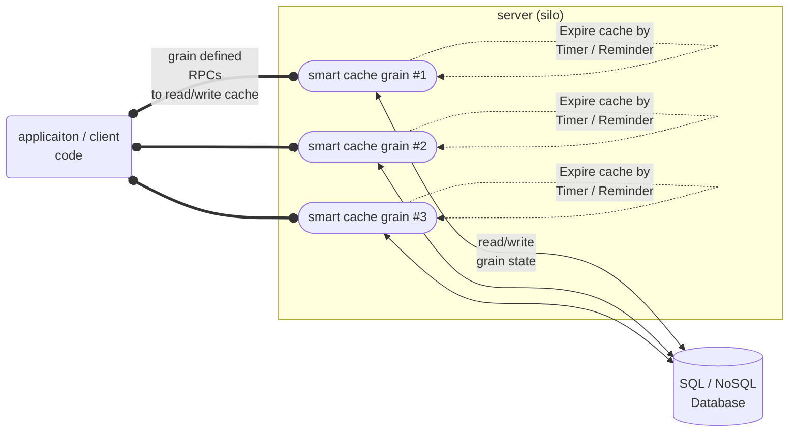
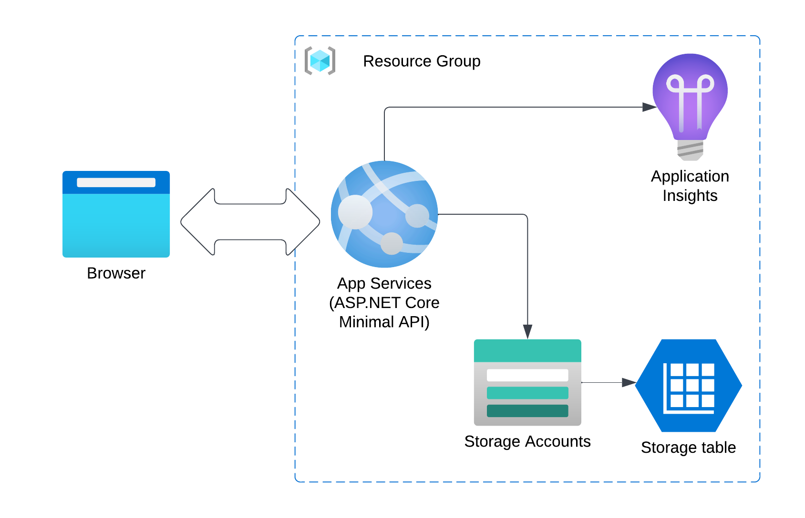
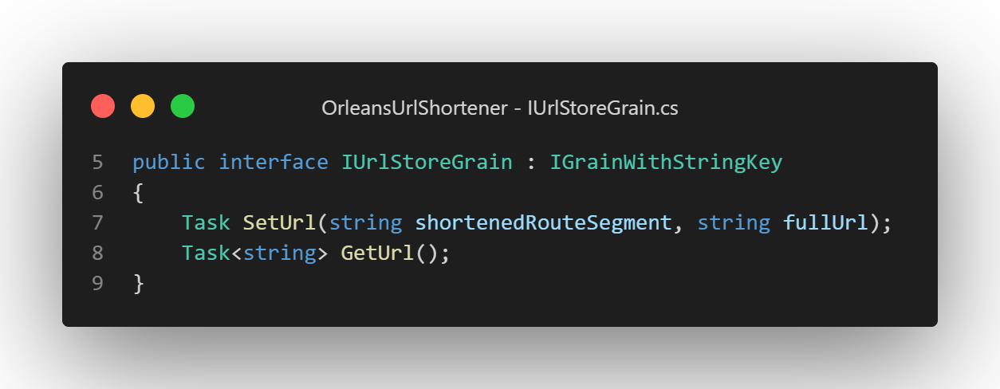
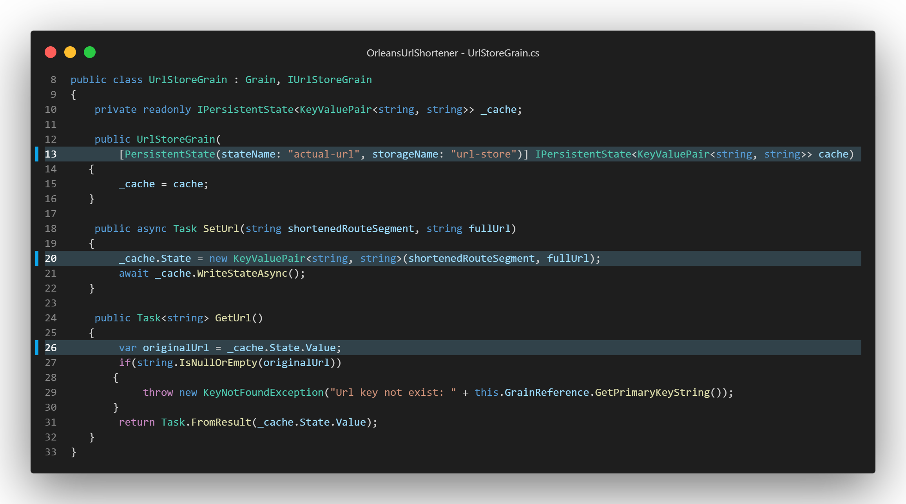
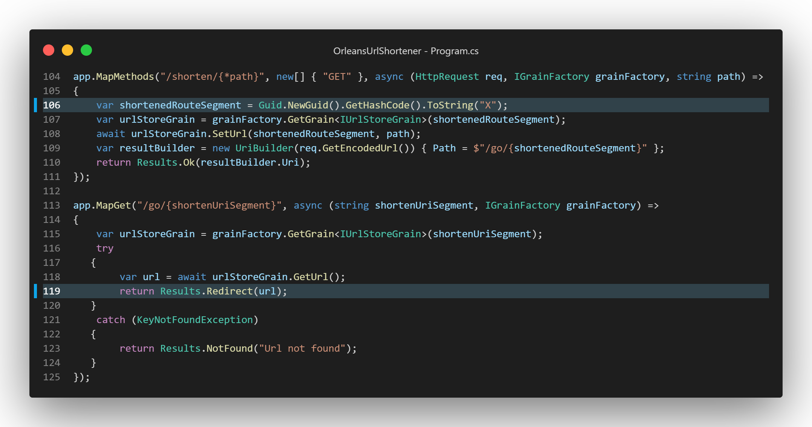
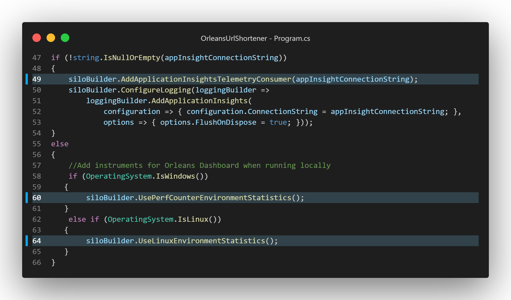
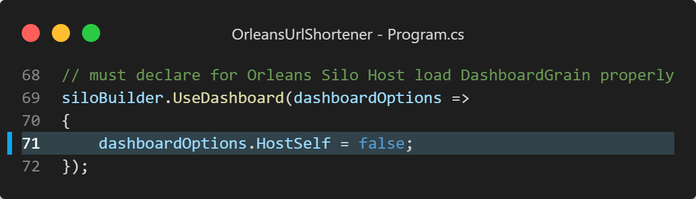
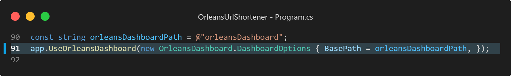

# Orleans常見系統架構模式：Smart Cache Pattern及其應用範例

## Smart Cache Pattern 介紹

[Smart Cache Pattern](https://github.com/OrleansContrib/DesignPatterns/blob/master/Smart%20Cache.md) 是一種 Orleans 的架構Pattern，利用Orleans Grain有State狀態儲存的機制來當作Application Cache，而不需要例如Redis和Memcached等的額外Cache服務伺服器：

此架構利用Grain每一個實體有其唯一識別子(Grain identity)的性質，來當作Cache的Key，而Grain的State狀態資料則當作Cache的Value，這樣就可以在Grain實體中，將Cache的資料儲存起來，Client端再透過根據應用程式需求所制定的Grain RPC方法來讀取或寫入Cache的資料；而Grain實體又有被RPC呼叫觸發後，會停留在系統記憶體一段時間除非閒置才休眠的特性，利用這個特性來達到In-Memory Cache的效果。

而這架構中定義的Grain(smart cache)，也可根據需求再額外利用Orleans Grain的*Timer/Reminder*機制，使cache在一段時間後自動過期，或是在cache由RPC方法被讀取時，再重新更新cache的過期時間，這樣就可以達到Cache的自動更新與過期的效果。

## Smart Cache Pattern 應用範例

以下以一個跑在Azure Web App的短網址服務為例，說明如何利用Smart Cache Pattern來實作短網址服務的Cache機制。

此範例的GitHub程式碼專案在：  
https://github.com/windperson/OrleansUrlShortener

### 短網址服務架構

此短網址服務架構如下圖所示：

以Azure Web App為主要應用運算實體的服務架構，包含了以下幾個部分：
* Azure Web App：使用ASP.NET Core 6的Minimal Api，作為短網址服務的API服務，並且使用Co-hosting配置來讓Microsoft Orleans Cluster和 ASP.NET Core Web Server 都跑在同個App Service Instance上。
* Azure Storage：使用Azure Table Storage作為Microft Orleans的Grain State儲存機制，以便儲存Grain的狀態資料，也就是原本使用者輸入的實際網址字串。
* Application Insight：用來監控短網址服務的運行狀況。

### 短網址程式碼解說

此短網址服務儲存實際網址資料的Grain，稱為`UrlStoreGrain`，其RPC介面定義在 **src/UrlShortener.Backend.Interfaces/IUrlStoreGrain.cs**：

這邊將到時候短網址服務產生的短網址末尾隨機碼字串，當作smart cache的key值，兼為Grain的Identity，所以繼承自 `IGrainWithStringKey` 介面，並在第七行定義用來儲存實際網址的RPC方法 `SetUrl(string shortenedRouteSegment, string fullUrl)`，以及在第八行定義用來讀取實際網址的RPC方法 `GetUrl()`。

而此Grain的實作在 **src/UrlShortener.Backend.Grains/UrlStoreGrain.cs**：

可以看到，在第13行用依賴注入一個 .NET 的 [`KeyValuePair<string, string>`](https://learn.microsoft.com/en-us/dotnet/api/system.collections.generic.keyvaluepair) 型別Grain State狀態變數，來儲存實際網址資料；而第20行就是SetUrl這個RPC實作將 *短網址末尾隨機碼 : 實際網址* 的資料，儲存到Grain State狀態變數中；第26行則是GetUrl這個RPC實作，將Grain State狀態變數中的實際網址資料，回傳給呼叫方。

實際上呼叫UrlStoreGrain的Minimal Api，寫在 **src/UrlShortener.Frontend/Program.cs** 的兩個Web API：

第106行先以產生一個Guid的Hash Code作為短網址的末尾隨機字串後，以此字串去初始一個UrlStoreGrain，並呼叫 `SetUrl()` 將末尾隨機碼以及原始網址儲存起來，而在第113行另一個取得真實網址的Web Api，則是以輸入的短網址（ */go/OOXX....* ）的末尾隨機碼，去取得UrlStoreGrain的RPC呼叫參考，並呼叫 `GetUrl()` 取得實際網址資料，然後在第119行以 ASP.NET Core Minimal API的 [`Results.Redirect()`](https://learn.microsoft.com/en-us/dotnet/api/microsoft.aspnetcore.http.results.redirect)，使原本瀏覽該Http GET Web API的Internet瀏覽器轉網址到真正實際網址。

以上是開發面向的短網址服務程式碼解說，接下來就是運營面Silo部署到Azure的一些注意事項：

#### Silo的Log資料寫入到Azure Application Insight或是其他遙測資料的取得

首先在 **src/UrlShortener.Frontend/Program.cs** 的第49行，使用從 [Microsoft.Orleans.OrleansTelemetryConsumers.AI](https://www.nuget.org/packages/Microsoft.Orleans.OrleansTelemetryConsumers.AI) 此Nuget套件提供的[`AddApplicationInsightsTelemetryConsumer()`](https://learn.microsoft.com/en-us/dotnet/api/orleans.hosting.aitelemetryconsumerconfigurationextensions.addapplicationinsightstelemetryconsumer)擴充方法，以便將Silo的遙測資料(Telemetry)，傳送到Azure Application Insight中，得以監控Silo的運行狀況。

另外，這些Telemetry資料也是OrleansDashboard用來取得Silo實際系統資源使用狀況的依據，根據目前執行的作業系統環境是Windows還是Linux，安裝不同的Nuget套件（Windows是 [Microsoft.Orleans.OrleansTelemetryConsumers.Counters](https://www.nuget.org/packages/Microsoft.Orleans.OrleansTelemetryConsumers.Counters)，Linux是 [Microsoft.Orleans.OrleansTelemetryConsumers.Linux](https://www.nuget.org/packages/Microsoft.Orleans.OrleansTelemetryConsumers.Linux)）並在第60和第64行配置各自作業系統的遙測資料來接收Silo的狀態資料輸出，這些程式碼如下圖所示：

#### OrleansDashboard的設定

OrleansDashboard 由於在Azure Web App上，已經都有預設的Web Server程式在80 port提供服務，與地端/開發機上使用的狀況不同；所以有個 `HostSelf` 在SiloHost的配置設定要設定為 `false`，以便讓OrleansDashboard不要自己啟動自己的Web Server，而使用Azure Web App的Web Server來提供OrleansDashboard的Web UI介面，這個設定在 **src/UrlShortener.Frontend/Program.cs** 的第71行，如下圖所示：

以及在WebApplication建置出來後設定OrleansDashboard的路由，這個設定在 **src/UrlShortener.Frontend/Program.cs** 的第91行，如下圖所示：

---

明天來介紹另一個Orleans的Dispatcher Pattern架構模式和其範例。
