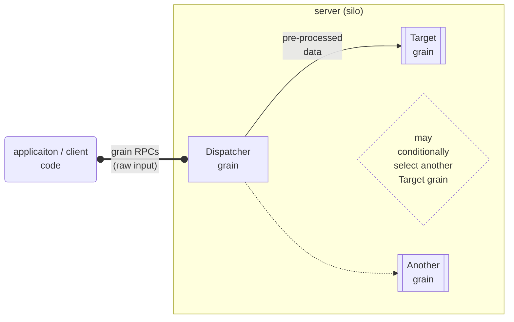

# Orleans常見系統架構模式：Dispatch Pattern及其應用範例

## Dispatch Pattern 介紹

[Dispatch Pattern](https://github.com/OrleansContrib/DesignPatterns/blob/master/Dispatcher.md)是一種 Orleans 的架構Pattern，利用Orleans Grain被Client端RPC呼叫後，RPC實作內部可以再次呼叫其他Grain的RPC方法之特性。這種模式可以用來實作一些接收從外部Client輸入資料後，需要進行一些預處理，後端才能消化的系統架構。

如上圖，Client端呼叫Dispatcher Grain的RPC方法以便輸入初始的Raw Data，Dispatcher Grain會將Client端傳入的資料進行預處理，然後在Dispatcher grain內呼叫Target Grain的RPC方法傳送整理好的資料給Target Grain，Target Grain再將資料進行商業邏輯的運算處理。

在Dispatcher grain裡，可以根據一些自行定義的條件來決定要呼叫哪一個Target Grain來給予資料，以便進行不同的商業邏輯運算。

使用 Dispatcher Pattern的好處是將外部輸入和內部商業邏輯層多隔出一層Dispatcher層，這樣可以讓Client端的程式呼叫API需求和後端的實際邏輯運算/資料儲存層分離，讓後端的實作可以更容易的進行重構或擴充，也可讓Client端的程式更容易依照使用者體驗的介面需求進行開發。

套用Dispatcher Pattern也能讓系統未來的規模發展達到類似 [BFF(Behind Frontend Framework) Pattern](https://samnewman.io/patterns/architectural/bff) 的架構概念，讓後端的實際業務Grain可在不同用途的Dispatcher呼叫時重複使用，或將資料讀寫分離等等的後續系統需求。

## Dispatch Pattern 應用範例

以下用一個網頁投票範例，來說明如何使用Dispatcher Pattern來實作投票系統。
