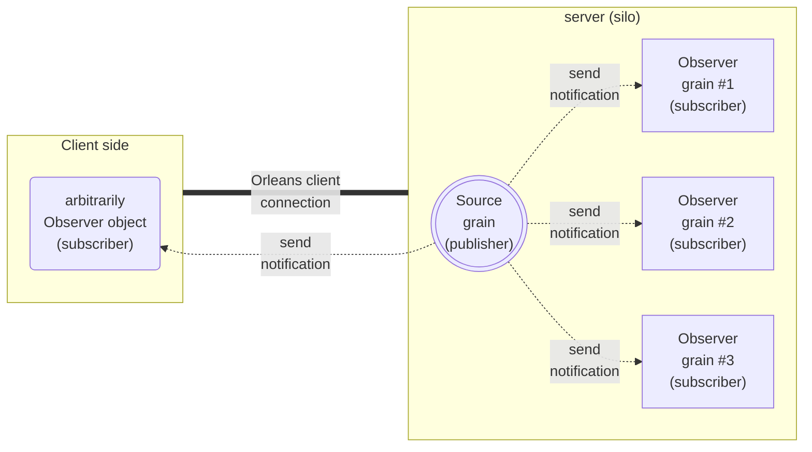

# Orleans常見系統架構模式：Observer Pattern及其應用範例

## Observer Pattern 介紹

[Observer Pattern](https://github.com/OrleansContrib/DesignPatterns/blob/master/Observer.md) 和先前介紹的幾個Pattern不同，屬於事件驅動的系統架構模式，先前介紹的Smart Cache, Dispatcher, Cadence Pattern都是從外部到系統內的資料流入方向，而Observer Pattern則是從系統內部的Grain發出事件通知，讓外部的Client端程式或是系統內其他Grain訂閱該事件，接收到事件通知後，再進行後續的處理，這其實就是經典GoF("Gang of Four")設計模式的 [publish/subscribe pattern](https://en.wikipedia.org/wiki/Publish%E2%80%93subscribe_pattern)：

類似於Cadence Pattern是利用Orleans框架提供的Timer/Reminder來實作一樣，Observer Pattern也是利用Orleans框架提供的Observer事件，或Stream功能來實作。

Source grain本身發送訊息的觸發條件可配合昨天介紹的Cadence Pattern，以便讓訊息的實際發送狀況是有規律、有節奏的，而不是突然就湧流濫發出一大堆訂閱訊息而使得subscriber端癱瘓。

Observer Pattern可用來實作對話聊天系統的後端訊息轉交發送機制，或是任何需要發送通知的系統應用。

## Observer Pattern 應用範例：以ASP.NET Core SignalR/Azure SignalR串接的對話聊天系統

以下以一個簡易對話聊天系統範例的實作，介紹如何以Orleans的Stream功能和 ASP.NET Core SignalR / Azure SignalR 串接，來實現Observer Pattern的系統架構。
