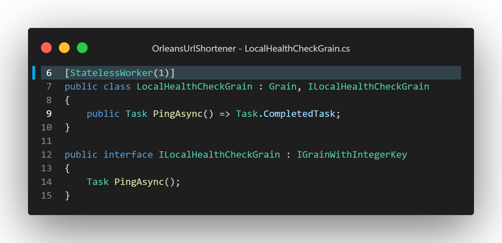

# Orleans應用部署Azure實例 — Azure App Service (Windows)

[Azure App Service](https://azure.microsoft.com/zh-tw/products/app-service)是微軟Azure雲端的PaaS(Platform as a Service)服務，可以讓使用服務者不需要花費時間精力管理其底層的Windows或Linux作業系統，就可以提供網站、Web API的基本Web服務。

Orleans 在 v3.0之後支援使用ASP.NET Core Co-hosting的配置，可以使用此配置將Orleans和使用其Grain(Actor model的Actor)的Web服務共同部署在Azure App Service上執行。

以下使用先前介紹Smart Cache Pattern的短網址服務範例專案（原始碼：https://github.com/windperson/OrleansUrlShortener/tree/AzureWebApp-multiple_instances ），介紹如何部署Orleans應用至Azure App Service。

## 使用Bicep建立App Service及相關配套的基礎Azure服務

以下使用 [Bicep](https://github.com/Azure/bicep) 這個Azure在其Azure CLI指令列程式內建的 IaC(Infrastructure as Code) 語言方式建立App Service及相關配套的基礎Azure服務，包含：
1. [Azure App Service Plan](https://learn.microsoft.com/zh-tw/azure/app-service/overview-hosting-plans)：實際執行Azure App Service的雲端運算資源。
2. [Azure App Service](https://learn.microsoft.com/zh-tw/azure/app-service/overview)：跑短網址服務及其使用 ASP.NET Core Co-hosting Orleans服務的Web App。
3. [Azure App Service Deployment Slot](https://learn.microsoft.com/zh-tw/azure/app-service/deploy-staging-slots)：用於在Azure App Service部署實際應用程式的環境，讓開發者在不影響正式環境的情況下，測試新的應用程式版本。
4. [Azure Application Insights](https://learn.microsoft.com/zh-tw/azure/azure-monitor/app/app-insights-overview?tabs=net)：監控App Service的運行狀況。
5. [Azure Virtual Network](https://learn.microsoft.com/zh-tw/azure/virtual-network/virtual-networks-overview)以及在Azure App Service上設定對應的[區域性虛擬網路整合(Regional virtual network integration)](https://learn.microsoft.com/zh-tw/azure/app-service/overview-vnet-integration#regional-virtual-network-integration)：讓不同Azure App Service執行實體上的Orleans Silo服務可以互相通訊。
6. [Azure Storage Account](https://learn.microsoft.com/zh-tw/azure/storage/common/storage-account-overview)：使用 [Azure Table Storage](https://learn.microsoft.com/zh-tw/azure/storage/tables/table-storage-overview) 這個No-SQL服務來儲存Orleans的Cluster連線資訊、Grain狀態資料。
7. [User-assigned Managed Identity](https://learn.microsoft.com/zh-tw/azure/active-directory/managed-identities-azure-resources/overview#managed-identity-types)：用來控制Azure App Service對前一項Azure Storage Account以及Azure Table Storage的存取權限。

假如你預估的存取服務量在實際需求上，不會需要超過一台執行實體的Azure App Service規模，那 5. Virtual Network虛擬網路可以不用建立。
如果不需要做藍綠部署(Blue/Green Deployment)以達到更新部署應用程式不中斷服務的需求，那麼 3. Azure App Service Deployment Slot的Azure app service衍生子服務可不必建立。

使用Bicep這種IaC語言的好處是可以將原本需要手動在Azure管理網頁上服務建立的設定，都寫在Bicep程式碼檔案 (_*.bicep_) 中以便納入版控追蹤服務設定變化，並且以執行Azure CLI指令列程式來呼叫服務部署的動作，可以在需要時在不同的環境（ex: testing, staging, production）重複執行，或是將呼叫Azure CLI的過程併入CI/CD的流程以便讓程式碼及其使用的Azure基礎服務配置有正確的對應；況且，有些Azure服務之間的中介設定，例如Managed Identity指派的存取權限設定，也不必自己一一手動指定。 

### Bicep簡介

Bicep 是奠基於原本Azure提供的ARM(Azure Resource Management) Template的Json檔的DSL語言，可以讓使用者以更簡潔的方式描述Azure服務的設定，並且可以在Bicep程式中使用模組、for loop迴圈等方式來重複使用程式碼，在Azure CLI程式執行資源部署指令時，底層的運作機制會將原本Bicep程式碼檔案內定義的服務內容，轉換為ARM Template Json，然後送至Azure雲端開始進行部署。

Bicep有獨立的命令列執行程式（可在[GitHub下載](https://learn.microsoft.com/en-us/azure/azure-resource-manager/bicep/install#install-on-air-gapped-cloud)），但一般都以在Azure CLI中使用 `az bicep` 指令列指令來執行Bicep的指令，例如 `az bicep build` 指令可以將Bicep程式碼檔案轉換為ARM Template Json檔案，或是 `az bicep decompile` 指令可以將ARM Template Json檔案轉換為Bicep程式碼檔案。

實際部署時，就以 `az deployment [sub|group] create` 指令來呼叫Azure CLI的部署指令，並以參數 `--template-file=` 來指定Bicep程式碼檔案的路徑，就可以部署Azure服務了。

不過建議在部署時如果有提示說需要更新Azure CLI內建的Bicep時，先按 **Ctrl+C** 取消，然後以`az bicep upgrade`更新後再部署，避免發生部署失敗的情形：


Bicep程式碼檔案的副檔名為 _.bicep_，可以使用Visual Studio Code或Visual Studio的擴充套件來編輯Bicep程式碼，提供語法彩色標示、語法檢查、自動完成的功能：
* Visual Studio Code：[Bicep VS Code Extension](https://marketplace.visualstudio.com/items?itemName=ms-azuretools.vscode-bicep)
* Visual Studio：[Bicep for Visual Studio](https://marketplace.visualstudio.com/items?itemName=ms-azuretools.visualstudiobicep)

Bicep是一種宣告式的DSL(Domain Specific Language)語言，語法類似Json，但是不需要使用逗號和分號來區分屬性值和敘述式，而是使用換行來區分，例如以下的建立App Service Plan的[Bicep程式碼片段](https://github.com/windperson/OrleansUrlShortener/blob/AzureWebApp-multiple_instances/infra/Azure/webapp.bicep#L1)：


第7行宣告此Bicep的一個Azure資源(resource)，名稱為後綴的 "`frontendAppServicePlan`" 字串，資源的類型為其後的 `Microsoft.Web/serverfarm` 字串，而實際和Azure資源存取REST API溝通以便建立該服務的API版本是該字串@符號後的後綴日期版本：`2022-03-01`。

Bicep有哪些resource可以宣告，以及對應的呼叫API版本，除了靠擴充套件的自動完成提示的文字之外，微軟的網站上也有對應的[官方參考文件](https://learn.microsoft.com/en-us/azure/templates/microsoft.web/serverfarms)可以查找：


從上述程式碼片段可以看到，Bicep程式碼可以定義參數([**param**](https://learn.microsoft.com/en-us/azure/azure-resource-manager/bicep/parameters))，以便用來在呼叫此Bicep模組時可以傳入實際參數值，而像第1和第4行的參數還有定義預設值，可在呼叫Bicep模組時不用傳入該參數值，直接指派預設值。

每一個內容為宣告一或多個Azure資源的Bicep檔案都自動成為一個模組([**module**](https://learn.microsoft.com/en-us/azure/azure-resource-manager/bicep/modules))，模組可以在其他Bicep檔案中使用 `module` 敘述式來呼叫，例如以下的[Bicep程式碼片段](https://github.com/windperson/OrleansUrlShortener/blob/AzureWebApp-multiple_instances/infra/Azure/webapp.bicep#L56)：


第56行就是呼叫與目前該Bicep程式碼檔案所在同個目錄下的 *operationalInsight.bicep* 檔案，並且在第58~62行的 `params` 區塊中指派呼叫其模組所需的 `location`, `webAppName`, `webAppResourceId` 這三個參數。

模組可以定義輸出參數([**output**](https://learn.microsoft.com/en-us/azure/azure-resource-manager/bicep/outputs))，以便在建立完Azure服務後回傳建立的資源ID或連線字串等重要資訊供呼叫者使用，例如以下的[Bicep程式碼片段](https://github.com/windperson/OrleansUrlShortener/blob/AzureWebApp-multiple_instances/infra/Azure/operationalInsight.bicep#L37)：


第37,38行定義了 `appInsightInstrumentKey` 和 `appInsightConnectionString` 兩個輸出參數，其值就是在 operationInsight.bicep 檔案中建立的 Application Insights 資源 `frontendAppInsight` 的Instrumentation Key和Connection String屬性：


而在呼叫模組的Bicep檔案中，可使用 `outputs` 屬性來取得模組內定義的輸出參數值，像下方的截圖就是使用呼叫 *operationInsight.bicep* 模組，建立Azure Application Insight雲端服務資源而獲得 **Instrument Key** 和 **Connection String** 對應的 `appInsightInstrumentKey` 和 `appInsightConnectionString` 輸出值，然後於定義App Service Config這項資源內 `appSettings` 屬性設定的Bicep程式碼使用：


所以我們可以用模組來分類不同的Azure雲端服務產生敘述內容，然後再於最上層的Bicep呼叫這些模組串接起來使用，如此以便將複雜的Azure雲端服務建立過程拆分成多個獨立模組，並在呼叫模組時傳入參數以建立自訂的Azure雲端服務內容。

模組輸出除了定義為字串型態之外，也可定義成陣列，如以下的[Bicep程式碼片段](https://github.com/windperson/OrleansUrlShortener/blob/AzureWebApp-multiple_instances/infra/Azure/webapp.bicep#L177)：


然後在使用該陣列時，可於資源宣告的後綴加上 [**for loop** 宣告](https://learn.microsoft.com/en-us/azure/azure-resource-manager/bicep/loops)，將陣列中的每個元素依序取出來使用，如以下的[Bicep程式碼片段](https://github.com/windperson/OrleansUrlShortener/blob/AzureWebApp-multiple_instances/infra/Azure/storage.bicep#L30)：


就能動態建立多個Azure服務資源，並使用陣列中的每個元素來設定資源的屬性值。

Bicep的 [**if**邏輯判斷](https://learn.microsoft.com/en-us/azure/azure-resource-manager/bicep/conditional-resource-deployment) 有兩種語法，第一種類似使用陣列變數的方式，寫在資源宣告的後綴，而另一種是在屬性宣告上使用，類似於C#的`?:`三元運算子，如以下[Bicep程式碼](https://github.com/windperson/OrleansUrlShortener/blob/AzureWebApp-single_instance/infra/Azure/webapp.bicep#L59)範例：


這個範例在傳入的 `storageAccountUrl` 參數值是空白字串時，就不會額外增加一個Azure Service Config服務資源中 `appSettings` 屬性內，名稱為 "`UrlStoreGrain:ServiceUrl`" 的設定值。

在Bicep程式中，有四種方式來敘述Azure資源之間的相依性：
1. 在資源(`resource`)定義中使用 [**dependsOn**](https://learn.microsoft.com/en-us/azure/azure-resource-manager/bicep/resource-dependencies#explicit-dependency) 屬性來指定此Azure資源相依於另一資源，也就是另一資源成功建立後，才會建立此資源。
2. 在資源定義區塊內再使用 [`resource`](https://learn.microsoft.com/en-us/azure/azure-resource-manager/bicep/resource-declaration) 關鍵字定義另一個子資源，則該子資源即相依於父資源（父資源建立後才會建立子資源）。
3. 原本資源組織起來的型態就是階層式的資源宣告（例如App Service Deployment Slot、App Configuration就是Azure App Service的子資源），子資源定義的宣告不寫在父資源定義區塊程式碼中，而是拉出來寫在與父資源同樣縮排等級的定義區塊，並且在定義區塊中使用 [**parant**](https://learn.microsoft.com/en-us/azure/azure-resource-manager/bicep/child-resource-name-type) 屬性來指定子資源的父資源是誰：
   
4. 在資源定義中指定屬性時，使用其他資源的屬性值，則此資源就隱性相依於其他資源。

Bicep在部署自動轉譯成ARM Template的JSON格式時，會自動處理以上四種資源宣告的相依性以便轉換成合乎邏輯的資源建立順序，假如有資源宣告的相依性無法被梳理，則會在部署的Azure CLI執行時回傳錯誤訊息。

### 短網址服務應用的Bicep部署方法與程式碼解說

#### 建立Azure Bicep部署方法

短網址服務範例專案的Bicep程式碼位於 **Infra/Azure** 目錄下，包含了五個 *.bicep檔案以及一個 *parameters.json* ，這是用來提供執行Azure ClI部署指令時大部分參數預設值的設定檔案。

要建立短網址服務的Azure資源，在該目錄執行以下指令：
```sh
az deployment sub create --name ithome_demo --location [azure_datacenter_region] --template-file ./main.bicep  --parameters deploy_region=[azure_datacenter_region] parameters.json
```
其中 `--name` 參數是此部署的名稱，可自訂，在此範例使用 *ithome_demo*，而 `[azure_datacenter_region]` 要替換成你想要部署的[Azure資料中心區域](https://aka.ms/AzureRegions)的縮寫名稱，例如 `eastus`、`westus`、`southeastasia`，可以使用 `az account list-locations -o table` 指令來取得可使用的區域名稱：


部署指令下達之後，稍等一段執行時間後，假如回傳的Json字串有 `"provisoningState": ""Succeeded"`，則表示Azure資源的建置部署指令成功，可進行後續的程式上版動作：


此時在Azure Portal管理網頁的資源群組(resource group)列表內可以看到名稱為 *ithome_cloud_summit_demo* 的新建資源群組（此名稱為寫在 parameters.json 檔內的 `resource_group` 參數），以及在內的App Service, Deployment slot, Storage Account等等總共9個Azure服務資源：


#### 移除Azure Bicep部署方法

當不需要此短網址服務的Azure資源，需要移除掉時：
1. 使用以下指令來移除先前建立的Azure Bicep部署 *ithome_demo*：
   ```sh
   az deployment sub delete --name ithome_demo
   ```
2. 刪除整個資源群組 *ithome_cloud_summit_demo*：
   ```sh
   az group delete --name ithome_cloud_summit_demo
   ```   

#### Bicep程式碼解說

短網址服務的Bicep程式碼架構為，由 `main.bicep` 為進入點，在建立資源群組之後，分別引用 `vnet.bicep` 建立Azure Virtual Network，`webapp.bicep` 建立Azure App Service，在webapp.bicep的程式碼中又引用 `operationalInsight.bicep` 建立Azure Application Insight和Azure Log Analytics、建立Staging環境使用的App Service Deployment Slot以及正式與Staging各自環境使用的Managed Identities，然後 在 `main.bicep` 中引用 `storage.bicep` 建立Azure Storage Account，整體相依的關係用 Visual Studio Code Extension 提供的產生視覺化圖形功能呈現如下：


由於在建立Azure App Service和Storage Account這兩種服務時，App Service需要Storage Account的服務提供網址做為App Config的設定參數值，而Storage Account需要使用Azure Web App指定的Managed Identities的資源ID來設定存取權限，等於就是互相有依賴關係。

所以解決這種雞生蛋蛋生雞的策略方針是，將這些兩邊會需要的屬性值，拉高一層在 `main.bicep` 先宣告一些變數並賦值，以便等下指派為在 `main.bicep` 中呼叫webapp和storage模組的參數值，便於這兩個服務的建立：


如上面這個[Bicep程式碼片段](https://github.com/windperson/OrleansUrlShortener/blob/AzureWebApp-multiple_instances/infra/Azure/main.bicep#L13)截圖所示，第15行定義了一個 `orleans_storage_account` 的變數以便後續宣告Azure資源時使用，第33行就是用Bicep字串插值(String interpolate)的方法，組合出當Storage Account建立之後，Azure Table Storage提供存取服務的網址字串做為傳入 `storageAccountUrl`的參數值；此範例中使用Bicep的 `take()` 和 `uniqueString()` 這些[內建字串處理函式](https://learn.microsoft.com/en-us/azure/azure-resource-manager/bicep/bicep-functions-string)，以便在部署時產生一個獨特唯一識別值的字串，避免重複的資源名稱造成部署失敗，畢竟Azure App Service和Storage Account的名稱在取名之後會變成存取網址URL的一部份，因此必須是全球唯一的。

同樣的道理，為了要讓Azure Virtual Network的虛擬網路名稱和Azure App Service的服務名稱在Azure Portal呈現時是一看就知道的，所以在第13行定義了 `webapp_name` 這個變數，並用在第22行給建立虛擬網路的呼叫 `vnet.bicep` 模組參數值，第31行給建立Azure App Service呼叫 `webapp.bicep` 模組的參數值，達到我們想要的效果。

整個建立好的Azure資源架構如下圖所示：  
  
此範例架構為了要示範使用多Orleans Silo執行的情形，所以Azure App Service服務預設就設為[手動調整規模(Manual Scale)為兩個執行實體(Instance)](https://learn.microsoft.com/zh-tw/azure/azure-monitor/autoscale/autoscale-get-started?toc=%2Fazure%2Fapp-service%2Ftoc.json#create-your-first-autoscale-setting)；實務上可以設定成根據CPU或記憶體使用率自動調整規模即可。  
此設定寫在 `webapp.bicep` 第12行的App Service Plan資源宣告屬性中：


而在Azure App Service的環境，假如啟用多個執行實體，且執行實體之間要互相通訊的話，需建立Azure Virtual Network服務並設定[區域性虛擬網路整合(Regional virtual network integration)](https://learn.microsoft.com/zh-tw/azure/app-service/overview-vnet-integration#regional-virtual-network-integration)以便讓執行實體有虛擬網路的IP和Port可以互通。  
手動設定的話，在建立完Azure Virtual Network之後，還需要到Azure App Service服務中，Networking的設定頁面，點選「VNet Integration」，再繼續選擇要整合的虛擬網路，以及要整合的子網路(Subnet)：
  
使用Bicep的話，建立虛擬網路的 `vnet.bicep` 中 `subnets` 的屬性要新增delegations的設定：
  
並且要回傳建立的Azure Virtual Network之中Subnet的Resource ID，以便在稍後建立Azure App Service的 `webapp.bicep` 程式中設定Regional virtual network integration使用；所以在第32行使用Bicep的[內建 `resourceId()` 函式](https://learn.microsoft.com/en-us/azure/azure-resource-manager/bicep/bicep-functions-resource#resourceid)來取得。  
然後此輸出變數會用在 `webapp.bicep` 第31行中 `virtualNetworkSubnetId` 的屬性指定，並且在第34行設定開放虛擬網路的兩個TCP Port，以便讓Orleans Silo程式通訊之用：
  
相對應的在 `webapp.bicep` 中 Deployment Slot 的資源宣告也要加上在第111和114行加上相同設定，以便讓部署在Staging環境的Orleans Silo也可以通訊：
  

其他的雜項設定例如[讓 App Service 執行應用程式的軟體堆疊預設使用 .NET 6](https://www.coderperfect.com/how-to-configure-runtime-stack-to-azure-app-service-with-bicep-bicep-version-0-4/)，在 `webapp.bicep` 中除了第35行設定版號為 *v6.0* 之外，還需要增加一個名稱為 **metadata** 的App Service組態資源並指定給App Service，如下的程式碼截圖第41~49行所示：


[指定App Service中哪些設定是屬與 *"Slot setting"*](https://learn.microsoft.com/zh-tw/azure/app-service/deploy-staging-slots#which-settings-are-swapped)，也就是不會隨著[交換位置(Slot swap)](https://learn.microsoft.com/zh-tw/azure/app-service/deploy-staging-slots#swap-two-slots)以致於正式與Staging環境互相交換的設定值，需要在 `webapp.bicep` 的Bicep程式碼中增加一個名稱為 **slotConfigNames** 的App Service組態資源，並加上那些 `NameValuePair` 型態設定的名稱(name)值，如下的程式碼截圖第162~175行所示：


而在建立Azure Storage Account的 `storage.bicep` 中，如果要在Bicep程式碼中取得原本已經既有的Azure內建角色權限資源，可以像下圖第15, 21, 27行一樣，[使用 `existing` 敘述式](https://learn.microsoft.com/en-us/azure/azure-resource-manager/bicep/existing-resource)來取得：
  
然後在第38行建立[role assignment資源](https://learn.microsoft.com/en-us/azure/templates/microsoft.authorization/roleassignments?pivots=deployment-language-bicep)時使用 `roleDefinitionId` 屬性來指定是剛剛取得的角色權限，而此role assignment資源則是第34行用[設定範圍(scope)屬性的方式](https://learn.microsoft.com/en-us/azure/azure-resource-manager/bicep/scope-extension-resources#apply-to-resource)綁定在Storage Account上。

使用Managed Identity來保護Azure Table Storage的存取權限，會在服務部署後正常運行時，Application Insight以Map顯示狀態圖中看到App Service有多存取了Microsoft AAD(Azure Active Directory)：
  
如果沒有在Storage Account指定適當權限給App Service所指派的Managed Identity，就會無法讀寫資料，達到嚴謹的資料保護且此方式不必在程式碼/連線字串中出現使用者ID/密碼等的機密資訊。

以上是建立Azure資源的Bicep Infrastructure as Code的程式碼解說，接下來繼續看Orleans Silo配置程式碼要如何使用這些部署的Azure資源。

## Silo相關配套設定解說

### Orleans Clustering 配置

在啟用了虛擬網路之後，App Service的服務實體[會多了一些額外的環境變數](https://learn.microsoft.com/en-us/azure/app-service/reference-app-settings?tabs=kudu%2Cdotnet#networking)，其中  `WEBSITE_PRIVATE_IP` 和 `WEBSITE_PRIVATE_PORTS` ，就是要用來讓Silo可以跨App Service服務實體用的網路連接資訊，可以在[Azure App Service的Kudu工程管理網頁](https://learn.microsoft.com/zh-tw/azure/app-service/resources-kudu)Environment分頁上找到：


有了上述的IP和Port資訊之後，為了要讓都位於同一台App Service Plan機器上的Azure App Service Deployment Slot所跑的Orleans Silo不會連錯到環境，所以我們必須用一個Azure App Service內建的環境變數『`WEBSITE_DEPLOYMENT_ID`』，此變數值會隨著程式部署而自動改變，所以我們可以用這個變數值來區分不同的Silo環境，如下圖，正式Production環境和Staging環境的Kudu管理網頁內，可以看到變數值會不同：


所以在 [*Program.cs* 的 `UseOrleans()` 擴充方法配置SiloBuilder的程式碼](https://github.com/windperson/OrleansUrlShortener/blob/AzureWebApp-multiple_instances/src/UrlShortener.Frontend/Program.cs#L37)中，第44, 45行取得 `WEBSITE_PRIVATE_IP` 和 `WEBSITE_PRIVATE_PORTS` 環境變數值，並解析成 IP Address和對應的兩個開放的Port數字之後，第56行就可以用這些資料來呼叫 [`ConfigureEndpoints()`](https://learn.microsoft.com/en-us/dotnet/api/orleans.hosting.endpointoptionsextensions.configureendpoints) 擴充方法來設定此Silo啟動時連線用網路連接資訊，並且在第60行多額外呼叫 [`UseAzureStorageClustering()`](https://learn.microsoft.com/en-us/dotnet/api/orleans.hosting.azuretableclusteringextensions.useazurestorageclustering) 擴充方法來啟用Azure Storage Table來做為Orleans Silo叢集Membership資訊儲存機制：
  
在第53行宣告 `clusterId` 字串值時，內容額外多添入了 `WEBSITE_DEPLOYMENT_ID` 環境變數值，並於第69行設定 [`ClusterOption`](https://learn.microsoft.com/en-us/dotnet/api/orleans.configuration.clusteroptions) 時使用，這樣就可以讓在不同Deployment Slot的Silo叢集啟動時會有不同的ClusterId來區分，而不會去連到不同環境的Silo執行實體。

### 設定 ASP.NET Core Health Check功能串接Orleans Silo

Azure App Service 有內建[健康情況檢查(Health Check)](https://learn.microsoft.com/zh-tw/azure/app-service/monitor-instances-health-check?tabs=dotnet)功能，其運作原理就是在指定的URL路徑，假如超過一段時間間隔都還連線不到或是沒有回傳正確的http response code時，就視為此服務運作不正常，可以讓後續監測機制回報狀況給管理者或是自動重啟App Service服務實體等網站維護事項；這個功能可以配合設定 [ASP .NET Core Health Checks功能](https://learn.microsoft.com/zh-tw/aspnet/core/host-and-deploy/health-checks?view=aspnetcore-6.0)來提供 ASP.NET Core 網站的健康狀態回報功能，Orleans也有辦法提供其Grain/Silo運作的狀態資訊給 ASP.NET Core Health Checks，以便讓架設在Azure App Service上的Silo服務運作更穩健。

要讓Azure Web App Service可以接到ASP.NET Core Health Checks功能，首先在服務架設的Bicep程式碼 *webapp.bicep* 要設定 `healthCheckPath` 屬性，讓App Service Health Check在服務執行時要監測的路徑是 `/healthz`：
  
在ASP.NET Core網站的配置程式碼 *Program.cs* 內，當builder建立出WebApplication實體變數 `app` 之後，就呼叫 [`MapHealthChecks()`](https://learn.microsoft.com/en-us/dotnet/api/microsoft.aspnetcore.builder.healthcheckendpointroutebuilderextensions.maphealthchecks) 擴充方法來設定對應的回報URL路徑，如下圖程式碼截圖的第146行所示：
  
而這個要能運作，必須在前面第140行builder配置時，先呼叫 [`AddHealthChecks()`](https://learn.microsoft.com/en-us/dotnet/api/microsoft.extensions.dependencyinjection.healthcheckservicecollectionextensions.addhealthchecks) 擴充方法來設定要啟用Health Checks功能，並且還要呼叫 [`AddCheck<T>()`](https://learn.microsoft.com/en-us/dotnet/api/microsoft.extensions.dependencyinjection.healthchecksbuilderaddcheckextensions.addcheck) 擴充方法來設定實際做健康檢查動作的實作類別。

Orleans 在實作健康檢查類別上，有三種機制：

* **使用自製Echo/Ping Grain**：類似有些網站/Web API系統會有所謂的Ping/Echo API，在系統內定義一種純粹只是用來回應RPC呼叫的Grain，並且在其實作類別宣告上加掛 `[StatelessWorker(1)]` 屬性來讓它在每一個Silo最多有一個實體執行，所以當Client端呼叫此Grain的RPC方法且有接收到回應的ack/ping back訊息時，就可以確保目前至少有Silo正在運作中。
* **使用Orleans內建 [IHealthCheckParticipant](https://learn.microsoft.com/en-us/dotnet/api/orleans.runtime.ihealthcheckparticipant?view=orleans-3.0)**：Orleans提供一個 `IHealthCheckParticipant` 介面，可藉由 .NET的DI注入機制，在 ASP.NET Core 的自製HealthCheck實作類別內注入所有有實作 Orleans 的 [`IHealthCheckable`](https://learn.microsoft.com/en-us/dotnet/api/orleans.runtime.ihealthcheckable?view=orleans-3.0) 介面之Silo物件，並呼叫其 [`CheckHealth()`](https://learn.microsoft.com/en-us/dotnet/api/orleans.runtime.ihealthcheckable.checkhealth?view=orleans-3.0) 方法來取得健康狀態。
* **使用Orleans內建 [IManagementGrain](https://learn.microsoft.com/en-us/dotnet/api/orleans.runtime.imanagementgrain?view=orleans-3.0)**：Orleans提供一個 `IManagementGrain` 介面，可以讓Client端呼叫其 [`GetHosts()`](https://learn.microsoft.com/en-us/dotnet/api/orleans.runtime.imanagementgrain.gethosts?view=orleans-3.0) RPC方法來取得目前所有Silo節點的端點狀態，此介面的實作是Orleans的內部 `ManagementGrain` 類別由Orleans框架在Silo執行時自訂註冊/啟動。

這三種機制中，後兩者可以取得目前正常運作的Silo數量，因此能比第一種機制只有回報正常/異常之外的狀態，額外提供一個『降級的(degraded)健康狀態』，建議最起碼實作後兩者之中的一種提供給ASP.NET Core的健康檢查功能，以便能夠更瞭解目前系統狀況。

在此範例專案中，在[`Program.cs`程式碼第141行](https://github.com/windperson/OrleansUrlShortener/blob/AzureWebApp-multiple_instances/src/UrlShortener.Frontend/Program.cs#L141)註冊的 `GrainHealthCheck` 自製HealthCheck類別，就是使用第一種自製Echo/Ping Grain機制；而在第142行註冊的 `SiloHealthCheck` 自製HealthCheck類別，就是使用第二種 `IHealthCheckParticipant` 機制；第143行註冊的 `ClusterHealthCheck` 則是第三種使用 `IManagementGrain` 功能的健康檢查機制。以下來說明如何實作這三種健康檢查機制。

#### 自製Echo/Ping Grain

在 **UrlShortener.Backend.Grains** 專案中，新增的 [*LocalHealthCheckGrain.cs*](https://github.com/windperson/OrleansUrlShortener/blob/AzureWebApp-multiple_instances/src/UrlShortener.Backend.Grains/LocalHealthCheckGrain.cs) 就是自製的Echo/Ping Grain：
  
由於此Grain只會被Co-hosting的ASP.NET Core網站服務的自製HealthCheck類別內呼叫到，所以其RPC介面就直接跟它的實作類別寫在同一個檔案，第6行宣告上加掛 `[StatelessWorker(1)]` 屬性來讓它可在多個Silo上啟動，且在每一個Silo最多一個Grain實體執行，它的RPC方法 `Ping()` 第9行的實作也只是回傳 `Task.CompletedTask`，並沒有做任何實際的工作。

使用 `LocalHealthCheckGrain` 的健康檢查類別 `GrainHealthCheck` 則是在 **UrlShortener.Frontend** 專案中的 [*GrainHealthChecks.cs*](https://github.com/windperson/OrleansUrlShortener/blob/AzureWebApp-multiple_instances/src/UrlShortener.Frontend/HealthChecks/GrainHealthCheck.cs)：
  
健康檢查類別需實作ASP.NET Core的 [`IHealthCheck`](https://learn.microsoft.com/en-us/dotnet/api/microsoft.extensions.diagnostics.healthchecks.ihealthcheck) 介面，並在建構子內注入 [`IClusterClient`](https://learn.microsoft.com/en-us/dotnet/api/orleans.iclusterclient?view=orleans-3.0) 介面以便在第22行的 `CheckHealthAsync()` 方法實作程式碼使用，此方法內呼叫 `IClusterClient` 的 [`GetGrain()`](https://learn.microsoft.com/en-us/dotnet/api/orleans.igrainfactory.getgrain?view=orleans-3.0) 方法來取得 `LocalHealthCheckGrain` 的Grain實體，並呼叫其 `Ping()` 方法來觸發健康檢查，若呼叫成功有發生任何錯誤例外就回傳呼叫  `HealthCheckResult.Unhealthy()` 結果的 `HealthCheckResult` 物件以便回報不健康的狀態，反之則呼叫 `HealthCheckResult.Healthy()` 回報狀態正常。

使用此種健康檢查機制，可從OrleansDashboard上看到 `LocalHealthCheckGrain` 的 `PingAsync` RPC方法呼叫，以及在各Silo的啟用數量：


#### 使用Orleans的IHealthCheckParticipant

使用IHealthCheckParticipant介面的健康檢查機制，實作在 **UrlShortener.Backend.Grains** 專案中的 [*SiloHealthCheck.cs*](https://github.com/windperson/OrleansUrlShortener/blob/AzureWebApp-multiple_instances/src/UrlShortener.Frontend/HealthChecks/SiloHealthCheck.cs)：
  
此健康檢查實作類別有兩個注意事項：
1. 需要在建構子內注入 `IEnumerable<IHealthCheckParticipant>`（程式碼第12行），以便取得所有目前系統內有實作Orleans的 [`IHealthCheckable`](https://learn.microsoft.com/en-us/dotnet/api/orleans.runtime.ihealthcheckable?view=orleans-3.0) 介面之Silo或其他Orleans的系統物件參考。
2. 由於呼叫 `IHealthCheckParticipant` 的 [`CheckHealth()`](https://learn.microsoft.com/en-us/dotnet/api/orleans.runtime.ihealthcheckable.checkhealth?view=orleans-3.0#orleans-runtime-ihealthcheckable-checkhealth(system-datetime-system-string@)) API需要一個 `lastCheckTime` 的輸入參數，需要輸入上一次呼叫此API的時間，所以需要在此物件的內部成員紀錄上一次的呼叫時間，這裡使用將DateTime存成64bit long整數值的方式來儲存該資料，並在第19行用 [Interlocked.Exchange()](https://learn.microsoft.com/en-us/dotnet/api/system.threading.interlocked.exchange?view=net-6.0#system-threading-interlocked-exchange(system-int64@-system-int64)) 將此變數存的值取出並同時將目前系統時間設為新的呼叫時間存入此變數。

在第23行，假如有任何一個呼叫 `CheckHealth()` 方法的結果回傳false，則我們就視為此Orleans系統目前部分節點有問題，回傳呼叫 `HealthCheckResult.Degraded()` 結果的 `HealthCheckResult` 物件以便回報降級的健康狀態，反之若全部都通過 `CheckHealth()` 的檢查，則呼叫 `HealthCheckResult.Healthy()` 回報狀態正常。

#### 使用Orleans的IManagementGrain

使用IManagementGrain介面的健康檢查機制，實作在 **UrlShortener.Frontend** 專案中的 [*ClusterHealthCheck.cs*](https://github.com/windperson/OrleansUrlShortener/blob/AzureWebApp-multiple_instances/src/UrlShortener.Frontend/HealthChecks/ClusterHealthCheck.cs)：

此方法還需要在建構子內注入 `IClusterClient`（程式碼第17行），以及一個 `SiloDeployOption` 的ASP.NET Core Options Pattern物件，定義在 **UrlShortener.Frontend** 專案中的 [*SiloDeployOption.cs*](https://github.com/windperson/OrleansUrlShortener/blob/AzureWebApp-multiple_instances/src/UrlShortener.Frontend/Options/SiloDeployOption.cs)：
```csharp
namespace UrlShortener.Frontend.Options;

public class SiloDeployOption
{
    public int MinSiloCount { get; set; } = 1;
}
```
此設定用來表示此系統應該要提供服務的最少Silo數量參考值，若在ClusterHealthCheck中第30行使用取得的 `IManagementGrain` 的 [`GetHosts()`](https://learn.microsoft.com/en-us/dotnet/api/orleans.runtime.imanagementgrain.gethosts?view=orleans-3.0) 方法取得的Silo數量小於最少Silo數量，則回報健康狀態為降級的。  
這個設定在Production環境的appsettings.json中設定為：
```json
{
  "SiloDeployOption": {
    "MinSiloCount": 2
  }
}
```
也就是當此系統目前運作中的Silo數量小於2時，就會回報健康狀態為降級。

此設定不必一定要寫在 *appsettings.json* 檔案中，也可寫在Azure App Service的Configuration、[Azure App Configuration服務](https://azure.microsoft.com/zh-tw/products/app-configuration)，或寫在環境變數中然後在執行時讀取，以便動態改變最小服務Silo數量的參考值。

---

明天來介紹如何將Orleans應用部署到使用Docker容器映像檔的Azure App Service (Linux)服務上。
