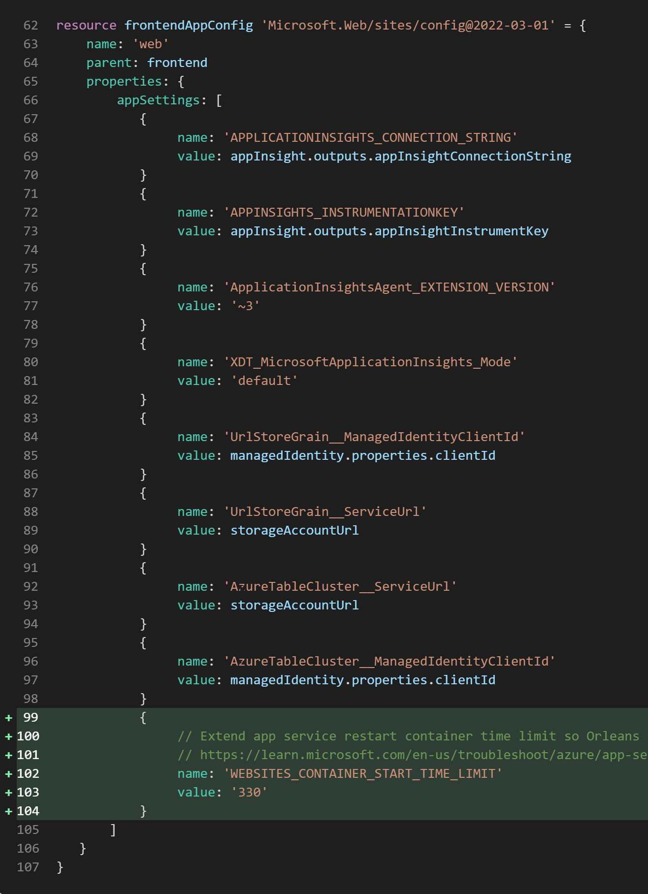

# Orleans應用部署Azure實例 — Azure App Service (Linux)

[Azure App Service](https://azure.microsoft.com/zh-tw/products/app-service)是微軟Azure雲端的PaaS(Platform as a Service)服務，可以讓使用服務者不需要花費時間精力管理其底層的Windows或Linux作業系統，就可以提供網站、Web API的基本Web服務。

Orleans 在 v3.0之後支援使用ASP.NET Core Co-hosting的配置，可以使用此配置將Orleans和使用其Grain(Actor model的Actor)的Web服務共同部署在Azure App Service上執行。

以下使用先前介紹Smart Cache Pattern的短網址服務範例專案（原始碼：https://github.com/windperson/OrleansUrlShortener/tree/AzureWebApp-Linux ），介紹如何部署Orleans應用至Azure App Service (Linux) 使用 code deploy 的PaaS服務。

## 建立Azure App Service (Linux)的Bicep程式碼解說

和昨天的範例一樣，使用 [Bicep](https://github.com/Azure/bicep) 這個Azure在其Azure CLI指令列程式內建的 IaC(Infrastructure as Code) 語言方式建立App Service及相關配套的基礎Azure服務，包含：

1.  [Azure App Service Plan](https://learn.microsoft.com/azure/app-service/overview-hosting-plans)：實際執行Azure App Service的雲端運算資源，設定為使用Linux種類的。
2.  [Azure App Service (Linux)](https://learn.microsoft.com/azure/app-service/overview#app-service-on-linux)：跑短網址服務及其使用 ASP.NET Core Co-hosting Orleans服務的Linux版 Web App。
3.  [Azure App Service Deployment Slot](https://learn.microsoft.com/azure/app-service/deploy-staging-slots)：用於在Azure App Service部署實際應用程式的環境，讓開發者在不影響正式環境的情況下，測試新的應用程式版本。
4.  [Azure Application Insights](https://learn.microsoft.com/azure/azure-monitor/app/app-insights-overview?tabs=net)：監控App Service的運行狀況。
5.  [Azure Virtual Network](https://learn.microsoft.com/azure/virtual-network/virtual-networks-overview)以及在Azure App Service上設定對應的[區域性虛擬網路整合(Regional virtual network integration)](https://learn.microsoft.com/azure/app-service/overview-vnet-integration#regional-virtual-network-integration)：讓不同Azure App Service執行實體上的Orleans Silo服務可以互相通訊。
6.  [Azure Storage Account](https://learn.microsoft.com/azure/storage/common/storage-account-overview)：使用 [Azure Table Storage](https://learn.microsoft.com/azure/storage/tables/table-storage-overview) 這個No-SQL服務來儲存Orleans的Cluster連線資訊、Grain狀態資料。
7.  [User-assigned Managed Identity](https://learn.microsoft.com/azure/active-directory/managed-identities-azure-resources/overview#managed-identity-types)：用來控制Azure App Service對前一項Azure Storage Account以及Azure Table Storage的存取權限。

#### 建立Azure Bicep部署的雲端服務

短網址服務範例專案的Bicep程式碼位於 **infra/Azure/AppService_linux** 目錄下，包含了五個 *.bicep檔案以及一個 *parameters.json\* ，這是用來提供執行Azure Cli部署指令時大部分參數預設值的設定檔案。

要建立短網址服務的Azure資源，在該目錄執行以下指令：

``` sh
az deployment sub create --name orleans_net6webapp_linux_demo01 --location [azure_datacenter_region] --template-file ./main.bicep  --parameters deploy_region=[azure_datacenter_region] parameters.json
```

其中 `--name` 參數是此部署的名稱，可自訂，在此範例使用 *orleans_net6webapp_linux_demo01*，而 `[azure_datacenter_region]` 要替換成你想要部署的[Azure資料中心區域](https://aka.ms/AzureRegions)的縮寫名稱，例如 `eastus`、`westus`、`southeastasia`，可以使用 `az account list-locations -o table` 指令來取得可使用的區域名稱：


部署指令下達之後，稍等一段執行時間後，假如回傳的Json字串有 `"provisoningState": ""Succeeded"`，則表示Azure資源的建置部署指令成功，可進行後續的程式上版動作：


此時在Azure Portal管理網頁的資源群組(resource group)列表內可以看到名稱為 *orleans_net6webapp_linux_demo* 的新建資源群組（此名稱為寫在該目錄下 **parameters.json** 檔的 `resource_group` 參數），以及包含的App Service Plan, App Service (Linux), Deployment slot, Storage Account等等總共9個Azure服務資源：


#### 移除Azure Bicep部署雲端服務

當不需要此短網址服務的Azure資源，需要移除掉時：

1.  使用以下指令來移除先前建立的Azure Bicep部署 *orleans_net6webapp_linux_demo01*：

    ``` sh
    az deployment sub delete --name orleans_net6webapp_linux_demo01
    ```

2.  刪除整個 *orleans_net6webapp_linux_demo* 資源群組：

    ``` sh
    az group delete --name orleans_net6webapp_linux_demo
    ```

### Linux版App Service的Bicep程式碼和Windows版App Service的差異

Linux版App Service的Bicep程式碼架構和昨天介紹的Windows版App Service相同，只有以下幾個設定有所不同：

1.  App Service Plan宣告為Linux版：需要在 *webapp.bicep* 檔中宣告App Service Plan資源（`Microsoft.Web/serverfarms`）的 `kind` 參數設定為 `linux`，而且要多一個 `reserved: true` 的properties設定，如下圖14\~17行所示：  
    
2.  App Service (Linux)以及deployment的Bicep程式碼資源宣告和Windows版的差異：
    - `kind` 參數設定為 `app,linux`，要注意逗號後面不可有空白，例如寫成”app, linux”的話，Bicep在執行部署時會如下圖的錯誤：  
        

    - `siteConfig` 設定內新增的 `linuxFxVersion` 屬性為 `DOTNETCORE:6.0`，Linux版支援的語言框架與版本的設定內容可由執行以下指令

      ``` sh
      az webapp list-runtimes --os-type linux
      ```

      取得當前可用的設定值，有些太舊的程式語言框架/版本會無法使用code deploy的方式部署，而得換成使用自製docker容器影像檔的方式進行。  
      此指令回傳的列表會以 `語言框架:版本` 的json列表格式，建議寫在App Service (Linux)的Bicep程式碼的屬性值時，將『:』冒號換成『\|』符號，因為有些版本的docker image得使用『\|』符號，在Bicep程式碼才能成功部署正確版本。

    - `siteConfig` 設定內新增的 `alwaysOn` 設定為 `true`，這是為了讓Linux版的App Service一旦部署了Orleans應用程式之後，就會立即運行其底層的docker容器應用服務啟動機制，並且啟動的應用服務執行實體數是我們在App Service Plan資源的Bicep程式碼宣告中`sku`設定的 `capacity`數量。  
      以上的修改如下圖26,39\~40行所示：  
        

    - App Service Config資源的name-value資料，name不可使用『**:**』符號，得置換為使用底線『\_』，而如果是要之後在 .NET Configuration 綁定Options物件的name-value設定，需要把原本使用的『`:`』分隔符號改為兩個底線『`__`』符號，否則在.NET程式執行時綁定Options物件會取不到值。

    - 新增一個 **WEBSITES_CONTAINER_START_TIME_LIMIT** name-value資料，並且將其value設為 **300** 以上，這是為了Linux版的App Service在部署完Orleans應用程式之後，App Service (Linux)底層配合docker容器服務的監控機制：[在設定的秒數內，假如無法正確啟動服務，就強制重啟docker容器](https://learn.microsoft.com/troubleshoot/azure/app-service/faqs-app-service-linux#my-custom-container-takes-a-long-time-to-start--and-the-platform-restarts-the-container-before-it-finishes-starting-up-)的功能；而原本Orleans在其 [`ClusterMembershipOption`](https://learn.microsoft.com/dotnet/api/orleans.configuration.clustermembershipoptions) 中，Silo斷線重連的Timeout值是5分鐘，也就是300秒，如下原始碼截圖51＆57行：  
        
      所以為了讓Orleans應用不會因為還在同步多台遠端Silo狀態時，就被App Service (Linux)監控機制強制重啟，造成Silo同步狀態資料搞爛，因此建議新增這個設定並且把值設定為300秒以上，以便給Orleans足夠的時間同步多台Silo的狀態資料。  
      以上兩點修改後的Bicep程式碼截圖如下圖所示：  
        
      要記得在設定哪些是固定在Deployment Slot的name-value資料名稱，也要修改成對應的符合Linux版的格式：  
      



## Silo相關配套設定解說

### Orleans Clustering 配置程式碼重構整理

此版本的Silo配置程式碼，鑑於前一天部署在Windows版App Service的寫法是把所有操作都寫在單一個Program.cs，會讓程式碼太過冗長並且有些操作邏輯之後無法重用，因此用C#的擴充方法(extension method)，進行簡單的重構，將這些程式碼從Program.cs抽離出來，放在一個新的類別庫(Class library)類型 **UrlShortener.Infra.Silo** 專案中，此專案再由 **UrlShortener.Frontend** 這個主要的 ASP.NET Core 專案所參考，以便於在Program.cs程式碼之中呼叫使用。

除了在操作動作層面上的重構之外， **UrlShortener.Infra.Silo** 專案中也額外定義了一些 .NET Core/.NET5+ 框架提供的[*“選項模式”(Options Pattern)*](https://learn.microsoft.com/aspnet/core/fundamentals/configuration/options)的Options Class類別定義以及一些擴充方法，以便於在 **UrlShortener.Frontend** 專案的初始配置程式碼（Program.cs）中，可使用這些擴充方法和類別定義來將此ASP.NET Core專案中json設定檔的Configuration資料，綁定成Options類別物件，然後再呼叫重構後的Silo設定擴充方法，以便實際執行Orleans的Silo配置。

簡單來說，此種重構的核心概念是：
\>把需要從各種執行環境資訊讀取Silo配置設定值的動作，與實際呼叫Orleans API來套用設定值配置Silo的動作，拆分開來實作，中間使用創建各種自訂或內建的Options類別物件當作儲存與傳遞資料的媒介，也可根據這些Options類別物件的屬性值，來決定是否要啟用或關閉某些功能，

這樣就可以讓Silo配置程式碼更有彈性，適用於不同的執行環境。

例如以下是 **UrlShortener.Infra.Silo** 專案中的 `GetOptions<T>()` 擴充方法程式碼截圖，這樣就可以輕鬆地從當前 [`HostBuilderContext`](https://learn.microsoft.com/dotnet/api/orleans.hosting.hostbuildercontext) 的Configuration屬性，建立並且綁定正確設定值給輸入泛型參數的Options類別物件：


以及這個[自定義 `SiloNetworkIpPortOption` 類別](https://github.com/windperson/OrleansUrlShortener/blob/AzureWebApp-Linux/src/UrlShortener.Infra.Silo/Options/SiloNetworkIpPortOption.cs)，是用來之後方便於呼叫Silo配置的擴充方法 [`ConfigureEndpoints()`](https://learn.microsoft.com/dotnet/api/orleans.hosting.endpointoptionsextensions.configureendpoints) 使用之IP和TCP Port連線設定資料的定義程式碼截圖：


整個重構後在 **UrlShortener.Frontend** 專案中 `Program.cs` 的配置Orleans Silo的程式碼就會長成這個樣子：


其中siloBuilder呼叫的擴充方法命名為 *Use…* 開頭的那些，即為配置SiloBuilder組態的方法。

接下來逐一介紹在 `UseOrleans()` 的配置宣告內使用的擴充方法內部程式碼及實作邏輯。

### Orleans Clustering 在docker容器環境執行的配套設定

由於 App Service (Linux)實際的底層服務器機制是使用docker容器，和原本App Service Windows版是使用IIS的不同，因此在Orleans Cluster的配置設定上，也要做一些調整，以便讓Orleans的Silo可以正確地在App Service (Linux)的docker容器環境中執行。

#### Silo之間可互連的VNET IP和Port取得方式

在啟用了區域性虛擬網路整合(Regional virtual network integration)Linux版的App Service中，可讓App Service實體之間互相連接的IP位址和TCP Port設定值，也和Windows版的App Service一樣，記錄在”`WEBSITE_PRIVATE_IP`“和”`WEBSITE_PRIVATE_PORTS`“這兩個環境變數之中，因此在 **UrlShortener.Infra.Silo** 專案中，定義一個 [`SiloNetworkIpPortOptionHelper` 類別及其 `HasAzureWebAppSiloNetworkIpPortOption()` 輔助方法](https://github.com/windperson/OrleansUrlShortener/blob/AzureWebApp-Linux/src/UrlShortener.Infra.Silo/SiloNetworkIpPortOptionHelper.cs#L10)來解析這兩個環境變數的值，並且直接回傳前面介紹過的自定義 `SiloNetworkIpPortOption` 類別，含IP位址和Port的資訊：


這個輔助方法定義成回傳true時表示有成功解析到環境變數的值，並且將解析到的值設定到回傳的 `SiloNetworkIpPortOption` 類別物件中，否則回傳false。

因此在 **UrlShortener.Frontend** 專案中 `Program.cs` 的第40行就使用這個輔助方法來判斷目前即將要跑起來的服務是否為在有配置區域性網路整合的App Service環境中執行，如果是的話，就會使用這個輔助方法回傳的 `SiloNetworkIpPortOption` 類別物件中的IP位址和Port繼續來設定Silo的IP和Port，反之則在第48行檢驗目前是否為Development環境，如果是的話就呼叫 [`ConfigSingleLocalSilo()` 擴充方法](https://github.com/windperson/OrleansUrlShortener/blob/AzureWebApp-Linux/src/UrlShortener.Infra.Silo/ConfigureSiloExtensions.cs#L17)來使用僅跑在本機的單一Silo叢集配置：


#### Silo的ClusterId和ServiceId指定方式

在App Service (Linux)的docker容器環境中，也是有Kudu後端工程平台，可以看到應用程式執行時可以讀取到的環境變數，不過和Windows版不同的是，原本Windows版在不同deployment set變數值會不一樣的環境變數 `WEBSITE_DEPLOYMENT_ID` ，在Linux版 App Service沒有，反而是另一個環境變數 `WEBSITE_SITE_NAME`，會隨著不同的deployment set而不同，因此在Linux版的Silo配置中，改用這個環境變數來作為ClusterId的指定來源。

因此在 **UrlShortener.Infra.Silo** 專案中，定義一個[`ClusterOptionsHelper` 類別以及內含的 `CreateClusterOptions()` 靜態方法](https://github.com/windperson/OrleansUrlShortener/blob/AzureWebApp-Linux/src/UrlShortener.Infra.Silo/ClusterOptionsHelper.cs#L9)，此方法的運作邏輯就是驗證當前執行的環境是Windows還是Linux作業系統，然後再決定要讀哪個環境變數來指定ClusterId，並且直接回傳 Orleans 框架Silo配置用的內建Options類別 [`ClusterOptions`](https://learn.microsoft.com/dotnet/api/orleans.configuration.clusteroptions) ，內含ClusterID和ServiceId的最終決定值：


然後此方法在 **UrlShortener.Frontend** 專案中 `Program.cs` 的第42行被呼叫以便取得ClusterOptions類別的物件，然後再下一行就真的要用前述產生的Options物件來設定Silo的執行配置了。

#### 跑在容器內的Silo設定EndPoint以及對應的Orleans框架內建設定調校

.NET Core/.NET 5+的程式在docker, K8s, 以及 App Service(Linux)這些容器化部署方式的服務內執行時，官方的docker影像檔有提供一個環境變數 [**DOTNET_RUNNING_IN_CONTAINER**](https://learn.microsoft.com/dotnet/core/tools/dotnet-environment-variables#dotnet_running_in_container-and-dotnet_running_in_containers)，因此我們可藉由驗證此環境變數是否存在且變數值設為”true”，來判斷目前的應用是否跑在容器裡面：

``` csharp
public static bool IsRunningInContainer()
{
   return Environment.GetEnvironmentVariable("DOTNET_RUNNING_IN_CONTAINER")?.Trim().ToLower() == "true";
}
```

此方法定義在 [**UrlShortener.Infra.Silo** 專案中的 `ContainerRunHelper` 輔助工具類別](https://github.com/windperson/OrleansUrlShortener/blob/AzureWebApp-Linux/src/UrlShortener.Infra.Silo/ContainerRunHelper.cs#L8)。

在配置用Azure Virtual Network的區域性虛擬網路整合(Regional virtual network integration)功能的Silo端點(Endpoint)的擴充方法 `UseAzureAppServiceRunningConfiguration()` 實作之中，在第19行就用了這個方法，來判斷是否跑在容器內，假如是，就得增加以下設定：

1.  **SiloNetworkIpPortOption** 類型的Option參數輸入物件，將屬性 `ListenOnAnyHostAddress` 設為true。此屬性之後會用來控制在呼叫SiloBuilder的 `ConfigureEndpoints()` 擴充方法時，是否要讓Silo去監聽當前環境所有的網路介面卡，以便接受來自網路上其他外部Silo傳進來的呼叫請求。
2.  設定Orleans內建的 [`ClusterMembershipOptions`](https://learn.microsoft.com/dotnet/api/orleans.configuration.clustermembershipoptions?view=orleans-3.0) 選項，將屬性 `ExtendProbeTimeoutDuringDegradation` 和 `EnableIndirectProbes` 都設為true。此為[官方建議Orleans服務於容器內執行時，必須設定的兩個參數](https://github.com/dotnet/orleans/issues/7973#issuecomment-1244517617)，以便使Silo同步其他網路上的Silo速度更快，讓應用程式啟動時的前期資料交換時間更短。
3.  假如環境變數 *“WEBSITES_CONTAINER_START_TIME_LIMIT”* 存在，將Orleans內建的 [`ClusterMembershipOptions`](https://learn.microsoft.com/dotnet/api/orleans.configuration.clustermembershipoptions?view=orleans-3.0) 選項的 [`DefunctSiloExpiration` 屬性](https://learn.microsoft.com/dotnet/api/orleans.configuration.clustermembershipoptions.defunctsiloexpiration?view=orleans-3.0)為此環境變數的兩倍。  
    

然後不管是否跑在容器內，在此方法實作內最後都呼叫一個[在 **UrlShortener.Infra.Silo** 專案內自定義的 `ConfigMultipleSilosClustering()` 擴充方法](https://github.com/windperson/OrleansUrlShortener/blob/AzureWebApp-Linux/src/UrlShortener.Infra.Silo/ConfigureSiloExtensions.cs#L79)，來設定Silo的集群(Cluster)相關設定；其方法的實作內容，一開始根據前面設定的 **SiloNetworkIpPortOption** 類型輸入物件 `ListenOnAnyHostAddress` 的屬性，是true就呼叫[siloBuilder的 `ConfigureEndpoints()` 最後面有額外多一個 “listenOnAnyHostAddress” 參數的重載擴充方法](https://learn.microsoft.com/dotnet/api/orleans.hosting.endpointoptionsextensions.configureendpoints#orleans-hosting-endpointoptionsextensions-configureendpoints(orleans-hosting-isilobuilder-system-net-ipaddress-system-int32-system-int32-system-boolean))，以便讓Silo監聽其執行主機上的所有網卡；反之則和原本配置Windows版App Service時一樣的的擴充方法，來設定Silo的網路監聽端點(Endpoint)；最後再呼叫設定Silo的ClusterId、ServiceId的 `Configure<ClusterOptions>` 擴充方法。


為什麼得做這樣的配置，是因為 App Service (Linux) 架構上使用docker容器來跑使用者的應用程式，而Azure Virtual Network的區域性虛擬網路整合(Regional virtual network integration)功能，是將Azure App Service的網路環境，與Azure Virtual Network的網路環境整合在一起，這樣使得Silo在執行時，能接收到的來源是容器內docker提供的虛擬網卡IP，而不是其容器外的Azure Virtual Network網路介面卡IP位址，Silo啟動時假如沒有啟用監聽所有網路介面卡的設定（listenOnAnyHostAddress要設為true）的話，會無法正常接收到其他Silo傳進來的資料。

而SiloBuilder的ConfigureEndpoint()擴充方法的第一個輸入參數 `advertisedIP` ，也不能因為是設定監聽所有網卡就省略，因為此IP輸入參數之後會記錄在Orleans的Cluster同步資料中，來讓其他Silo知道此Silo的網路位置，所以此參數要設定為容器外的Azure Virtual Network網路介面卡IP位址，也就是 `SiloNetworkIpPortOptionHelper` 類別 `CreateClusterOptions()` 靜態方法中取得的 `WEBSITE_PRIVATE_IP` 環境變數值。

### Orleans Grain Storage Provider的設定

在 **UrlShortener.Frontend** 專案中 `Program.cs` 的第54行從設定中綁定 `UrlStoreGrainOption` 類別的輸入Options物件之後，第55行呼叫的，是在 [**UrlShortener.Infra** 專案中自定義的 `SetGrainStorageUsingAzureTable` 擴充方法](https://github.com/windperson/OrleansUrlShortener/blob/AzureWebApp-Linux/src/UrlShortener.Infra.Silo/ConfigGrainStorageExtensions.cs#L11)：


其實作會根據 `UrlStoreGrainOption` 類型輸入物件的 `ServiceUrl` 屬性，此屬性為Azure Table的Url網址，假如此Url是http開頭的話，就會呼叫在定義在此方法下面不使用Azure Managed Identity的擴充方法來設定Grain Storage Provider；反之就是呼叫另一個在正式環境配合使用Azure Managed Identity設定的 `AzureTableGrainStorageUseDefaultAzureCredential()` 擴充方法，程式碼內容就不再贅述。

### Azure Application Insight 以及 Orleans Dashboard 的Telemetry設定

在 **UrlShortener.Frontend** 專案中 `Program.cs` 配置Orleans Silo的程式碼，假如發現系統上有 Azure Application Insight 的設定值，則在第60行呼叫 [**UrlShortener.Infra.Silo** 專案中的 `UseAzureApplicationInsightLogging()` 擴充方法](https://github.com/windperson/OrleansUrlShortener/blob/AzureWebApp-Linux/src/UrlShortener.Infra.Silo/ConfigureSiloExtensions.cs#L66)，來設定Orleans Silo的Telemetry遙測資料傳送到 Azure Monitor（也就是 Application Insight）的雲端服務上：


此段程式碼第69行呼叫的 `AddApplicationInsightsTelemetryConsumer()` 擴充方法，是Orleans框架提供的擴充方法，需要安裝 [Microsoft.Orleans.OrleansTelemetryConsumers.AI](https://www.nuget.org/packages/Microsoft.Orleans.OrleansTelemetryConsumers.AI) Nuget套件。

同樣地，在 **UrlShortener.Frontend** 專案中 `Program.cs` 配置Orleans Silo的程式碼第64行所呼叫的[自定義 `UseOsEnvironmentStatistics()` 擴充方法](https://github.com/windperson/OrleansUrlShortener/blob/AzureWebApp-Linux/src/UrlShortener.Infra.Silo/ConfigureSiloExtensions.cs#L41)負責給 [OrleansDashboard](https://github.com/OrleansContrib/OrleansDashboard) 這個第三方儀表板元件會需要使用的Telemetry遙測資料設定，根據執行的作業系統不同，其實作在第50、60行使用不同Nuget套件（Windows：[Microsoft.Orleans.OrleansTelemetryConsumers.Counters](https://www.nuget.org/packages/Microsoft.Orleans.OrleansTelemetryConsumers.Counters)，Linux：[Microsoft.Orleans.OrleansTelemetryConsumers.Linux](https://www.nuget.org/packages/Microsoft.Orleans.OrleansTelemetryConsumers.Linux)）提供的擴充方法：


設定好之後，在OrleansDashboard的網頁上，點左邊的Silo目錄之後再進入任一個Silo的詳細頁面，就可以看到該Silo的CPU和記憶體使用量資訊了：


要注意的是，若使用的部署環境是App Service Windows版，由於架構上的權限限制存取Windows Performance Counter，所以在OrleansDashboard的Silo頁面上，會看不到CPU和記憶體使用量的資訊。



## 部署到Azure Web App (Linux)的疑難排解

### 檢視App Service環境應用程式可使用的環境變數

在App Service (Linux)的Azure Portal頁面，點選左側的SSH，然後按Go開啟另一個瀏覽器分頁的Web SSH介面：


然後在WebSSH介面的命令提示字元下，輸入指令 `env|sort`，即可列出目前App Service環境應用程式可使用的環境變數和其值。

雖然在App Service (Linux)的Kudu後台也有一個頁面可以檢視環境變數，但使用此方法可以列出Kudu後台無法列出的環境變數，例如儲存Azure Virtual Network區域性虛擬網路整合(Regional virtual network integration)的通訊埠環境變數 *“WEBSITE_PRIVATE_PORTS”*：


### 開啟以及取得應用程式層級的Log

預設App Service (Linux)的應用程式層級Log是關閉的，不會顯示其底層實際執行的container容器內部應用的Console Log，這樣會造成很難除錯應用程式無法啟動的問題。  
欲開啟應用程式層級的Log，在Azure Portal的App Service (Linux)的Azure管理頁面，點選左側的 **App Services logs**，然後選Application logging的FileSystem來啟用，並設定Log的檔案大小quota和Log保留期限後按儲存：


然後就可以在更下方的 **Log Stream** 中看到應用程式層級的Log，或是使用Azure CLI指令列工具的 [`az webapp log tail` 指令](https://learn.microsoft.com/cli/azure/webapp/log?view=azure-cli-latest#az-webapp-log-tail)來檢視Log。

不過這會和App Service (Linux)系統層級的Log參雜在一起，如要個別根據執行實體分開的應用程式層級Log，有兩種方式：

1.  在Kudu後台網站首頁的REST API 連結中，有一個 **(Download as Zip)** 的下載連結，可以下載所有Log檔的zip壓縮版本：  
      
    此壓縮檔解壓縮後，Log檔案命名末尾有 \*\*\_default_docker\*\* 的就是應用程式層級的Log：  
      
    不過此方法下載的Log內容會有點延遲，而且只能下載最近的Log，無法下載過去的Log。
2.  在Kudu後台上方的Bash項目點選後開啟Web SSH介面，然後在Web SSH介面的命令提示字元下，切換到 **\~/LogFiles** 目錄下，此目錄中會有所有Log檔案，一樣也是檔名末尾是 \*\*\_default_docker\*\* 的就是應用程式層級Log：  
    

### App Service (Linux)虛擬網路的連線驗證方法

由於App Service (Linux)所部署的應用程式是跑在container容器內，當需要確認一些外部或是跨服務實體連線的時候，可以參考[這篇文章](https://github.com/renhanli/AzureAppService/wiki/Azure-Linux-App-Service-Network-Test-Tools)來安裝 [**tcptraceroute**](https://linuxcommandlibrary.com/man/tcptraceroute) 、 [**tcpping**](https://www.slashroot.in/what-tcp-ping-and-how-it-used) 等指令列工具來驗證連線以及網路速度。

傳統使用ICMP通訊協定的 *ping* 和 *tracert* 指令列工具在Azure App Service (Linux)無法使用，因為Azure App Service (Linux)的網路不允許ICMP封包。

### 服務在程式部署或Deployment slot切換後無法啟動的問題

有時候會在應用程式部署、App Service重啟，或是Deployment slot切換之後，服務無法啟動，連線網址出現Application Error 5xx等錯誤字樣：


此時在儲存Silo連線資訊的Azure Table Storage中，會發現Silo的連線狀態會有一些卡在Joining或者在Active狀態，但實際上已經連不到的Silo：


而且察看應用程式的Log，會發現有一堆Connection Error的錯誤訊息：


這是因為在部署或重啟之後，Virtual Network的通訊Port有可能會因為App Service (Linux)的服務實體重啟而導致連線Port被重新分配，而App Service (Linux)的架構在重啟或關閉服務實體時，不會像地端的 docker/docker-compose 的部署會對容器內的應用送出 *SIGTERM* 或 *SIGINT* 的訊號，而是直接將容器強制關閉；所以在部署或重啟之後，Silo的連線資訊有可能會因為Port的變更而無法連線，而且也產生了還在Active狀態的錯誤Silo連線記錄項目。

此時建議先將App Service (Linux)的服務實體關閉，將當前Azure Table Storage上還在Active/Joining的記錄刪除，然後再重新啟動，讓Orleans的Silo重新建立連線資訊。

這也是為什麼在前面Silo配置程式碼需特別將Orleans框架的 [`ClusterMembershipOptions`](https://learn.microsoft.com/dotnet/api/orleans.configuration.clustermembershipoptions?view=orleans-3.0) 選項的 [`DefunctSiloExpiration` 屬性](https://learn.microsoft.com/dotnet/api/orleans.configuration.clustermembershipoptions.defunctsiloexpiration?view=orleans-3.0)特別要設定成比預設值短的時間，以便讓已經是錯誤狀態的Silo連線記錄能夠在短時間內被移除，避免新跑起來的服務實體讀到錯誤資訊，一直去嘗試連線到已經不存在的Silo。

------------------------------------------------------------------------

下一篇介紹使用包裝成自製docker image，也就是容器影像檔的方法來部署Orleans應用到Azure雲端。
