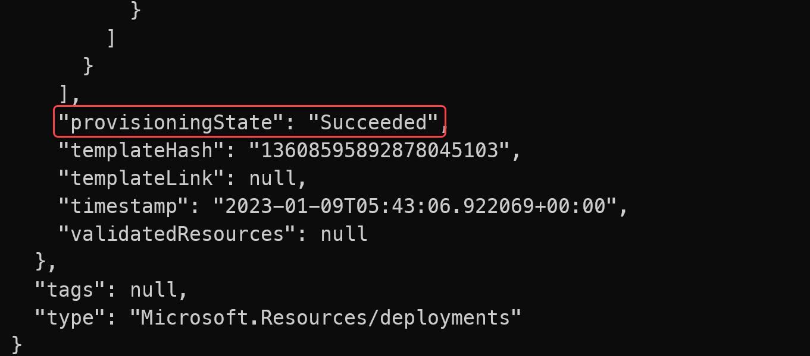
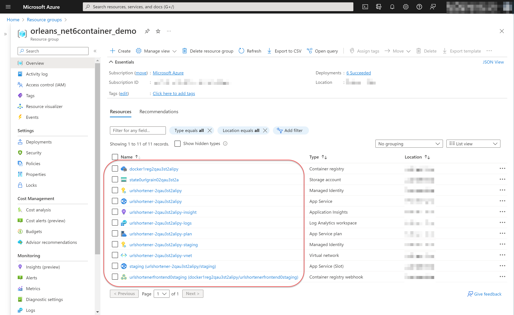
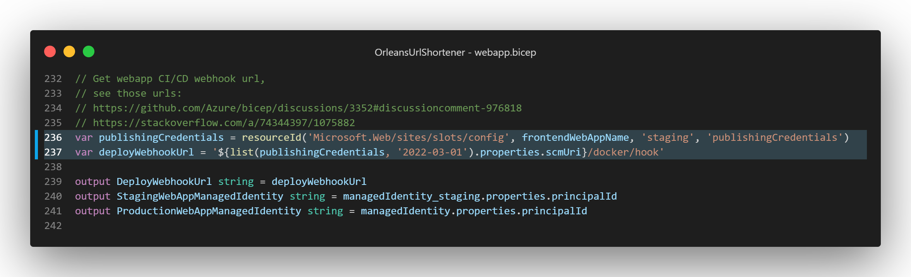
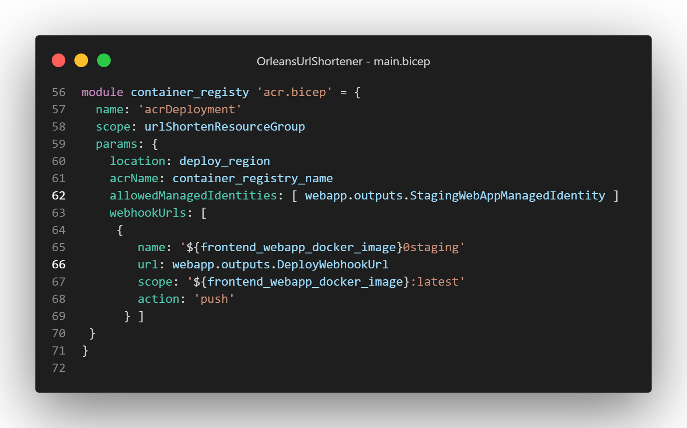

# Orleans應用部署Azure實例 — Azure App Service (Linux) Custom Container 與 Azure Container Instance

昨天介紹的 Azure App Service (Linux) 雲端PaaS服務，除了可以使用傳統的程式碼使用 Visual Studio/ Azure Cli指令打包zip方式部署之外，由於底層是使用 Docker Container 作為基礎架構，因此也可以使用自製 Docker Container Image 的方式來部署應用程式，利用Azure App Service提供 "[持續部署(Continuous Deployment)](https://learn.microsoft.com/azure/app-service/deploy-ci-cd-custom-container?tabs=acr&pivots=container-linux)" 功能，配合 Azure Container Registry 這個提供建置/管理容器影像的雲端服務，實現極簡版的 CI/CD 流程。

## Azure App Service (Linux) 服務使用 Custom Container Image 部署

### 搭建的Azure服務架構與CI/CD流程

以下是不使用一些正式的CI/CD服務如Azure DevOps, GitHub Action的情況下，含持續部署流程的Azure服務組成範例架構：
.svg)

這個和之前的架構上差異，就是新增了一個 Azure Container Registry （以下簡稱 *ACR* ）服務，用來建置/管理容器影像，ACR可以在開發端使用azure cli指令列工具，進行容器影像的上傳，或是更簡便一點，直接將ACR當作可操控的雲端 container image build server，將本機端的工作目錄內的檔案內容上傳到ACR並自動建立容器影像檔；容器影像檔建立完成或上傳完畢後，觸發ACR的"Webhook"功能，以便通知Azure App Service (Linux) 服務現在有新版本可以部署到服務機了。

Azure App Service 的持續部署功能（Continuous Deployment）設定之後，會提供一個可供其他整合服務使用的Webhook呼叫點，以通知App Service本身進行所設定的持續部署行為：將容器影像部署到 Azure App Service (Linux) 服務上。此呼叫點的網址就是上一段所介紹的，ACR的Webhook功能所呼叫網址，這樣就可以實現從開發者端的電腦上傳專案程式碼內容到成為容器影像檔，並部署到Azure App Service (Linux) 服務的整個流程。

當然實務上建議，從開發者電腦到ACR的這段流程，還是串接正式的原始碼版本管理服務以及CI/CD服務來協助，例如Azure DevOps, GitHub Action等等，這樣可以有程式碼檔案版本管理功能以及保存原始碼，並且可以進行自動測試，以確保程式碼的品質。

### Bicep 程式碼解說

短網址服務範例專案（原始碼：https://github.com/windperson/OrleansUrlShortener/tree/AzureWebApp-CustomContainer ），建置前一節介紹Azure服務架構的Bicep程式碼位於 **infra/Azure/AppService_CustomContainer** 目錄下，包含了六個 *.bicep檔案以及一個 *parameters.json* ，這是用來提供執行Azure Cli部署指令時大部分參數預設值的設定檔案。

#### 建立Azure Bicep部署的雲端服務

要建立短網址服務的Azure資源，[安裝Azure CLI](https://learn.microsoft.com/cli/azure/install-azure-cli)並登入後，在 *infra/Azure/AppService_CustomContainer* 目錄執行以下指令：
```sh
az deployment sub create --name orleans_net6webapp_linux_demo02 --location [azure_datacenter_region] --template-file ./main.bicep --parameters deploy_region=[azure_datacenter_region] ./parameters.json
```
其中 `--name` 參數是此部署的名稱，可自訂，在此範例使用 *orleans_net6webapp_linux_demo02*，而 `[azure_datacenter_region]` 要替換成你想要部署的[Azure資料中心區域](https://aka.ms/AzureRegions)的縮寫名稱，例如 `eastus`、`westus`、`southeastasia` 等等；可使用Azure CLI的 `az account list-locations -o table` 指令來取得可部署的區域名稱。

部署指令下達之後，稍等一段執行時間後，假如回傳的Json字串有 `"provisoningState": ""Succeeded"`，則表示Azure資源的建置部署指令成功，可進行後續的程式上版動作：


此時在Azure Portal管理網頁的資源群組(resource group)列表內可以看到名稱為 *orleans_net6container_demo* 的新建資源群組（此名稱為寫在該目錄下 **parameters.json** 檔的 `resource_group` 參數），以及包含的App Service Plan, App Service (Linux), Deployment slot, Storage Account, Managed Identity, Container Registry, Container Registry webhook 等等總共11個Azure服務資源：


#### 移除Azure Bicep部署雲端服務

當不需要此短網址服務的Azure資源，需要移除掉時：
1. 使用以下指令移除建立的Azure Bicep部署項目 *orleans_net6webapp_linux_demo02*：
   ```sh
   az deployment sub delete --name orleans_net6webapp_linux_demo02
   ```
2. 刪除整個 *orleans_net6container_demo* 資源群組：
   ```sh
   az group delete --name orleans_net6container_demo
   ```   

#### Bicep程式碼和Linux版App Service的差異

此版本的Bicep程式碼和昨天的 App Service (Linux) 不同的是：
1. 在建立App Service的 [**webapp.bicep**](https://github.com/windperson/OrleansUrlShortener/blob/AzureWebApp-CustomContainer/infra/Azure/AppService_CustomContainer/webapp.bicep) 檔案中啟用容器影像持續部署的設定，以及回傳觸發持續部署的webhook url網址：  
   在App Service (Linux)持續部署(Continuous Deployment)要使用容器影像檔的方式部署，除了在原本的 `kind` 屬性值要寫成 **app,linux,container** （要注意逗號間不可有空白）之外，還需在 `linuxFxVersion` 屬性上設定為  
   `DOCKER|<ACR_Registry_Name>.azurecr.io/<Container_Image_Name>:<Tag>`  
   的格式，而在App Service的 appSettings 也要新增一個 `DOCKER_ENABLE_CI` 的設定，其值為 `true`，這樣才能啟動用容器影像持續部署的功能；
   由於在此範例專案的Azure雲端資源架構ACR是使用 Azure Managed Identity 來對其操作的權限授權，因此在 appSettings 內不需要額外提供 `DOCKER_REGISTRY_SERVER_USERNAME` 和 `DOCKER_REGISTRY_SERVER_PASSWORD` 的設定，假如是其他例如 Docker Hub、GitHub Container Registry 等等的容器影像倉庫，則需要提供其帳號密碼的設定，才能讓App Service能夠存取到容器影像倉庫的影像檔案；
   而在此Bicep模組檔案的最後，除了要跟之前的版本一樣把在此模組建立的 Azure Managed Identity 的 `princiaplId` 回傳給呼叫端之外，在第236~237行使用了呼叫Bicep的 `resourceId()` 函式的技巧，來取得沒有開放出Bicep屬性定義的持續部署webhook網址，做為給呼叫端的回傳參數 `DeployWebhookUrl`：
   
2. 增加 [**acr.bicep**](https://github.com/windperson/OrleansUrlShortener/blob/AzureWebApp-CustomContainer/infra/Azure/AppService_CustomContainer/acr.bicep) Bicep模組程式碼檔案，此為建立 ACR(Azure Container Registry)和所屬的Webhook資源，而在初始進入點的 [main.bicep](https://github.com/windperson/OrleansUrlShortener/blob/AzureWebApp-CustomContainer/infra/Azure/AppService_CustomContainer/webapp.bicep) 也在最後配套增加呼叫此檔案的程式碼：
     
   在第62行只有設定上面建立的app service的staging slot所屬的 Managed Identity 可以存取此ACR，因為在此範例只打算在staging slot上進行持續部署，正式的app service slot就不需要存取此ACR，等到staging slot一切備妥可上線時，再進行 ["Slot swap"](https://learn.microsoft.com/azure/app-service/deploy-staging-slots#swap-two-slots) 以便讓服務正式上線。  
   而由於需要在ACR一旦有指定的容器影像被『上傳（也就是有 image push）』時，呼叫 App Service 的觸發Webhook以便開始跑持續部署行為，
   因此在第63~69行也將前面呼叫 `webapp.bicep` 建立App Service時回傳的 "DeployWebhookUrl" 網址參數，在第66行用來組合成Bicep陣列物件，以便讓 `webhookUrls` 這個Bicep模組的輸入參數在實際建立ACR時使用。
   而第67行的 scope 是指定特定容器影像名稱含標籤(tag)，配合第68行的 `action` 則是定義當container image被上傳（push）時，此webhook才會被觸發。
