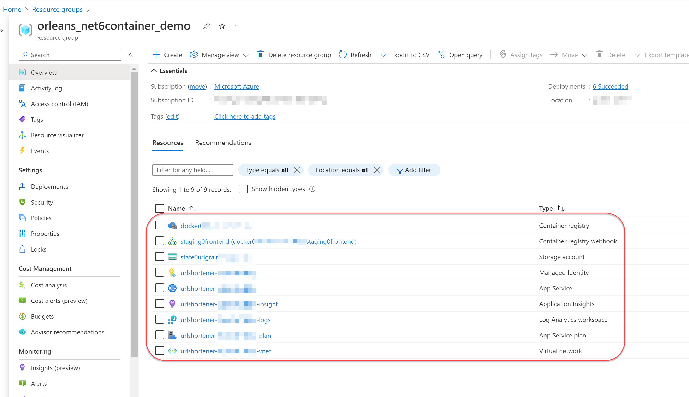
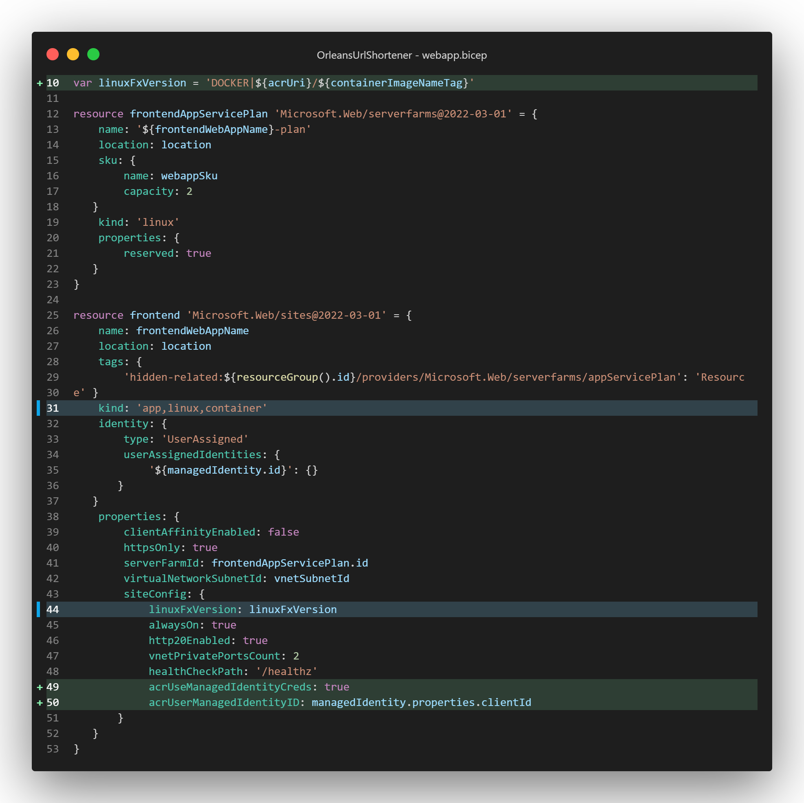
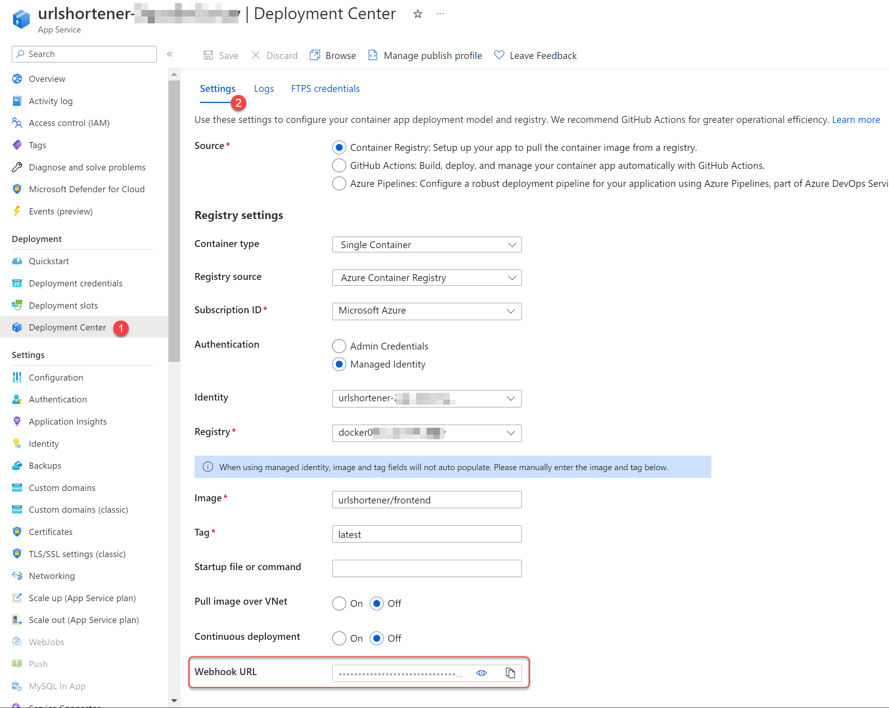
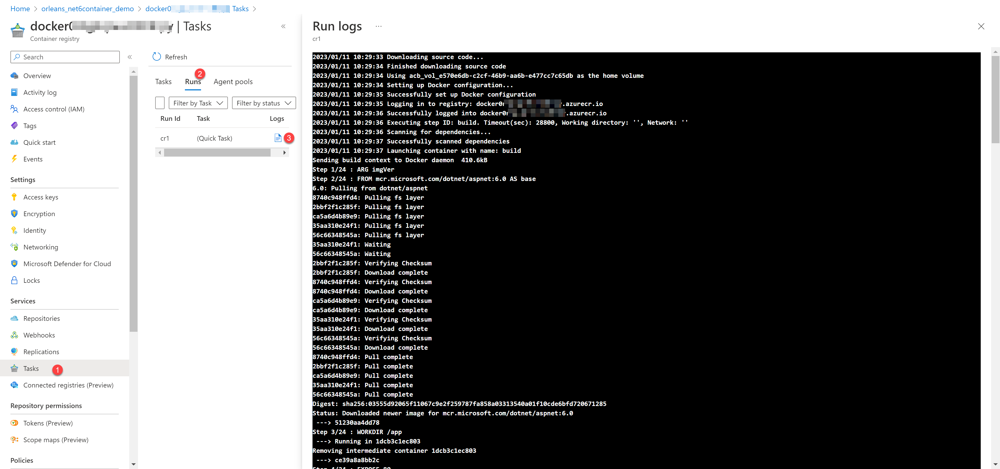
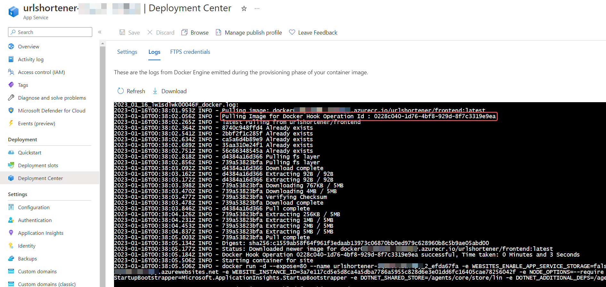

# Orleans應用部署Azure實例 — Azure App Service (Linux) Custom Container 與 Azure Container Instance

昨天介紹的 Azure App Service (Linux) 雲端PaaS服務，除了可以使用傳統的程式碼使用 Visual Studio/ Azure Cli指令打包zip方式部署之外，由於底層是使用 Docker Container 作為基礎架構，因此也可以使用自製 Docker Container Image 的方式來部署應用程式，利用Azure App Service提供 "[持續部署(Continuous Deployment)](https://learn.microsoft.com/azure/app-service/deploy-ci-cd-custom-container?tabs=acr&pivots=container-linux)" 功能，配合 Azure Container Registry 這個提供建置/管理容器影像的雲端服務，實現極簡版的 CI/CD 流程。

## Azure App Service (Linux) 服務使用 Custom Container Image 部署

### 搭建的Azure服務架構與CI/CD流程

以下是在不用正式的CI/CD服務如Azure DevOps, GitHub Action情況下，包含持續部署流程的Azure服務組成範例架構：
.svg)

這個和之前的架構上差異：不使用Deployment Slot了，並且新增一個 Azure Container Registry （以下簡稱 *ACR* ）服務，用來建置/管理/儲存容器影像(Container Image)。

沒有使用 Deployment Slot 的原因是：由於 App Service 在使用自訂容器影像檔(Custom Container Image)部署方式的持續部署(Continuous Deployment)功能時，會讓 App Service Deployment Slot 在 ["Slot swap"](https://learn.microsoft.com/azure/app-service/deploy-staging-slots#swap-two-slots) 後交換下來的應用服務實體，自動部署其持續部署功能頁所設定使用之容器影像檔名稱（含影像標籤）；導致換下來的舊版本應用服務實體在Slow swap交換成功後，就又自動被持續部署功能把舊版本應用服務實體替換成使用當前版的容器影像檔部署再重新啟動起來了：  


這樣就失去原本採用 Deployment Slot 用來暫時保留舊版應用的運營面目的，為了要補足這方面的缺點，就得採用ACR(Azure Container Registry)服務來管理＆儲存部署過的容器影像版本。

微軟ACR服務可以在開發端使用 [azure cli](https://learn.microsoft.com/cli/azure/) 指令列工具，進行容器影像的上傳，或是更簡便一點，直接將ACR當作可遠端操控的雲端 container image build server，將本機端的工作目錄內的檔案內容上傳到ACR並自動建立容器影像檔；ACR還能設定在容器影像檔建立完成或上傳完畢後，觸發ACR的 ["Webhook"](https://learn.microsoft.com/azure/container-registry/container-registry-webhook) 功能，以便通知 Azure App Service 服務現在有新版本可部署到服務機了。

Azure App Service 的持續部署功能設定之後，會提供一個可供其他整合服務使用的Webhook呼叫點，以通知App Service本身進行所設定的持續部署行為：將容器影像部署到 Azure App Service 服務上。此呼叫點的網址就是上一段所介紹的，ACR的Webhook功能所呼叫網址，這樣就可以實現從開發者端電腦上傳專案程式碼內容到ACR成為容器影像檔，再自動部署到 Azure App Service 服務的整個流程。

當然實務上建議，從開發者電腦到ACR的這段流程，還是要串接正式的原始碼版本管理服務以及CI/CD服務如Azure DevOps, GitHub Action來協助從開發到運營的完整工作流程，這樣可以有程式碼檔案版本管理功能以及保存原始碼，並且可以進行自動測試，以確保程式碼的品質。

### Bicep 程式碼解說

短網址服務範例專案（原始碼：https://github.com/windperson/OrleansUrlShortener/tree/AzureWebApp-CustomContainer ），建置前一節介紹Azure服務架構的Bicep程式碼位於 **infra/Azure/AppService_CustomContainer** 目錄下，包含了六個 *.bicep檔案以及一個 *parameters.json* ，這是用來提供執行Azure Cli部署指令時大部分參數預設值的設定檔案。

#### 建立Azure Bicep部署的雲端服務

要建立短網址服務的Azure資源，[安裝Azure CLI](https://learn.microsoft.com/cli/azure/install-azure-cli)並登入後，在 *infra/Azure/AppService_CustomContainer* 目錄執行以下指令：
```sh
az deployment sub create --name orleans_net6webapp_linux_demo02 --location [azure_datacenter_region] --template-file ./main.bicep --parameters deploy_region=[azure_datacenter_region] ./parameters.json
```
其中 `--name` 參數是此部署的名稱，可自訂，在此範例使用 *orleans_net6webapp_linux_demo02*，而 `[azure_datacenter_region]` 要替換成你想要部署的[Azure資料中心區域](https://aka.ms/AzureRegions)的縮寫名稱，例如 `eastus`、`westus`、`southeastasia` 等等；可使用Azure CLI的 `az account list-locations -o table` 指令來取得可部署的區域名稱。

部署指令下達之後，稍等一段執行時間後，假如回傳的Json字串有 `"provisoningState": ""Succeeded"`，則表示Azure資源的建置部署指令成功，可進行後續的程式上版動作：


此時在Azure Portal管理網頁的資源群組(resource group)列表內可以看到名稱為 *orleans_net6container_demo* 的新建資源群組（此名稱為寫在該目錄下 **parameters.json** 檔的 `resource_group` 參數），以及包含的App Service Plan, App Service (Linux), Storage Account, Managed Identity, Container Registry, Container Registry webhook 等等總共9個Azure服務資源：


#### 移除Azure Bicep部署雲端服務

當不需要此短網址服務的Azure資源，需要移除掉時：
1. 使用以下指令移除建立的Azure Bicep部署項目 *orleans_net6webapp_linux_demo02*：
   ```sh
   az deployment sub delete --name orleans_net6webapp_linux_demo02
   ```
2. 刪除整個 *orleans_net6container_demo* 資源群組：
   ```sh
   az group delete --name orleans_net6container_demo
   ```   

#### Bicep程式碼和Linux版App Service的差異

此版本的Bicep程式碼和昨天的 App Service (Linux) 不同的是：
1. 在建立App Service的 [**webapp.bicep**](https://github.com/windperson/OrleansUrlShortener/blob/AzureWebApp-CustomContainer/infra/Azure/AppService_CustomContainer/webapp.bicep) 檔案中啟用容器影像持續部署的設定，以及回傳觸發持續部署的webhook url網址：  
   在App Service (Linux)持續部署(Continuous Deployment)要使用容器影像檔的方式部署，除了在原本的 `kind` 屬性值（第31行）要寫成 **app,linux,container** （要注意逗號間不可有空白）之外，還需要第44行 `linuxFxVersion` 屬性設定為：
   ```
   DOCKER|<ACR_Registry_Name>.azurecr.io/<Container_Image_Name>:<Tag>
   ```
   的格式，此格式為 Azure App Service 持續部署功能指定容器影像倉庫(container registry)、影像檔名稱與影像檔標籤的方法。  
   由於此範例專案的Azure雲端資源架構ACR是使用 Azure Managed Identity 來對其操作的權限授權，因此在 appSettings 內不需要額外提供 `DOCKER_REGISTRY_SERVER_USERNAME` 和 `DOCKER_REGISTRY_SERVER_PASSWORD` 這兩個設定值，假如是其他例如 Docker Hub、GitHub Container Registry 等等的容器影像倉庫，則需要在Bicep配置 appSettings 的程式碼中明確增加這兩個設定，以便提供持續部署的系統服務存取容器影像倉庫的帳號密碼資訊，讓App Service有辦法成功存取到容器影像倉庫的影像檔案，而且還要在 appSettings 多新增一個 `DOCKER_ENABLE_CI` 的設定，其值為 `true`，這樣才能啟動用容器影像持續部署的功能。  
   在第49行 **siteConfig** 屬性額外增加 `acrUseManagedIdentityCreds` 設定，設為 `true`，就是指定App Service使用 Azure Managed Identity 的授權方式對ACR操作，第50行則是指定對ACR有操作權限的 User Defined Managed Identity 資源。  
   
   而在 **appSettings** 裡還多了一個 key-value pair 的設定： `WEBSITES_ENABLE_APP_SERVICE_STORAGE` 的值為 `false`，此設定值如果沒明確設定的話，預設值是true，這個設定是App Service原本使用程式碼部署的方式時，App Service會在執行實體的檔案系統中留一個掛載的網路檔案目錄，用來存放應用程式執行的二進位檔或script程式碼之用，以便讓執行實體之間可以共用此種儲存空間，當需要水平擴充(scale-out)時減少需要重複拷貝的檔案，在使用容器影像部署的方式時，就不需要這個功能了，因此藉由將此功能停用，以減少App Service的應用服務執行實體空間使用量。  
     
   在此Bicep模組檔案的最後，除了要跟之前的版本一樣把在此模組建立的 Azure Managed Identity 的 `princiaplId` 回傳給呼叫端之外，在第124~125行使用了呼叫Bicep的 [`resourceId()`](https://learn.microsoft.com/azure/azure-resource-manager/bicep/bicep-functions-resource#resourceid) 這個可以取得Azure雲端資源唯一識別ID的內建函式，來取得沒有開放出Bicep屬性定義的持續部署webhook網址，做為給呼叫端的回傳參數 `DeployWebhookUrl`：
     
   此webhook的實際網址字串，可從Azure Portal的App Service的『持續部署』設定頁找到，如下圖所示： 
   
2. 增加 [**acr.bicep**](https://github.com/windperson/OrleansUrlShortener/blob/AzureWebApp-CustomContainer/infra/Azure/AppService_CustomContainer/acr.bicep) Bicep模組程式碼檔案，此為建立 ACR(Azure Container Registry)和所屬的Webhook資源，而在初始進入點的 [main.bicep](https://github.com/windperson/OrleansUrlShortener/blob/AzureWebApp-CustomContainer/infra/Azure/AppService_CustomContainer/webapp.bicep) 也在最後配套增加呼叫此檔案的程式碼：
     
   第61行是將前面產生的app service所屬的Azure Managed Identity的 `principalId` 作為參數傳入 `acr.bicep` 模組，以便在之後設定存取ACR權限時使用。
   由於需要在ACR一旦有指定的容器影像被『上傳（也就是有 image push）』時，呼叫 App Service 的觸發Webhook以便開始跑持續部署行為，
   因此在第62~68行也將前面呼叫 `webapp.bicep` 模組建立App Service時回傳的 "DeployWebhookUrl" 網址參數，在第65行用來組合成Bicep陣列物件，以便讓 `webhookUrls` 這個Bicep模組的輸入參數在實際建立ACR時使用。
   而第66行的 scope 是指定特定容器影像名稱含標籤(tag)，配合第67行的 `action` 則是定義當container image被上傳（push）時，此webhook才會被觸發。  
   實際建立ACR(Azure Container Registry)的 acr.bicep 模組內容如下，除了第14行是允許外部公開網路連線，以便配合App Service的持續部署功能能夠存取到之外，其他做的事情就是建立 Azure Container Registry、指定傳入的 Azure Managed Identity 有『acrPull』權限，也就是容許設定該 Azure Managed Identity 的Azure雲端資源可從此ACR的容器影像倉庫拉取container image，以及根據另一個陣列型態輸入參數 `webhookUrls` 在第40、41、43行設定對應的webhook呼叫功能：  
   

其他一些定義實際參數值的寫法是為了要符合[Azure雲端服務的各種資源命名規則](https://learn.microsoft.com/azure/azure-resource-manager/management/resource-name-rules)所對應的寫法，例如 **main.bicep** 檔案在第20行定義要用來指定為ACR服務名稱的變數取值方式就類似於App Service的取名機制，以達到全Azure雲端唯一識別的名稱，畢竟ACR的服務名稱會結合Azure給予的預設網域名稱結尾字串成為 *`<ACR服務名稱>.azurecr.io`* 的存取網址，而此網址不能和Azure上既有的ACR服務重複。


### 短網址服務容器影像檔建立以及部署方法

要讓ACR建立短網址服務的容器影像檔並讓整個持續部署的流程自動動起來的最簡單方法，就是在短網址範例專案 git clone 下來後的根目錄，使用如下的Azure CLI指令，將專案內容上傳給ACR執行容器影像建置：

```sh
az acr build --no-logs -t urlshortener/frontend:latest -r <ACR_service_name> -f src/UrlShortener.Frontend/Dockerfile .
```

記得要將 ***<ACR_service_name>*** 替換成前面使用Bicep建立的ACR服務名稱，`-t` 參數表示我們要將此欲打包的容器影像檔名稱為 **urlshortener/frontend**，並且設定容器影像檔標籤為 **latest**；而 `src/UrlShortener.Frontend/Dockerfile` 則是指定要使用的Dockerfile檔案路徑，而最後面還有一個『 `.` 』符號，要注意不可省略，那是指定要使用的其他Docker Context相關檔案目錄路徑（也就是目前指令列工作目錄所在的專案根目錄），這樣就可以讓ACR自動執行Dockerfile內的指令，將專案內容打包成容器影像檔。

還有一個 `--no-logs` 參數，可以不指定，當不指定的時候就會和使用本機端的docker指令一樣，顯示出建置容器影像時docker執行Dockerfile和下載相關依賴影像檔的整個打包過程，那些打包過程實際上是從雲端ACR執行端收集後，再傳送回給地端的azure cli顯示，所以會有一些延遲，而且其實不管有沒有使用該參數來在地端顯示建置記錄，實際上都可以從開始執行azure cli指令之後，畫面上顯示的 **Queue a build with ID:** ，取得該次建置的ACR task ID，例如下圖的task ID就是 "*cr1*"：  
  
然後再從Azure Portal上ACR服務的Tasks功能頁面查看建置記錄：
  

假如容器影像檔成功建置的話，在ACR的Webhooks功能頁面上可查看到先前建立有Image Push動作就會自動觸發的webhook發送記錄：


此時ACR的Webhook呼叫會觸發App Service上設定的持續部署機制，自動將 ***urlshortener/frontend:latest*** 的容器影像檔版本下載並部署到App Service上，可在App Service的Deployment Center功能頁面的Logs上查看到此流程：
  
稍等一段時間後，App Service就完成部署，開始能正常提供短網址服務了。

如果要將此版本的容器影像檔增加標籤(image tag)，不必用地端的docker指令列下載影像檔、定義標籤後再上傳的方式，可利用Azure Cli的 [`az acr import`](https://learn.microsoft.com/cli/azure/acr?view=azure-cli-latest#az-acr-import) 指令的技巧，直接在雲端ACR服務上增加標籤，例如：

```sh
az acr import -n <ACR_service_name> --source <ACR_service_name>.azurecr.io/urlshortener/frontend:latest -t urlshortener/frontend:1.0 --force
```

記得將 ***<ACR_service_name>*** 替換成建立起來的Azure Container Registry服務名稱，這就可以將目前在這ACR服務中容器影像檔名稱為 **urlshortener/frontend**，標籤為 **latest** 的容器影像版本建立一個『**1.0**』的標籤，建立之後可用 [`az acr respository show-tags`](https://learn.microsoft.com/cli/azure/acr/repository?view=azure-cli-latest#az-acr-repository-show-tags) 指令列出目前 **urlshortener/frontend** 所有標籤：

```sh
az acr repository show-tags -n <ACR_service_name> --repository urlshortener/frontend --output table
```

執行結果如下：
  
或使用Azure Portal網頁上ACR服務的 **Repositories** 功能頁面查看：


使用這個從自己容器影像庫的容器影像檔案匯入自己影像庫的技巧，就能直接在雲端ACR服務上建立容器影像標籤，倘若之後有新版的應用服務要部署時，可依上述流程將當前App Service使用的容器影像建立標籤版本備份保存後，再次發送上述的 `az acr build` 指令，在雲端ACR服務上建立新版的容器影像檔，並且在App Service上自動部署新版的應用服務了。

### 短網址服務範例專案容器影像檔在地端建立及測試方法

雖然容器影像檔是在雲端上的ACR服務建立並部署至App Service，實務上在開發時仍有得在地端進行除錯/測試的需求，此時就需要能夠在地端的開發電腦上，開發人員也可建置和執行專案的容器影像檔來進行測試，以下介紹在地端建立短網址範例專案容器影像檔的方法：

#### 使用 Visual Studio Container Tools 工具快速建立DockerFile

原本的短網址範例 asp.net core 專案版本，要加上建立容器影像檔的配套設定檔，最快的方式是使用 Visual Studio 2022 提供的 [Visual Studio Container Tools](https://learn.microsoft.com/aspnet/core/host-and-deploy/docker/visual-studio-tools-for-docker) 工具來快速建立建置容器影像用的DockerFile、地端測試用的Docker Compose相關配套設定檔以及能夠在Visual Studio上進行Docker Compose除錯的 ***.dcproj*** 專案檔後，再進行修改。
